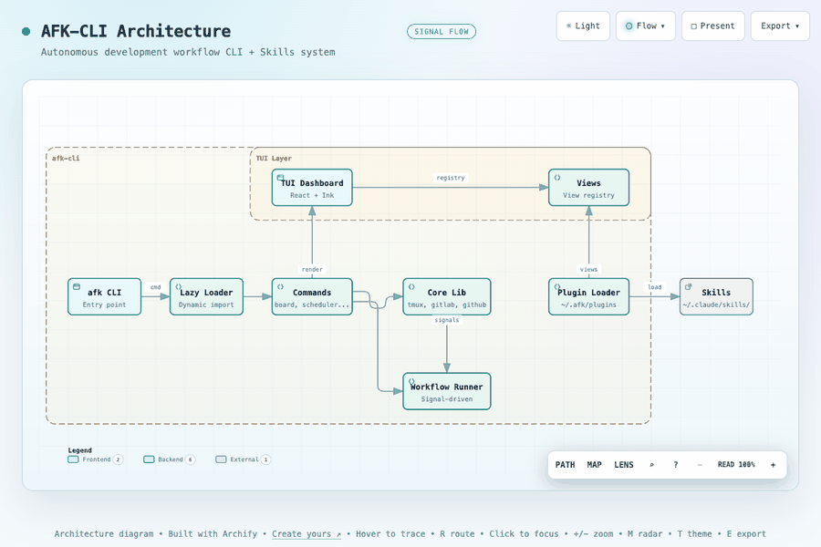

# AFK

**AFK = Away From Keyboard** — 自主开发工作流的 CLI + Skills 系统

基于 Claude AI agents 和 TypeScript 的跨平台 issue 跟踪自动化（GitLab/GitHub）。

## 架构图



**交互式版本**: [docs/afk-architecture.html](docs/afk-architecture.html)（支持缩放、搜索、主题切换）

## 特性

- **跨平台** — GitLab 和 GitHub 统一 CLI（issues, MRs/PRs）
- **Skills 套件** — 9 个核心 Claude Code skills，涵盖完整开发流程
- **TUI 仪表板** — 交互式 issue 跟踪仪表板
- **后台自动化** — 基于 tmux 的工作流调度器
- **TDD 集成** — 内置测试驱动开发方法论

## 快速开始

```bash
git clone https://github.com/easyhaloo/afk.git
cd afk
npm install && npm run build
npm link
afk --version
```

详细步骤和配置见 [快速开始指南](docs/GETTING-STARTED.md)

## 安装 Claude Code 插件（可选）

AFK 提供完整的 Claude Code skill 套件，可作为插件集成到 Claude Code 中。

### 方式一：在 Claude Code 会话中安装（推荐）

在 Claude Code 交互式会话中直接使用 slash command：

```bash
/plugin install afk@afk
```

### 方式二：使用 CLI 安装

```bash
# 添加 marketplace
claude plugin marketplace add easyhaloo/afk --scope user

# 安装插件
claude plugin install afk@afk
```

### 方式三：settings.json 配置

在 Claude Code 的 `settings.json`（全局或项目级 `.claude/settings.json`）中添加：

```json
{
  "extraKnownMarketplaces": {
    "afk": {
      "source": {
        "source": "github",
        "repo": "easyhaloo/afk"
      }
    }
  }
}
```

支持的 `source` 类型：
- `"github"` — 从 GitHub 仓库加载
- `"local"` — 从本地文件系统加载

### 方式四：符号链接 skills

将 `skills/` 目录链接到全局 skills 目录（无需插件机制）：

```bash
mkdir -p ~/.claude/skills
ln -s /path/to/afk/skills/* ~/.claude/skills/
```

### 验证安装

在 Claude Code 中运行 `/afk-grill-me` 确认 skills 已加载。

## CLI 命令

```bash
# Issue 管理
afk issue get <id>
afk issue list --label "stage::ready-for-implement"
afk issue create "Title" --label "feature"

# MR/PR 操作
afk mr create "feat: add login" --source feat/login --target main
afk mr merge <id> --delete-source-branch
afk mr approve <id>

# 工作流 & 自动化
afk dashboard                         # 交互式 TUI
afk workflow launch --iid <id>        # Issue → MR 流水线
afk scheduler start --max-concurrent 3 # 后台调度器
```

完整命令参考：`afk --help`

## Skills（Claude Code）

| Skill | 用途 | 触发场景 |
|-------|------|---------|
| `/afk-grill-me` | 需求澄清 | 需求模糊或可能有遗漏 |
| `/afk-do` | 任务编排 | 明确的功能需求或任务描述 |
| `/afk-research` | 技术调研 | 需要了解现有实现再编码 |
| `/afk-prototype` | 方案验证 | 技术决策前需要验证方案 |
| `/afk-implement` | TDD 实现 | 清晰定义的实现目标 |
| `/afk-qa` | 独立验证 | MR/PR 准备合并前验证 |
| `/afk-debug` | 快速修复 | 具体可重现的失败场景 |
| `/afk-hand-off` | 工作交接 | 需要转移任务给其他开发者 |
| `/api-workflow` | API 测试 | 多步骤 API 链式调用与浏览器混合测试 |

详见 [Skills 深度说明](docs/SKILLS.md)

## 架构

AFK 使用 **TrackerProvider** 接口抽象 GitLab 和 GitHub 差异：

```typescript
interface TrackerProvider {
  getIssue(id: number): Promise<TrackedIssue>;
  createMR(options: CreateMROptions): Promise<number>;
  mergeMR(id: number, options?: MergeMROptions): Promise<void>;
  // ... 更多操作
}
```

平台自动检测，无需切换命令。详见 [架构设计](docs/ARCHITECTURE.md)

## 工作流

三种核心工作流模式：

1. **Issue → 实现 → MR 流水线** — 从 issue 发现到合并请求
2. **调度器工作流** — 后台依赖感知执行
3. **Skills 工作流** — TDD 方法论集成

详见 [工作流程文档](docs/WORKFLOWS.md)

## 开发

```bash
npm install
npm run build    # 构建 TypeScript
npm test         # 运行测试
npm link         # 全局安装
```

## 文档

- **[快速开始](docs/GETTING-STARTED.md)** — 5分钟上手 AFK
- **[架构设计](docs/ARCHITECTURE.md)** — 跨平台抽象层 + CLI 命令映射
- **[工作流程](docs/WORKFLOWS.md)** — Issue → MR 流水线、调度器、Skills 集成
- **[Skills 说明](docs/SKILLS.md)** — 8个核心 skills 的设计与使用

## 许可证

MIT
