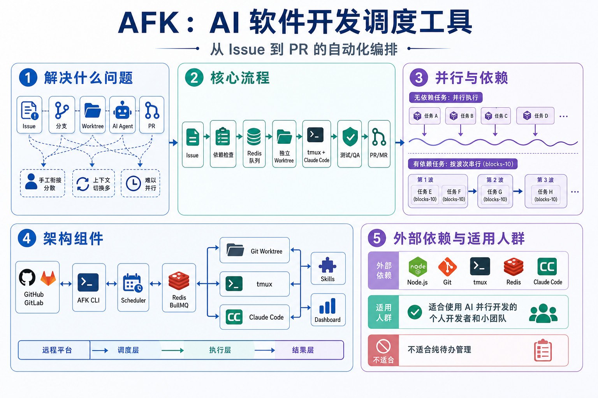

# AFK

**AFK = Away From Keyboard** — 自主开发工作流 CLI + Skills 系统

跨平台 Issue 追踪自动化（GitLab/GitHub），由 Claude AI Agent 和 TypeScript 驱动。

[English](README.md)

## 架构图



## 功能特性

- **跨平台** — 统一的 GitLab 和 GitHub CLI（issues、MRs/PRs）
- **Skills 套件** — Claude Code skills，覆盖完整开发周期与质量治理
- **TUI 仪表盘** — 交互式 Issue 追踪仪表盘
- **后台自动化** — 基于 tmux 的工作流调度器
- **TDD 集成** — 内置测试驱动开发方法论

## 快速开始

```bash
git clone https://github.com/easyhaloo/afk.git
cd afk
npm install && npm run build
npm link
afk --version
```

详细设置请查看[快速入门指南](docs/GETTING-STARTED_zh.md)。

## 安装 Claude Code 插件（可选）

AFK 提供完整的 Claude Code skill 套件，可作为插件集成（**v1.0.6**）。

### 方式一：在 Claude Code 会话中（推荐）

直接在 Claude Code 中使用斜杠命令：

```bash
/plugin install afk@afk
```

### 方式二：使用 CLI

```bash
# 添加 marketplace
claude plugin marketplace add easyhaloo/afk --scope user

# 安装插件
claude plugin install afk@afk
```

### 方式三：settings.json 配置

在 Claude Code 的 `settings.json`（全局或项目级 `.claude/settings.json`）中添加：

```json
{
  "extraKnownMarketplaces": {
    "afk": {
      "source": {
        "source": "github",
        "repo": "easyhaloo/afk"
      }
    }
  }
}
```

支持的 `source` 类型：
- `"github"` — 从 GitHub 仓库加载
- `"local"` — 从本地文件系统加载

### 方式四：软链接 Skills

将 `skills/` 目录链接到全局 skills 目录：

```bash
mkdir -p ~/.claude/skills
ln -s /path/to/afk/skills/* ~/.claude/skills/
```

### 验证安装

在 Claude Code 中运行 `/afk-grill-me` 确认 skills 已加载。

## CLI 命令

```bash
# Issue 管理
afk issue get <id>
afk issue list --label "stage::ready-for-implement"
afk issue create "标题" --label "feature"
afk issue edit <id> --label "bug"
afk issue comment <id> "消息"
afk issue link <src> <project>:<iid>     # 跨项目链接
afk issue run <iid> --project <repo>      # 跨项目工作流

# MR/PR 操作
afk mr create "feat: add login" --source feat/login --target main
afk mr merge <id> --delete-source-branch
afk mr approve <id>
afk mr close <id>
afk mr reopen <id>

# 工作流与自动化
afk board                             # 交互式 TUI 面板
afk kanban                            # 看板
afk workflow run --iid <id>           # Issue → MR 流程
afk loop start                        # 持续集成循环
afk scheduler start --max-concurrent 3 # 后台调度器
afk qa run                            # QA 验证

# 基础设施
afk worktree create <iid>             # Git worktree 管理
afk tmux create-session               # Tmux 会话管理
afk isolate up                        # DB 服务隔离

# 调试与升级
afk debug reproduce <cmd>             # 调试循环
afk escalate create "标题"           # 提 GitLab Issue

# 信号管理
afk signal goal-complete               # 工作流信号通信
```

完整命令参考：`afk --help`

## Skills（Claude Code）

| Skill | 用途 | 使用场景 |
|-------|------|---------|
| `/afk-grill-me` | 需求访谈 | 需求模糊或可能存在遗漏 |
| `/afk-grill-me-context` | 补充访谈 | 现有草稿/文档需要验证 |
| `/afk-to-prd` | 生成 PRD | 需求对齐后 |
| `/afk-to-issues` | 分解为 Issues | PRD 批准后 |
| `/afk-do` | 任务编排 | 清晰的功能或任务描述 |
| `/afk-research` | 技术调研 | 编码前需要理解现有实现 |
| `/afk-prototype` | 方案验证 | 承诺投入前验证技术方案 |
| `/afk-implement` | TDD 实现 | 清晰实现目标 |
| `/afk-qa` | 独立验证 | MR/PR 准备合并 |
| `/afk-diagnose` | 诊断 | 具体、可复现的故障 |
| `/afk-pipeline` | 阶段路由 | 不确定使用哪个 skill |
| `/afk-branch-migrate` | 跨分支迁移 | 在分歧分支间 cherry-pick |
| `/afk-hand-off` | 工作交接 | 任务转移给其他开发者 |
| `/afk-scheduler` | 后台调度 | 多 Issue 依赖感知执行 |
| `/afk-skill-craft` | Skill 创作 | 创建、诊断或重构 skills |
| `/software-complexity-governance` | 复杂度治理 | 指标、异味、模块/服务边界、反 CP 复用 |
| `/api-workflow` | API 测试 | 多步骤 API 链配合浏览器测试 |
| `/md-to-pdf` | Markdown 转 PDF | 导出带 Mermaid 图表的文档 |
| `/reasoning-guard` | 推理守卫 | 编码 Agent 多轮推理降级 |
| `/reasoning-watchdog` | 自动推理监控 | 基于 Hooks 的推理降级拦截 |

详细文档请查看 [Skills 指南](docs/SKILLS_zh.md)。

## 架构设计

AFK 使用 **TrackerProvider** 接口抽象 GitLab 和 GitHub 的差异：

```typescript
interface TrackerProvider {
  getIssue(id: number): Promise<TrackedIssue>;
  createMR(options: CreateMROptions): Promise<number>;
  mergeMR(id: number, options?: MergeMROptions): Promise<void>;
  // ... 更多操作
}
```

平台自动检测，无需切换命令。查看[架构设计](docs/ARCHITECTURE_zh.md)和[执行环境设计](docs/EXECUTION-DESIGN_zh.md)。

## 工作流程

三种核心工作流模式：

1. **Issue → 实现 → MR 流程** — 从 Issue 发现到合并请求
2. **调度器工作流** — 后台依赖感知执行
3. **Skills 工作流** — TDD 方法论集成

查看[工作流文档](docs/WORKFLOWS_zh.md)。

## 开发

```bash
npm install
npm run build    # 构建 TypeScript
npm test         # 运行测试
npm link         # 全局安装
```

## 文档

- **[快速开始](docs/GETTING-STARTED_zh.md)** — 5 分钟 AFK 上手
- **[架构设计](docs/ARCHITECTURE_zh.md)** — 跨平台抽象 + CLI 命令映射
- **[工作流程](docs/WORKFLOWS_zh.md)** — Issue → MR 流程、调度器、Skills 集成
- **[Skills 指南](docs/SKILLS_zh.md)** — Skills 设计与使用

## License

MIT
