# AFK Architecture

## Design Goals

The core problem AFK (Away From Keyboard) solves is: **enabling AI agents to automatically complete Issues in an isolated environment and produce mergeable MRs**.

To achieve this, the system must address four challenges:

| Challenge | Solution |
|-----------|----------|
| Platform Differences | TrackerProvider abstraction layer, unified GitLab/GitHub interface |
| Concurrent Interference | git worktree physical isolation + tmux session isolation |
| State Synchronization | Signal files + statusline JSON + bidirectional label sync |
| Runaway Protection | Watchdog hard timeout + retry escalation to HITL |

---

## Core Architecture

### Directory Structure

```
src/
├── index.ts              # Thin CLI dispatcher (lazy-loads commands)
├── command-registry.ts   # Single source of truth for all commands
├── lazy-loader.ts        # Per-command dynamic import
├── full-cli.ts           # Fallback: loads all commands for unknown commands
├── commands/             # Individual command implementations
│   ├── signal.ts, tracker.ts, tmux.ts, worktree.ts, workflow.ts
│   ├── scheduler.ts, board.ts, kanban.ts, debug.ts, escalate.ts
│   ├── isolate.ts, qa.ts, loop.ts, completion.ts
│   └── board-entry.ts    # TUI entry point (Ink + React)
├── lib/
│   ├── core/             # Platform clients, IO, git, config, tmux
│   │   ├── config/, git/, github/, gitlab/, io/, tmux/, tracker/
│   ├── agents/           # Agent providers (claude-code, cursor, etc.)
│   ├── branches/         # Branch strategies
│   ├── modules/          # Runner workers (loop-runner, qa-runner)
│   ├── sandbox/          # Docker/Podman sandbox
│   ├── scheduler.ts      # Scheduler logic (in-memory, no Redis)
│   ├── sessions/         # Session store
│   ├── templates/        # Workflow templates
│   └── workflows/        # Workflow execution
├── views/                # TUI views (Ink + React)
│   ├── app/
│   └── board/            # Dashboard, kanban, navigation, registry
└── types/
```

### Module Dependency Graph

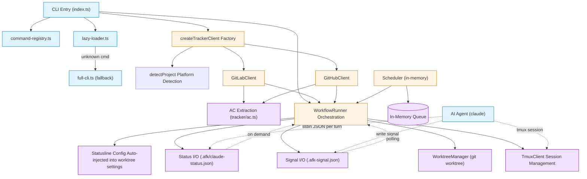

### Module Responsibilities

| Module | Responsibility | Key Design Decision |
|--------|---------------|---------------------|
| **command-registry.ts** | Single source of truth for all CLI commands | One array feeds both lazy-loader and full-cli |
| **lazy-loader.ts** | Per-command dynamic import | Fast path: ~50ms cold start |
| **full-cli.ts** | Load-all fallback for unknown commands | Parallel `Promise.all` load |
| **index.ts** | Thin CLI dispatcher | No shared logging at import time |
| **WorkflowRunner** | Orchestrates complete lifecycle | Signal-driven + statusline objective validation + AC objective verification |
| **AC Extraction** | Extract AC from issue labels / legacy markdown | Label-driven first, markdown as fallback |
| **WorktreeManager** | Independent workspace per Issue | Physical isolation, no branch conflicts |
| **TmuxClient** | Agent runtime environment | Independent sessions, crashes don't affect each other |
| **Signal I/O** | Agent-Runner control communication | Atomic file writes, Zod validation |
| **Status I/O** | Read Claude statusline JSON | Token objective data source |
| **Statusline Config** | Auto-inject worktree settings.json | tee stdin JSON to file + placeholder for startup detection |
| **Scheduler** | Multi-Issue concurrent scheduling | In-memory queue + priority, no Redis dependency |

---

## Key Design Decisions

### 1. Why File Signals Instead of IPC?

Agents run in tmux sessions, which are **process-isolated** from the scheduler. Three communication approaches were considered:

| Approach | Advantages | Rejection Reason |
|----------|------------|------------------|
| Unix Socket | Low latency | Complex cross-process lifecycle management, socket residue after Agent crash |
| HTTP Long Poll | Bidirectional push | Requires a persistent service inside the Agent, violates "non-invasive" principle |
| **File Signals** | **Recoverable state after process crash** | **Adopted** |

**Key Design:**
- Atomic writes (tmp + rename), avoid reading half-written JSON
- Zod schema validation, fast failure on version incompatibility

### 1b. Context Overflow Detection

**Runner polls statusline, Agent doesn't participate**: Runner reads token count from `<worktree>/.afk/claude-status.json` each polling cycle (statusline writes each turn), and compares against `CONTEXT.HIGH_THRESHOLD` (default 100K). When threshold is reached, handoff is triggered. There is no context_high in the signal protocol.

This avoids "the evaluated judging itself" bias — LLM self-assessment of its own state is unreliable (TUI warnings are invisible at the rendering layer), so the system should make decisions based on objective data.

### 1c. AC Expressed via Issue Labels, Not Markdown Regex

Neither GitLab nor GitHub APIs return structured checklists. The original regex parsing of `- [ ]` was extremely brittle — variants like Chinese titles, indentation, emojis, numbered lists all broke it.

**Switch to label-expressed AC**: Each AC item is a label (`ac::1:: User can log in`), platform APIs directly return structured arrays, enabling server-side filtering.

Legacy markdown sections are kept as fallback (best-effort), no migration needed. See `src/lib/core/tracker/ac.ts` for details.

### 1d. Why Not Pane Capture + Regex for State Detection?

Agent state detection (prompt ready, timeout triggered, signal complete) always uses:
- **File signals** (`.afk-signal.json`)
- **Status files** (`.afk/claude-status.json`)
- **Structured APIs** (Direct GitLab/GitHub SDK calls)

Not `tmux capture-pane` + regex/string matching, because:
- Claude Code UI theme/font changes can change characters
- Pane output depends on color codes, ANSI escapes
- Multi-pane boundaries and wide characters make regex error-prone

Remaining `capturePane` calls are only used for **writing log snapshots** (ops archival) and CLI `afk tmux capture` (user-initiated), not for state detection.

### 2. Why Worktree Instead of Docker?

| Approach | Startup Overhead | Isolation Strength | Disk Usage |
|----------|-----------------|-------------------|------------|
| Docker container | 5-10s | Process-level | GB/container |
| **git worktree** | **<1s** | **File-level** | **MB/worktree** |

What the Agent needs is **branch isolation**, not **process isolation**. Worktrees share the `.git` directory but have independent working trees, with near-zero switching overhead.

### 3. Why Watchdog?

Agents can get stuck for the following reasons:
- Waiting for user input (shouldn't happen, but does with skill design flaws)
- Infinite loops or recursive calls
- Network request hangs

**Two layers of protection:**
- `completionTimeoutMs` (default 5min): Soft timeout, triggers signal detection
- `hardTimeoutMs` (default 60min): Hard timeout, watchdog directly `kill-session`

Watchdog starts as an independent process via `setsid`, **triggering even if the parent process crashes**.

### 4. Why Retry on AC Failure Instead of Directly Escalating to HITL?

Common causes of AC failure:
- Agent misunderstood requirements (50%) — Retry + clearer AC often passes
- Actual implementation defect (30%) — Retry + code fixes
- Requirements issue itself (20%) — Needs HITL

Direct escalation to HITL surrenders 80% of automatable scenarios to humans. **Retry mechanism preserves the core value of automation**.

---

## Cross-Platform Abstraction Layer

### Layered Architecture

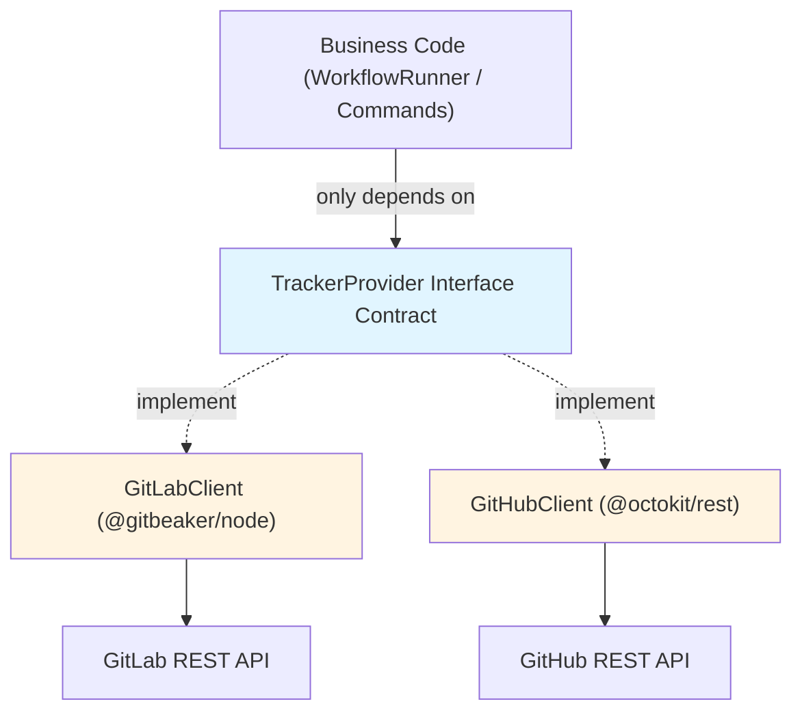

**Core Principle: Differences are encapsulated inside clients, interfaces maintain semantic consistency.**

### Platform Difference Handling

| Difference | GitLab | GitHub | Abstraction Strategy |
|------------|--------|--------|----------------------|
| Issue ID | `iid` | `number` | Unified to `id: number` |
| Adding labels on MR creation | Native API support | Requires extra API call | GitHubClient handles automatically internally |
| Delete branch on merge | `removeSourceBranch` parameter | Separate `git.deleteRef` | Encapsulated in `mergeMR()` |
| Issue linking | Native `Issues.link()` | Can only comment reference | GitHubClient degrades to comment |

### Platform Detection Flow

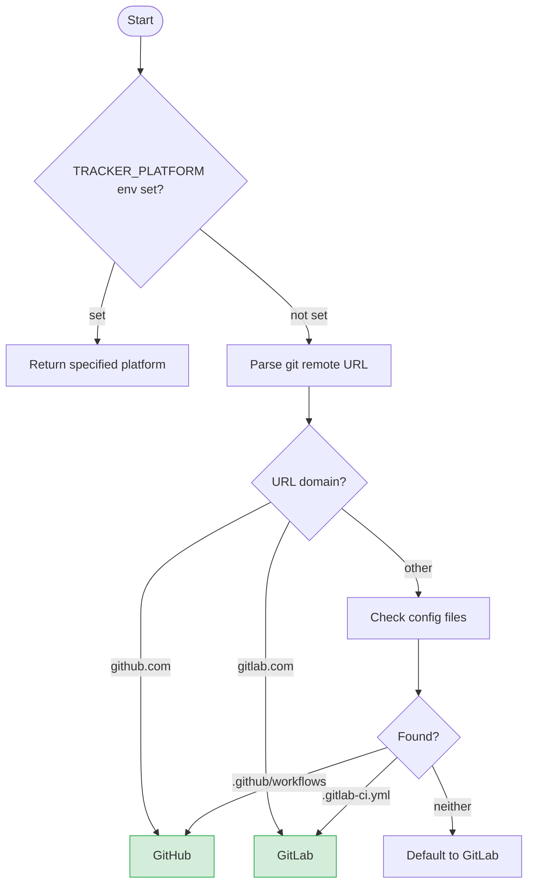

**Detection Priority:** Environment variable > git remote > config files > Default GitLab

---

## Signal Protocol

### Two Data Channels

The system communicates with the Agent via two channels, each with different focus:

| Channel | Data | Written By | Read By | Purpose |
|---------|------|------------|---------|---------|
| `.afk-signal.json` | Control events | Agent | Runner polling | goal_complete / ac_result / timeout / handoff_ready |
| `.afk/claude-status.json` | Objective state | Claude Code statusline | Runner on demand | Token count, model, context window |

**Design Principle: Control signals go through files (Agent-initiated), state data through statusline (engine auto-push).**

### Signal Types (Control Channel)

| Signal | Trigger Scenario | System Response |
|--------|-----------------|-----------------|
| `goal_complete` | Agent completed goal | Enter AC acceptance |
| `ac_result` | AC check result | PASS-create MR, FAIL-retry or escalate |
| `timeout` | Hard timeout | Capture logs, add `mode::timeout` label |
| `handoff_ready` | Context switch complete | Close old session, start new session |

Context overflow is not a signal: Runner directly triggers handoff after polling statusline token count and comparing against `CONTEXT.HIGH_THRESHOLD`.

### Signal Lifecycle

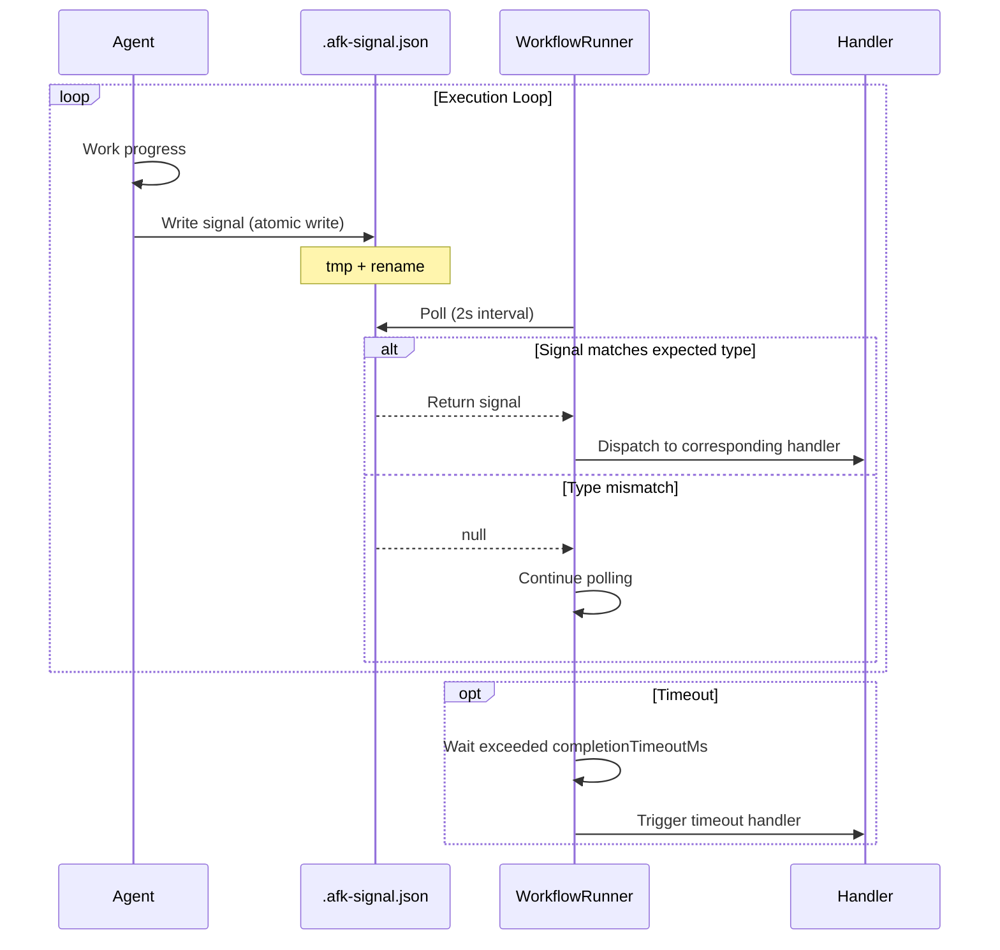

### State Data Flow (Status Channel)

Claude Code statusline auto-pushes JSON payload via stdin each turn. AFK auto-configures statusline on worktree creation to use tee command to write to file simultaneously, and writes a placeholder file so Runner can immediately detect prompt-ready:

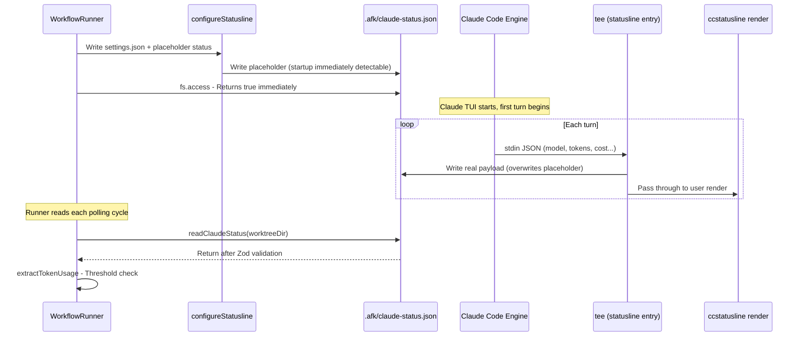

**Status JSON schema (Zod):**

```typescript
{
  model: { display_name: string },
  context_window: {
    context_window_size: number,           // e.g., 200000
    current_usage: {
      input_tokens: number,
      output_tokens: number,
      cache_creation_input_tokens: number,
      cache_read_input_tokens: number,
    }
  },
  session_id: string,
  // ... other fields ignored
}
```

### Why Zod Validation?

Signal files cross process boundaries, **format errors are the norm, not the exception**:
- Agent skill version mismatch
- Manually edited test signals
- Network issues causing write interruption

Zod fails fast at the boundary, better than letting errors like `undefined.sha` propagate and crash deep in the system.

---

## WorkflowRunner Flow

### Core State Machine

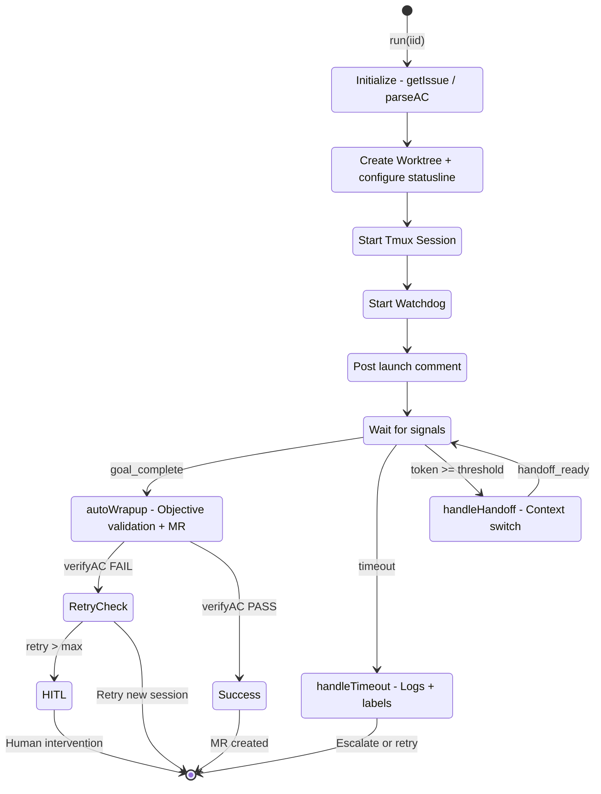

### Sequence Diagram: Complete Lifecycle

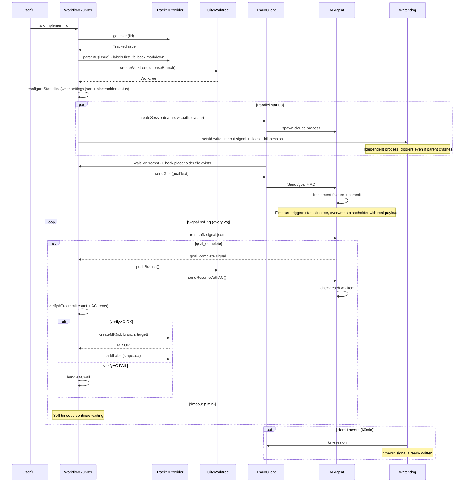

### Key Design of autoWrapup

**AC acceptance doesn't rely on Agent self-assessment**. Runner performs objective validation:

1. Push branch to origin
2. `verifyAC()` objective validation:
   - Branch has commits relative to baseBranch (not empty repo)
   - Issue has AC items (labels or markdown)
3. Agent sends `ac_result` signal as **a hint**, not a gate
4. **Runner makes the decision itself**, moving evaluation responsibility from "the evaluated" to "the evaluator"

**Why not trust Agent's PASS/FAIL?**
LLMs tend to "optimistic reporting". Even if Agent writes `result: 'PASS'`, empty repos or issues without AC are still caught by `verifyAC`.

### AC Data Sources

AC supports two formats, labels first:

```yaml
# Recommended: ac::1::... labels (structured)
labels:
  - ac::1:: User can log in
  - ac::2:: See welcome page

# Compatible: ## AC markdown section (best-effort parsing)
description: |
  ## AC
  - [ ] User can log in
  - [ ] See welcome page
```

### Retry Mechanism

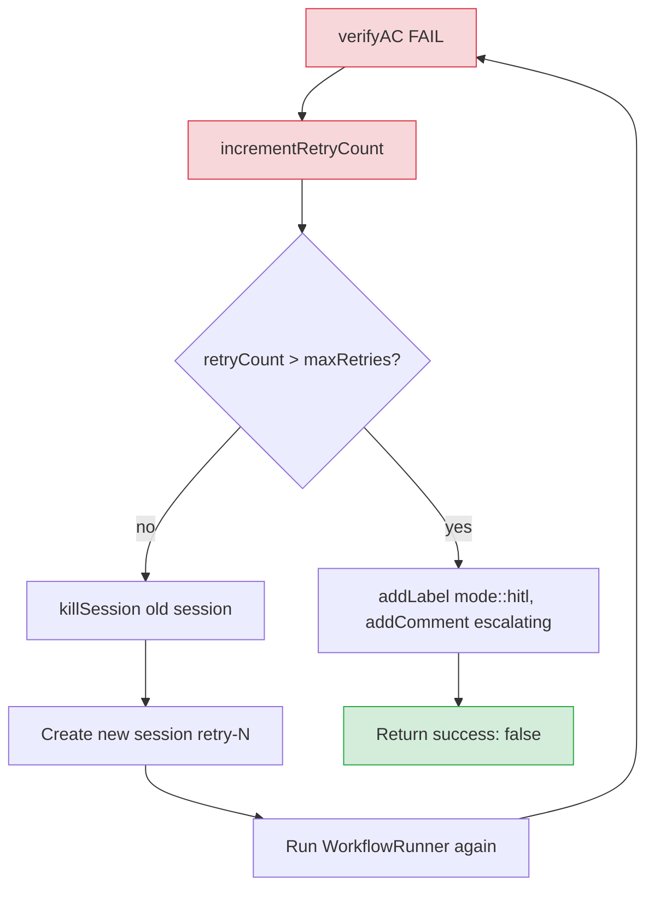

**Key: Each retry is a new session**, not continuing in the same session. This avoids context pollution and aligns with Claude Code's session independence.

---

## Scheduler Design

### Why Scheduler?

`afk implement <iid>` is a single-run command. Scheduler solves:
- **Auto-discovery**: Poll GitLab for Issues with `stage::ready-for-implement`
- **Concurrency control**: Prevent one machine running 10 Agents and blowing up CPU/memory
- **Priority scheduling**: `priority::high` takes precedence over `priority::low`
- **Failure retry**: In-memory queue with exponential backoff

### Scheduling Flow

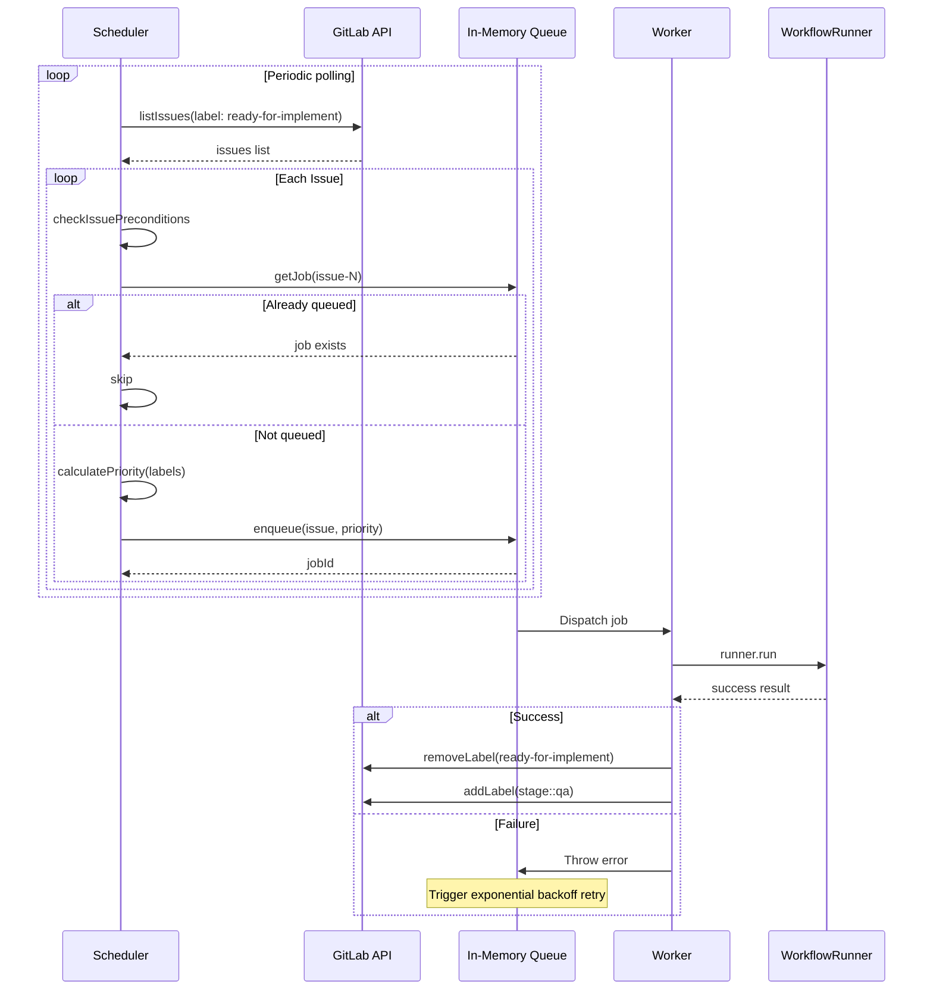

### Priority Mapping

| Label | Priority |
|-------|----------|
| `priority::high` | 10 |
| `priority::medium` | 5 |
| `priority::low` | 1 |
| (none) | 5 |

**Deduplication:** `queue.getJob('issue-123')` checks if already queued, avoiding duplicate submissions.

---

## CLI Command System

### Entry Point (`src/index.ts`)

The CLI entry point is a **thin dispatcher** (~50 lines), intentionally minimal to preserve lazy-loading performance:

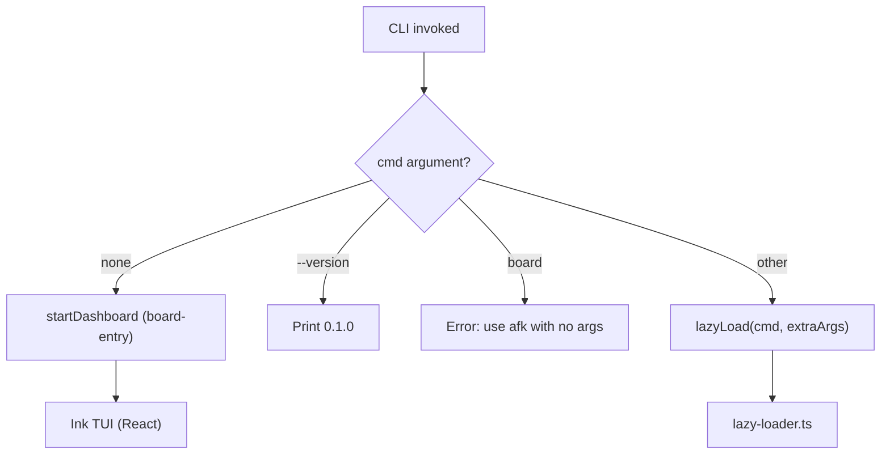

**Design principle:** No shared logging stack at import time. User-facing output lives in commands via `cli-utils` helpers. The entry point only handles version contract and last-resort errors.

### Command Registration (`src/command-registry.ts`)

**Single source of truth.** One `COMMANDS` array feeds both the lazy-loader (fast path) and full-cli (fallback), preventing drift:

```typescript
export const COMMANDS: CommandEntry[] = [
  { names: ['signal'], loader: () => import('./commands/signal.js') },
  { names: ['issue', 'mr'], loader: () => import('./commands/tracker.js') },
  { names: ['tmux'], loader: () => import('./commands/tmux.js') },
  { names: ['worktree'], loader: () => import('./commands/worktree.js') },
  { names: ['workflow'], loader: () => import('./commands/workflow.js') },
  { names: ['scheduler'], loader: () => import('./commands/scheduler.js') },
  { names: ['board'], loader: () => import('./commands/board.js') },
  { names: ['kanban'], loader: () => import('./commands/kanban.js') },
  { names: ['debug'], loader: () => import('./commands/debug.js') },
  { names: ['escalate'], loader: () => import('./commands/escalate.js') },
  { names: ['isolate'], loader: () => import('./commands/isolate.js') },
  { names: ['qa'], loader: () => import('./commands/qa.js') },
  { names: ['loop'], loader: () => import('./commands/loop.js') },
  { names: ['completion', '__complete'], loader: () => import('./commands/completion.js') },
];
```

### Lazy-Loader (`src/lazy-loader.ts`)

Per-command dynamic import — the fast path:

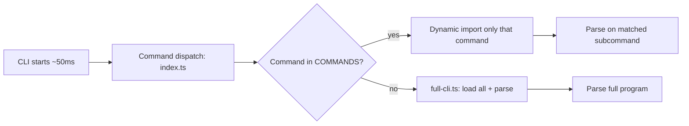

**Why?** Loading all command dependencies slows down lightweight commands like `afk --help`. Lazy-loader reduces cold-start from ~500ms to ~50ms.

### Full-CLI Fallback (`src/full-cli.ts`)

For unknown commands, loads all modules in parallel as fallback:

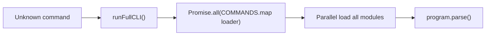

### Command Structure

| Command | Register Function | Description |
|---------|-------------------|-------------|
| `afk signal` | `registerSignalCommands` | Structured signal file management |
| `afk issue` / `afk mr` | `registerTrackerCommands` | Issue/MR CRUD, auto-detects platform |
| `afk tmux` | `registerTmuxCommands` | Tmux session management |
| `afk worktree` | `registerWorktreeCommands` | Git worktree list/clean |
| `afk workflow` | `registerWorkflowCommands` | Signal-driven workflow orchestration |
| `afk scheduler` | `registerSchedulerCommands` | In-memory background scheduler |
| `afk board` | `registerBoardCommands` | TUI dashboard |
| `afk kanban` | `registerKanbanCommands` | Kanban board of issues |
| `afk debug` | `registerDebugCommands` | Debug loop (reproduce → verify) |
| `afk escalate` | `registerEscalateCommands` | File issue + launch workflow |
| `afk isolate` | `registerIsolateCommands` | DB service isolation per worktree |
| `afk qa` | `registerQACommands` | QA verification on merged code |
| `afk loop` | `registerLoopCommands` | Continuous integration loop |
| `afk completion` | `registerCompletionCommands` | Shell completion |

**Note:** `github` / `gitlab` legacy command groups are removed. All issue/MR operations go through `afk issue` / `afk mr`.

---

## Tech Stack Selection

| Selection | Alternative | Reason |
|-----------|-------------|--------|
| **TypeScript** | Go/Rust | LLM code generation friendly; mature Node ecosystem |
| **commander** | yargs/oclif | Lightweight, stable API |
| **In-memory queue** | BullMQ (removed) | Lightweight priority queue, no Redis dependency |
| **tmux** | Subprocess management | Process isolation + observability (attach to see output) |
| **git worktree** | Branch switching | Physical isolation, zero switching overhead |
| **Zod** | io-ts/typebox | Friendly error messages, mature ecosystem |
| **Ink** | blessed/ratatui | React-based, componentized TUI |

---

## Extension Points

### Adding a New Platform (Bitbucket Example)

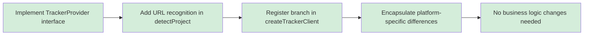

**No changes needed:** WorkflowRunner, business commands, Scheduler

### Adding a New Signal Type

1. Define Zod schema in `SignalSchema`
2. Add new type in WorkflowRunner's `waitForAnySignal()`
3. Add corresponding handler method
4. Update Agent skill instructions

### Custom AC Source

AC extraction logic is centralized in `src/lib/core/tracker/ac.ts`. To add a new source (e.g., YAML block, external AC service):

1. Add new extraction function in `extractAC()` by priority
2. Return `{ items, source: 'your-source' }`
3. Callers don't need changes

### Smarter Decisions Using Statusline Data

Statusline JSON provides rich session metadata (token usage, cache hit rate, cost, model, etc.). Beyond context detection, future use cases:

| Decision | Required Field | Threshold Constant |
|----------|---------------|-------------------|
| Trigger early handoff | `cache_read_input_tokens` ratio | TBD |
| Cost alert | `cost.total_cost_usd` | TBD |
| Model switch judgment | `model.display_name` | Config-driven |
| Cache strategy evaluation | `cache_creation_input_tokens` growth rate | TBD |

Extension: Add aggregated fields in `extractTokenUsage()` in `src/lib/core/io/status.ts`; add thresholds in `constants.ts`; read as needed in WorkflowRunner.

### Custom Workflow Hooks

RunnerOptions supports hooks like `customValidation`, allowing custom logic (lint, performance tests, screenshot verification) before/after AC checks.

---

## State Files

| File | Content | Written By | Read By |
|------|---------|------------|---------|
| `.afk/worktrees.json` | Worktree metadata | WorktreeManager | WorktreeManager / CLI |
| `<worktree>/.afk-signal.json` | Control signal | Agent | WorkflowRunner polling |
| `<worktree>/.afk/claude-status.json` | Claude statusline payload | statusline tee (first turn overwrites placeholder) | Runner polling (context threshold detection, prompt-ready detection) |
| `<worktree>/.afk/CRASHED` | Abnormal exit marker | watchdog | WorktreeManager |
| `<worktree>/.afk/SUCCESS` | Success completion marker | workflow end | WorktreeManager |
| `<worktree>/.claude/settings.json` | Auto-injected statusline config | configureStatusline | Claude Code |
| `~/.claude/logs/afk/` | Timeout logs, watchdog records | handleTimeout / watchdog | Ops |

---

## FAQ

### Q: Platform detection fails

Set `TRACKER_PLATFORM=gitlab` or ensure `git remote -v` contains a recognizable domain.

### Q: AC keeps failing

Two scenarios:
1. **AC parsing fails**: Check if issue has `ac::1::...` label or `## AC` markdown section
2. **verifyAC fails**: Branch must have commits relative to baseBranch; empty repos are blocked

### Q: Worktree disk usage

`afk worktree clean --stale` cleans worktrees inactive for 7+ days.

### Q: How to debug a single Issue?

`afk implement <iid> --dry-run` skips execution, only prints the plan.

---

## Related Documents

- [Quick Start](GETTING-STARTED.md) — Installation and configuration
- [Workflows](WORKFLOWS.md) — Complete Issue to MR flow
- [Skills Guide](SKILLS.md) — 8 Claude Code skills
