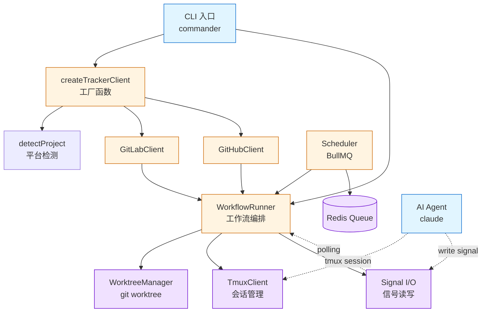
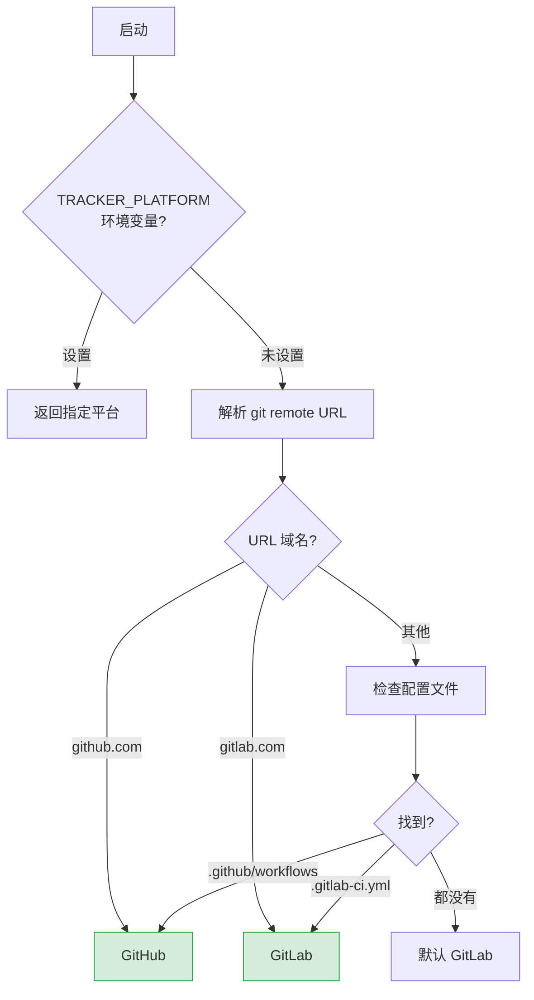
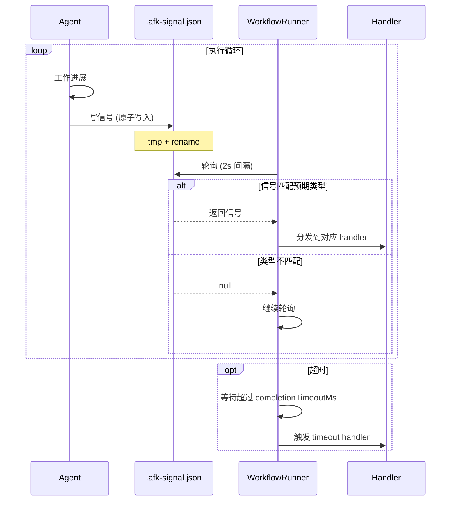
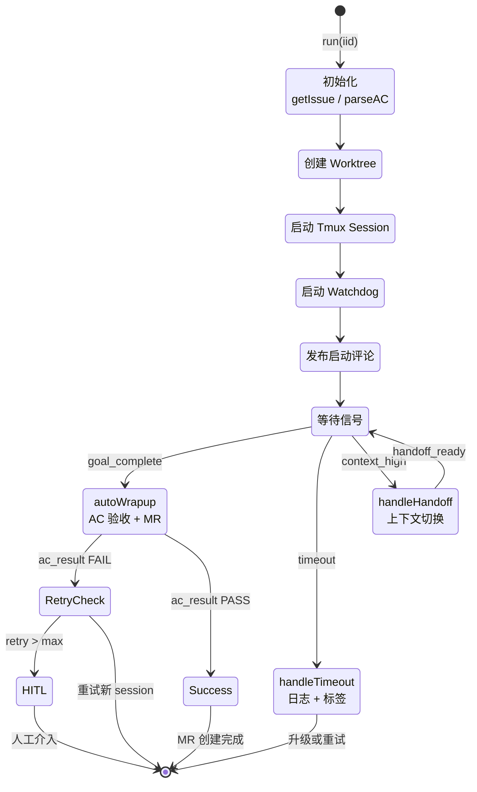
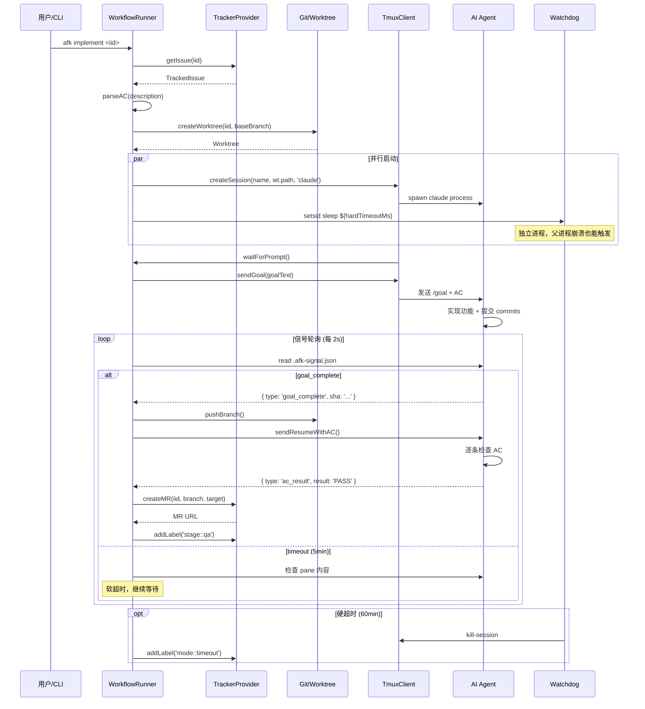
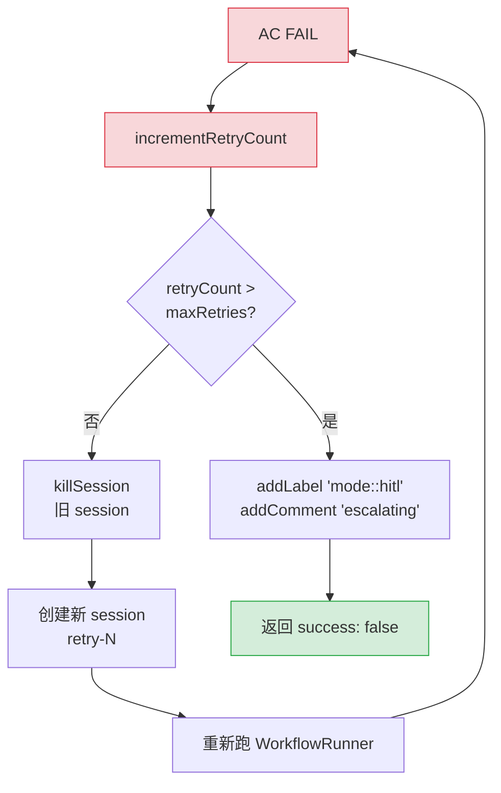
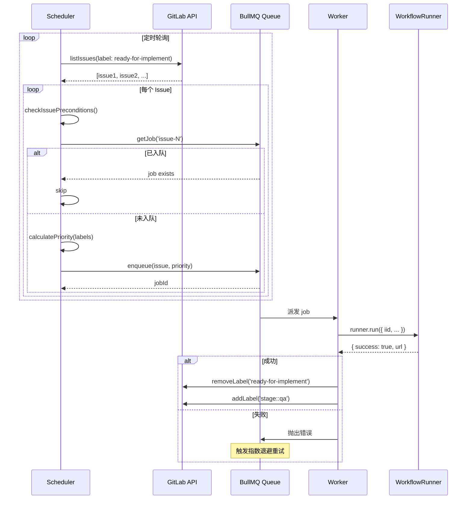
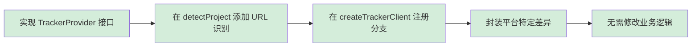

# AFK 架构设计

## 设计目标

AFK (Away From Keyboard) 的核心问题是：**让 AI agent 在隔离环境中自动完成 Issue，并产出可审查的 MR**。

围绕这个目标，系统需要解决四个挑战：

| 挑战 | 解法 |
|------|------|
| 平台差异 | TrackerProvider 抽象层，GitLab/GitHub 统一接口 |
| 并发干扰 | git worktree 物理隔离 + tmux 会话隔离 |
| 状态同步 | 信号文件 + 双向标签同步 |
| 失控保护 | watchdog 硬超时 + 重试升级到 HITL |

---

## 核心架构

### 模块依赖图



### 模块职责

| 模块 | 职责 | 关键设计决策 |
|------|------|-------------|
| **TrackerProvider** | 平台无关的 Issue/MR 操作 | 接口契约，多平台实现 |
| **WorkflowRunner** | 编排完整生命周期 | 信号驱动，非阻塞轮询 |
| **WorktreeManager** | 每个 Issue 独立工作区 | 物理隔离，避免分支冲突 |
| **TmuxClient** | Agent 运行环境 | 独立会话，崩溃不互相影响 |
| **Signal I/O** | Agent↔Runner 通信 | 文件原子写入，Zod 校验 |
| **Scheduler** | 多 Issue 并发调度 | BullMQ + 优先级队列 |

---

## 关键设计决策

### 1. 为什么是文件信号，不是 IPC？

Agent 运行在 tmux session 中，与调度系统是**进程隔离**的。考虑过三种通信方式：

| 方案 | 优点 | 否决原因 |
|------|------|---------|
| Unix Socket | 低延迟 | 跨进程生命周期管理复杂，Agent 崩溃后 socket 残留 |
| HTTP 长连接 | 可双向推送 | 需要在 Agent 内常驻服务，违反"无侵入"原则 |
| **文件信号** | **进程崩溃后状态可恢复** | **采用** |

**关键设计：**
- 原子写入（tmp + rename），避免读到半截 JSON
- Zod schema 校验，版本不兼容时快速失败
- 兼容旧版文本标记（`GOAL_COMPLETE`），平滑升级

### 2. 为什么是 Worktree，不是 Docker？

| 方案 | 启动开销 | 隔离强度 | 磁盘占用 |
|------|---------|---------|---------|
| Docker 容器 | 5-10s | 进程级 | GB/容器 |
| **git worktree** | **<1s** | **文件级** | **MB/worktree** |

Agent 需要的是**分支隔离**，不是**进程隔离**。worktree 共享 `.git` 目录但工作区独立，切换开销几乎为零。

### 3. 为什么需要 Watchdog？

Agent 可能因为以下原因卡住：
- 等待用户输入（不该发生，但 skill 设计缺陷时会有）
- 死循环或递归调用
- 网络请求 hang

**两层防护：**
- `completionTimeoutMs`（默认 5min）：软超时，触发 signal 检测
- `hardTimeoutMs`（默认 60min）：硬超时，watchdog 直接 `kill-session`

watchdog 用 `setsid` 启动独立进程，**即使父进程崩溃也能触发**。

### 4. 为什么 AC 失败要重试而不是直接 HITL？

AC 失败的常见原因：
- Agent 误解需求（50%）→ 重试 + 更明确的 AC 通常能通过
- 真正的实现缺陷（30%）→ 重试 + 修改代码
- 需求本身有问题（20%）→ 需要 HITL

直接升级到 HITL 会把 80% 的可自动化场景拱手让给人类。**重试机制保留自动化的核心价值**。

---

## 跨平台抽象层

### 分层架构

```mermaid
graph TD
    Biz[业务代码<br/>WorkflowRunner / Commands]
    IF[TrackerProvider<br/>接口契约]
    GL[GitLabClient<br/>@gitbeaker/node]
    GH[GitHubClient<br/>@octokit/rest]

    Biz -->|只依赖| IF
    IF -.实现.-> GL
    IF -.实现.-> GH

    GL --> GL_API[GitLab REST API]
    GH --> GH_API[GitHub REST API]

    classDef biz fill:#e1f5ff
    classDef impl fill:#fff4e1
    class IF biz
    class GL,GH impl
```

**核心原则：差异封装在 client 内部，接口保持语义一致。**

### 平台差异处理

| 差异 | GitLab | GitHub | 抽象策略 |
|------|--------|--------|---------|
| Issue ID | `iid` | `number` | 统一为 `id: number` |
| 创建 MR 加标签 | API 原生支持 | 需额外 API 调用 | GitHubClient 内部自动处理 |
| 合并时删分支 | `removeSourceBranch` 参数 | 单独 `git.deleteRef` | 封装在 `mergeMR()` 中 |
| Issue 关联 | 原生 `Issues.link()` | 只能通过评论引用 | GitHubClient 降级为评论 |

### 平台检测流程



**检测优先级：** 环境变量 > git remote > 配置文件 > 默认 GitLab

---

## 信号协议

### 信号类型

| 信号 | 触发场景 | 系统响应 |
|------|---------|---------|
| `goal_complete` | Agent 完成目标 | 进入 AC 验收 |
| `ac_result` | AC 检查结果 | PASS→创建 MR，FAIL→重试或升级 |
| `timeout` | 硬超时 | 捕获日志，添加 `mode::timeout` 标签 |
| `context_high` | 上下文接近上限 | 触发 handoff 流程 |
| `handoff_ready` | 上下文切换完成 | 关闭旧 session，启动新 session |

### 信号生命周期



### 为什么 Zod 校验？

信号文件跨进程边界，**格式错误是常态而非异常**：
- Agent skill 版本不匹配
- 手动编辑的测试信号
- 网络问题导致写入中断

Zod 在边界处快速失败，比让 `undefined.sha` 这种错误传播到深处再崩溃要好。

---

## WorkflowRunner 流程

### 核心状态机



### 时序图：完整生命周期



### autoWrapup 的关键设计

AC 验收不是"问 Agent 你做完了吗"，而是：
1. 推送分支到 origin
2. 让 Agent **逐条检查 AC 并产出结构化结果**
3. **WorkflowRunner 解析结果**，不信任 Agent 的自我评价

**为什么不让 Agent 自我评估？**
LLM 倾向于"乐观报告"。把结果解析权交给系统，是把评估责任从"被评估者"移到"评估者"。

### 重试机制



**关键：每个 retry 都是新 session**，不是同一个 session 继续跑。这避免了上下文污染，也符合 Claude Code 的会话独立性。

---

## Scheduler 设计

### 为什么需要 Scheduler？

`afk implement <iid>` 是单次命令。Scheduler 解决：
- **自动发现**：轮询 GitLab 找 `stage::ready-for-implement` 的 Issue
- **并发控制**：避免一台机器跑 10 个 Agent 把 CPU/内存打爆
- **优先级调度**：`priority::high` 优先于 `priority::low`
- **失败重试**：BullMQ 内置指数退避

### 调度流程



### 优先级映射

| 标签 | 优先级 |
|------|--------|
| `priority::high` | 10 |
| `priority::medium` | 5 |
| `priority::low` | 1 |
| （无） | 5 |

**去重机制：** `queue.getJob('issue-123')` 检查是否已入队，避免重复提交。

---

## CLI 命令系统

### Lazy-Loader 设计

```mermaid
graph LR
    A[CLI 启动<br/>~50ms] --> B[命令注册<br/>仅注册元数据]
    B --> C{用户执行<br/>哪个命令?}
    C -->|afk issue get| D[动态 import<br/>tracker.ts]
    C -->|afk scheduler| E[动态 import<br/>scheduler.ts]
    C -->|afk implement| F[动态 import<br/>implement.ts]

    D --> G[加载依赖<br/>@gitbeaker]
    E --> H[加载依赖<br/>bullmq + ioredis]
    F --> I[加载依赖<br/>workflow runner]

    classDef fast fill:#d4edda
    classDef lazy fill:#fff4e1
    class A,B,C fast
    class D,E,F,G,H,I lazy
```

**为什么？** 加载所有命令的依赖会拖慢 `afk --help` 这种轻量命令的响应。Lazy-loader 把启动时间从 ~500ms 降到 ~50ms。

### 命令结构

| 命令族 | 文件 | 说明 |
|--------|-----|------|
| `afk issue <cmd>` | `tracker.ts` | Issue CRUD，自动检测平台 |
| `afk mr <cmd>` | `tracker.ts` | MR/PR 创建、合并、审查 |
| `afk implement <iid>` | `implement.ts` | 启动单次 workflow |
| `afk scheduler <cmd>` | `scheduler.ts` | 启动/停止/查看调度器 |
| `afk worktree <cmd>` | `worktree.ts` | 列出/清理 worktree |

---

## 技术栈选型

| 选型 | 替代方案 | 选择理由 |
|------|---------|---------|
| **TypeScript** | Go/Rust | LLM 代码生成友好；Node 生态成熟 |
| **commander** | yargs/oclif | 轻量、API 稳定 |
| **BullMQ** | 自研队列 | Redis 持久化、内置重试、可视化面板 |
| **tmux** | 子进程管理 | 进程隔离 + 可观测（attach 看输出） |
| **git worktree** | 分支切换 | 物理隔离，零切换开销 |
| **Zod** | io-ts/typebox | 错误信息友好，生态成熟 |
| **Ink** | blessed/ratatui | React-based，组件化 TUI |

---

## 扩展点

### 添加新平台（以 Bitbucket 为例）



**无需修改**：WorkflowRunner、业务命令、Scheduler

### 添加新信号类型

1. 在 `SignalSchema` 中定义 Zod schema
2. 在 WorkflowRunner 的 `waitForAnySignal()` 中添加新类型
3. 添加对应的 handler 方法
4. 更新 Agent skill 指令

### 自定义 Workflow 钩子

RunnerOptions 支持 `customValidation` 等钩子，在 AC 检查前后插入自定义逻辑（lint、性能测试、截图验证等）。

---

## 状态文件

| 文件 | 内容 | 生命周期 |
|------|------|---------|
| `.afk/worktrees.json` | Worktree 元数据 | 持续更新，清理时归档 |
| `<worktree>/.afk-signal.json` | 当前信号 | Agent 写入，Runner 消费 |
| `<worktree>/.afk/CRASHED` | 异常退出标记 | watchdog 写入 |
| `<worktree>/.afk/SUCCESS` | 成功完成标记 | workflow 结束时写入 |
| `~/.claude/logs/afk/` | 超时日志、watchdog 记录 | 追加 |

---

## 常见问题

### Q: 平台检测失败

设置 `TRACKER_PLATFORM=gitlab` 或确保 `git remote -v` 包含可识别的域名。

### Q: AC 一直失败

检查 Issue 描述中的 AC 是否清晰、机器可验证。模糊的 AC（如"代码质量好"）会导致 agent 反复猜测。

### Q: Worktree 占用空间

`afk worktree clean --stale` 清理 7 天未活动的 worktree。

### Q: 如何调试单个 Issue？

`afk implement <iid> --dry-run` 跳过实际执行，只打印计划。

---

## 相关文档

- [快速开始](GETTING-STARTED.md) — 安装和配置
- [工作流程](WORKFLOWS.md) — Issue → MR 完整流程
- [Skills 说明](SKILLS.md) — 8 个 Claude Code skills