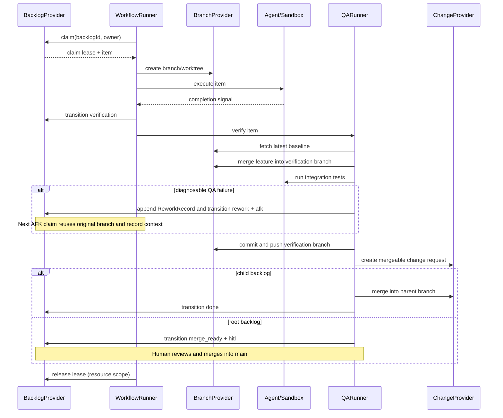

# AFK architecture

## Scope and command surface

AFK executes backlog items that were already created and decomposed by an
external planner. It does not create or split work. The command registry is the
single source of truth for the supported surface:

| Command | Responsibility |
| --- | --- |
| `afk backlog init` | Provision provider metadata |
| `afk backlog list/show/tag` | Inspect and manage backlog records |
| `afk run --backlog-id <id>` | Execute one claimed item |
| `afk loop` | Repeated implementation, baseline-aware QA, and conditional merge |
| `afk qa --backlog-id <id>` | Run QA for an item awaiting verification |
| `afk signal`, `afk tmux`, `afk board`, `afk kanban`, `afk debug`, `afk isolate`, `afk completion` | Operational and local tooling |

There are no aliases for removed command groups. Provider metadata labels are
an adapter detail and never part of this CLI contract.

## Provider boundaries

`BacklogProvider` is the canonical source for item identity, title and
description, state, execution mode, parent, dependencies, business tags, and
the branch mapping. `BranchProvider` owns branch and worktree operations.
`ChangeProvider` owns change-request creation, lookup, and merge. The runner
coordinates these interfaces and never parses provider labels.

GitHub and GitLab are concrete `BacklogProvider` implementations selected by
the provider bundle. They delegate common tracker mechanics internally while
keeping platform validation and construction at the platform boundary. A
future integration such as Linear implements `BacklogProvider` directly; no
tracker-specific type is required by the runner.

The management bundle wraps a concrete provider in a claim-free facade. Its
backlog surface includes lookup, listing, metadata initialization, business
tag updates, and the state/mode updates needed by QA. It has no `claim()` at
the type or runtime boundary. The execution bundle is the only path that
exposes claiming and runnable checks.

## Backlog lifecycle

```text
ready/rework --claim--> in_progress --> verification --> merge_ready --> done
       \                         \
        \                         +--> rework + afk (diagnosable integration QA failure)
         +--> blocked + hitl (conflict, timeout, transport failure, malformed result, or expired lease)
```

An item is runnable only when it is in `ready` or `rework`, uses the `afk` execution mode,
has no child items, and all `dependsOn` items are `done`. `parentId` groups
child items; a parent itself is never runnable. A complete implementation AC
failure is corrected in the same branch and worktree, up to
`AFK_MAX_SELF_ITERATIONS` (default 2), and creates no persistent record. A
cross-process integration QA failure with a complete diagnosis appends a
provider-backed `ReworkRecord`, sets `rework + afk`, and injects that record
into the next run on the original branch. GitHub stores it as an Issue comment
and GitLab as an Issue note. Records are append-only: QA PASS resolves the
exact open record, and a later distinct failure creates the next one. Ambiguous
results, conflicts, timeouts, and transport failures are `blocked + hitl`.

## Claim boundary and local fallback

Providers may expose a native conditional claim (CAS). The execution provider
uses that operation whenever available. Otherwise it acquires a durable lease
under `${AFK_STATE_DIR:-~/.afk/state}` and, while holding it, rereads and
validates the item, performs `ready -> in_progress`, and rereads to confirm the
claim. The returned lease is heartbeated by the runner and released exactly
once by the run resource scope on success, failure, timeout, crash, or handoff.

The filesystem lease is a single-host mechanism backed by a local trusted
filesystem; it is not a multi-host consensus or crash-recovery mechanism.
Multi-host execution requires provider-native CAS (a shared filesystem alone is
not sufficient). Lease paths are
namespaced by provider, project, and backlog ID. Symlinked state paths are
rejected, stale leases fail closed by default, and expiry recovery is allowed
only after the provider durably records `blocked` with mode `hitl`.

## End-to-end flow



`afk loop` runs the same sequence repeatedly and invokes QA in-process. The
standalone QA command uses the management bundle and cannot claim
implementation work. Implementation only pushes its feature branch; QA owns
the latest-baseline merge, integration tests, commit, push, and mergeable change
request. Child changes merge automatically into their parent branch, while a
root change remains `merge_ready + hitl` until a human approves the main merge.

## Extension points

Plugins can register provider implementations through the plugin runtime.
Each provider supplies the complete `BacklogProvider` contract, including
parent/dependency validation, state transitions, execution mode, tags, and
claim behavior. Platform clients remain private to their provider. No
database or additional middleware is required; local state is kept in the
filesystem lease directory.

## Reliability rules

- A failed transition, conflict, timeout, malformed result, transport failure,
  or expired lease is `blocked + hitl`; only complete QA diagnoses enter
  `rework + afk`.
- Native claim is preferred; the filesystem fallback is deliberately scoped to
  a trusted local filesystem on one host.
- Lease cleanup is lifecycle-owned and idempotent.
- Backlog IDs map deterministically to branches through the provider-neutral
  branch naming function.
