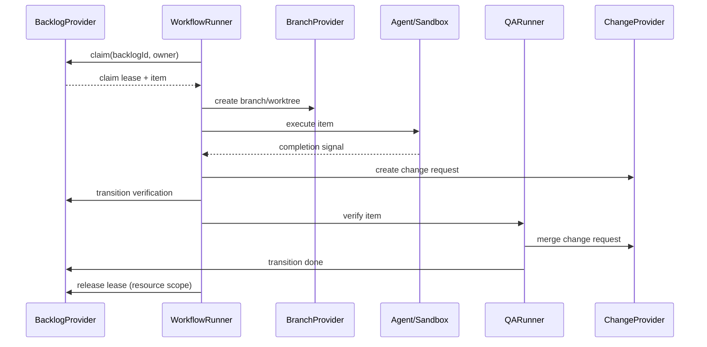

# AFK architecture

## Architecture guard

`pnpm architecture:check` enforces layer direction and disallows generic
records and legacy client-factory imports. The legacy migration is complete:
`scripts/architecture-legacy-baseline.json` records zero legacy files, imports,
and patterns. New legacy files or imports fail the check. Delete the stale
baseline record when removing an entry.

Layer direction applies to relative imports between non-test files in
`src/cli`, `src/domain`, `src/application`, `src/infrastructure`,
`src/shared`, and `src/views`.

## Scope and command surface

AFK executes backlog items that were already created and decomposed by an
external planner. It does not create or split work. The command registry is the
single source of truth for the supported surface:

| Command | Responsibility |
| --- | --- |
| `afk backlog init` | Provision provider metadata |
| `afk backlog list/show/tag` | Inspect and manage backlog records |
| `afk run --backlog-id <id>` | Execute one claimed item |
| `afk loop` | Repeated execution followed by QA and merge |
| `afk qa --backlog-id <id>` | Run QA for an item awaiting verification |
| `afk` (TUI), `afk signal`, `afk tmux`, `afk kanban`, `afk debug`, `afk isolate`, `afk completion` | Operational and local tooling |

There are no aliases for removed command groups. Provider metadata labels are
an adapter detail and never part of this CLI contract.

## Provider boundaries

`BacklogProvider` is the canonical source for item identity, title and
description, state, execution mode, parent, dependencies, business tags, and
the branch mapping. `BranchProvider` owns branch and worktree operations.
`ChangeProvider` owns change-request creation, lookup, and merge. The runner
coordinates these interfaces and never parses provider labels.

GitHub and GitLab are concrete `BacklogProvider` implementations selected by
the provider bundle. They delegate common tracker mechanics internally while
keeping platform validation and construction at the platform boundary. A
future integration such as Linear implements `BacklogProvider` directly; no
tracker-specific type is required by the runner.

The management bundle wraps a concrete provider in a claim-free facade. Its
backlog surface includes lookup, listing, metadata initialization, business
tag updates, and the state/mode updates needed by QA. It has no `claim()` at
the type or runtime boundary. The execution bundle is the only path that
exposes claiming and runnable checks.

## Work-item and execution identity

The Provider Backlog is the business source of truth. Its `BacklogItem.id` is
carried unchanged through `afk run --backlog-id <id>`, `Run.workItemId`,
`TaskRuntimeRecord.backlogId`, TUI projections, and Desktop summaries.
`runId` identifies one execution attempt and must never replace the Backlog ID.

Relationships have separate meanings: `parentId` is organizational grouping,
`dependsOn` controls scheduling, and `baseBacklogId` selects an explicit Git
execution base. Neither parent nor dependency edges implicitly select a branch.

## Backlog lifecycle

```text
ready/rework --claim--> in_progress --> verification --> merge_ready --> done
   \                         \
    \                         +--> blocked (execution mode: hitl)
     +--> blocked (conflict, failure, timeout, or expired lease)
```

An item is runnable only when it is in `ready` or `rework`, uses the `afk` execution mode,
has no child items, and all `dependsOn` items are `done`. `parentId` groups
child items; a parent itself is never runnable. Any automation failure,
conflict, timeout, or uncertain lease recovery transitions the item to
`blocked` and routes it to `hitl`.

## Runtime and Desktop projections

Canonical runtime files under `~/.afk/runtime/tasks` own execution-attempt
status, phase, heartbeat, progress, and diagnostics. A heartbeat older than the
freshness threshold is displayed as runtime `stale`; it does not mutate the
Provider Backlog lifecycle state.

Desktop's workspace-local `.afk/backlog-runs.json` contains process launch
metadata only. It may report a PID or launch error, but it cannot infer
`verification`, `blocked`, or `done`. Desktop joins Backlog, launch metadata,
and canonical runtime records by exact `backlogId`; missing or malformed runtime
data leaves the Backlog visible with an explicit no-runtime state.

## Claim boundary and local fallback

Providers may expose a native conditional claim (CAS). The execution provider
uses that operation whenever available. Otherwise it acquires a durable lease
under `${AFK_STATE_DIR:-~/.afk/state}` and, while holding it, rereads and
validates the item, performs `ready -> in_progress`, and rereads to confirm the
claim. The returned lease is heartbeated by the runner and released exactly
once by the run resource scope on success, failure, timeout, crash, or handoff.

The filesystem lease is a single-host mechanism backed by a local trusted
filesystem; it is not a multi-host consensus or crash-recovery mechanism.
Multi-host execution requires provider-native CAS (a shared filesystem alone is
not sufficient). Lease paths are
namespaced by provider, project, and backlog ID. Symlinked state paths are
rejected, stale leases fail closed by default, and expiry recovery is allowed
only after the provider durably records `blocked` with mode `hitl`.

## End-to-end flow



`afk loop` runs the same sequence repeatedly and invokes QA in-process. The
standalone QA command uses the management bundle and cannot claim
implementation work.

## Extension points

Plugins can register provider implementations through the plugin runtime.
Each provider supplies the complete `BacklogProvider` contract, including
parent/dependency validation, state transitions, execution mode, tags, and
claim behavior. Platform clients remain private to their provider. No
database or additional middleware is required; local state is kept in the
filesystem lease directory.

## Reliability rules

- A failed transition, conflict, timeout, or expired lease is `blocked` plus
  `hitl`; it is never silently retried as automatic work.
- Native claim is preferred; the filesystem fallback is deliberately scoped to
  a trusted local filesystem on one host.
- Lease cleanup is lifecycle-owned and idempotent.
- Backlog IDs map deterministically to branches through the provider-neutral
  branch naming function.
