# AFK 架构设计

## 设计目标

AFK (Away From Keyboard) 的核心问题是：**让 AI agent 在隔离环境中自动完成 Issue，并产出可审查的 MR**。

围绕这个目标，系统需要解决四个挑战：

| 挑战 | 解法 |
|------|------|
| 平台差异 | TrackerProvider 抽象层，GitLab/GitHub 统一接口 |
| 并发干扰 | git worktree 物理隔离 + tmux 会话隔离 |
| 状态同步 | 信号文件 + statusline JSON + 双向标签同步 |
| 失控保护 | watchdog 硬超时 + 重试升级到 HITL |

---

## 核心架构

### 目录结构

```
src/
├── index.ts              # 极简 CLI 分发器 (懒加载命令)
├── command-registry.ts   # 所有 CLI 命令的单一数据源
├── lazy-loader.ts        # 按命令动态 import
├── full-cli.ts           # 兜底: 未知命令时加载全部
├── commands/             # 各命令实现
│   ├── signal.ts         # 信号文件管理
│   ├── tracker.ts        # Issue/MR CRUD (issue, mr 命令)
│   ├── tmux.ts           # Tmux 会话管理
│   ├── worktree.ts       # Git worktree 列出/清理
│   ├── workflow.ts       # 工作流编排
│   ├── scheduler.ts      # 后台调度器 CLI 封装
│   ├── board.ts          # TUI 仪表盘
│   ├── kanban.ts         # 看板
│   ├── debug.ts          # 调试循环 (复现→验证)
│   ├── escalate.ts       # 提 issue + 启动工作流
│   ├── isolate.ts        # 每个 worktree 的 DB 服务隔离
│   ├── qa.ts             # QA 验证
│   ├── loop.ts           # 持续集成循环
│   ├── completion.ts     # Shell 补全
│   └── board-entry.ts    # TUI 入口 (Ink + React)
├── lib/
│   ├── core/             # 平台客户端, IO, git, config, tmux
│   │   ├── config/       # 工作流配置
│   │   ├── git/          # Git 操作 (WorktreeManager)
│   │   ├── github/       # GitHub 客户端 (@octokit/rest)
│   │   ├── gitlab/       # GitLab 客户端 (@gitbeaker/node)
│   │   ├── io/           # Signal, status, statusline, logger
│   │   ├── tmux/         # Tmux 客户端
│   │   └── tracker/      # Tracker 抽象 (types, detect, ac)
│   ├── agents/           # Agent 提供商 (claude-code, cursor, copilot 等)
│   ├── branches/         # 分支策略 (issue, named, existing, merge-to-head)
│   ├── modules/          # 生命周期模块 (loop-runner, qa-runner, isolate)
│   │   ├── _registry.ts  # 模块加载器
│   │   ├── loop-runner.ts
│   │   ├── qa-runner.ts
│   │   ├── isolate.ts
│   │   └── project-resolver.ts
│   ├── sandbox/          # 沙箱提供商 (local, container)
│   │   ├── container/    # Docker/Podman 沙箱
│   │   ├── providers/    # 沙箱提供商注册表
│   │   ├── types.ts      # Sandbox, ExecutionResult 接口
│   │   └── legacy-compat.ts
│   ├── scheduler.ts      # 调度器逻辑 (内存队列，无 Redis)
│   ├── sessions/         # Session 存储 (file, handoff, chain)
│   ├── templates/        # 工作流模板 (registry, resolver, builtin)
│   ├── workflows/        # 工作流执行 (lifecycle, handoff, watchdog, budget)
│   ├── plugins/          # Skill 插件加载器
│   ├── completion/       # Shell 补全工具
│   └── stats/            # 统计
├── views/                # TUI 视图 (Ink + React)
│   ├── app/              # 主应用视图
│   └── board/            # Dashboard, kanban, navigation, registry
└── types/                # 共享 TypeScript 类型
```

### 模块依赖图

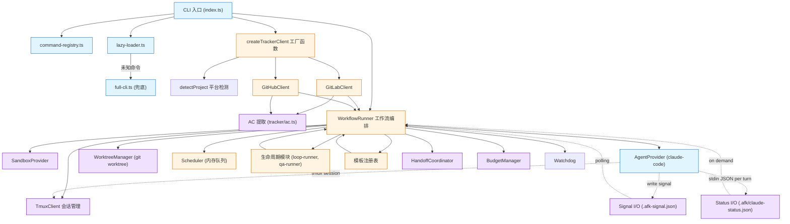

### 模块职责

| 模块 | 职责 | 关键设计决策 |
|------|------|-------------|
| **command-registry.ts** | 所有 CLI 命令的单一数据源 | 一个数组同时支持懒加载器和 full-cli |
| **lazy-loader.ts** | 按命令动态 import | 快速路径: ~50ms 冷启动 |
| **full-cli.ts** | 未知命令时加载全部的兜底 | 并行 `Promise.all` 加载 |
| **index.ts** | 极简 CLI 分发器 | 导入时不加载共享日志栈 |
| **WorkflowRunner** | 编排完整生命周期 | 模板驱动 + handoff + budget + AC 客观验证 |
| **SandboxProvider** | Agent 运行环境抽象 | Local (tmux) 或 Container (Docker/Podman) |
| **AgentProvider** | AI agent 抽象 | claude-code, cursor, copilot, codex, opencode, pi |
| **HandoffCoordinator** | 上下文溢出管理 | 协商摘要 → 持久化文档 → 发评论 → 重启 |
| **BudgetManager** | Token 和 handoff budget 追踪 | 追踪跨 handoff 生成的总 token |
| **Watchdog** | 硬超时保护 | `setsid` 独立进程，即使父进程崩溃也能触发 |
| **AC 提取** | 从 issue labels / 旧 markdown 提取 AC | 标签驱动优先，markdown 兼容 |
| **WorktreeManager** | 每个 Issue 独立工作区 | 物理隔离，避免分支冲突 |
| **TmuxClient** | Agent 运行环境 | 独立会话，崩溃不互相影响 |
| **Signal I/O** | Agent↔Runner 控制通信 | 文件原子写入，Zod 校验 |
| **Status I/O** | 读取 Claude statusline JSON | token 客观数据源 |
| **Scheduler** | 多 Issue 并发调度 | 内存队列 + 优先级，无 Redis 依赖 |
| **生命周期模块** | 可扩展的运行器 | loop-runner (持续集成), qa-runner (验证), isolate (DB隔离) |
| **模板注册表** | 工作流模板加载 | 内置模板 + 自定义模板支持 |

---

## 关键设计决策

### 1. 为什么是文件信号，不是 IPC？

Agent 运行在 tmux session 中，与调度系统是**进程隔离**的。考虑过三种通信方式：

| 方案 | 优点 | 否决原因 |
|------|------|---------|
| Unix Socket | 低延迟 | 跨进程生命周期管理复杂，Agent 崩溃后 socket 残留 |
| HTTP 长连接 | 可双向推送 | 需要在 Agent 内常驻服务，违反"无侵入"原则 |
| **文件信号** | **进程崩溃后状态可恢复** | **采用** |

**关键设计：**
- 原子写入（tmp + rename），避免读到半截 JSON
- Zod schema 校验，版本不兼容时快速失败

### 1b. 上下文溢出检测

**Runner 轮询 statusline，Agent 不参与**：Runner 每轮询周期读取 `<worktree>/.afk/claude-status.json` 的 token 计数（statusline 每个 turn 写入），与 `CONTEXT.HIGH_THRESHOLD`（默认 100K）比较，达到阈值即触发 handoff。信号协议中不存在 context_high。

这避免了"被评估者自评"的偏差——LLM 对自己状态的判断并不可靠（TUI 警告在渲染层不可见），应由系统基于客观数据做决策。

### 1c. AC 用 issue label 表达，不用 markdown 正则

GitLab/GitHub API 都不返回结构化 checklist。原先的正则解析 `- [ ]` 极度脆弱——中文标题、缩进、emoji、数字列表等变体均失效。

**改用 label 表达 AC**：每条 AC 是一个 label（`ac::1:: 用户能登录`），平台 API 直接返回结构化数组，可服务端筛选。

旧 markdown 章节保留作为 fallback（best-effort），无需迁移。详见 `src/lib/core/tracker/ac.ts`。

### 1d. 不用 pane capture + 正则做状态判断

Agent 状态检测（prompt 是否就绪、timeout 是否触发、信号是否完成）一律走：
- **文件信号**（`.afk-signal.json`）
- **状态文件**（`.afk/claude-status.json`）
- **结构化 API**（GitLab/GitHub SDK 直接调用）

不用 `tmux capture-pane` + 正则/字符串匹配，因为：
- Claude Code UI 主题/字体变化会导致字符（❯/›/➜/▶）改变
- pane 输出依赖颜色码、ANSI 转义
- 多 pane 边界和宽字符让正则易错

剩余 `capturePane` 调用仅用于**写日志快照**（运维归档）和 CLI `afk tmux capture`（用户主动调用），不用于状态判断。

### 2. 为什么是 Worktree，不是 Docker？

| 方案 | 启动开销 | 隔离强度 | 磁盘占用 |
|------|---------|---------|---------|
| Docker 容器 | 5-10s | 进程级 | GB/容器 |
| **git worktree** | **<1s** | **文件级** | **MB/worktree** |

Agent 需要的是**分支隔离**，不是**进程隔离**。worktree 共享 `.git` 目录但工作区独立，切换开销几乎为零。

### 3. 为什么需要 Watchdog？

Agent 可能因为以下原因卡住：
- 等待用户输入（不该发生，但 skill 设计缺陷时会有）
- 死循环或递归调用
- 网络请求 hang

**两层防护：**
- `completionTimeoutMs`（默认 5min）：软超时，触发 signal 检测
- `hardTimeoutMs`（默认 60min）：硬超时，watchdog 直接 `kill-session`

watchdog 用 `setsid` 启动独立进程，**即使父进程崩溃也能触发**。

### 4. 为什么 AC 失败要重试而不是直接 HITL？

AC 失败的常见原因：
- Agent 误解需求（50%）→ 重试 + 更明确的 AC 通常能通过
- 真正的实现缺陷（30%）→ 重试 + 修改代码
- 需求本身有问题（20%）→ 需要 HITL

直接升级到 HITL 会把 80% 的可自动化场景拱手让给人类。**重试机制保留自动化的核心价值**。

---

## 跨平台抽象层

### 分层架构

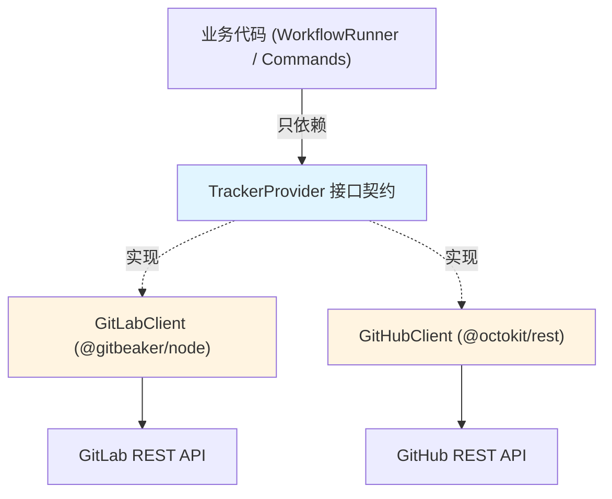

**核心原则：差异封装在 client 内部，接口保持语义一致。**

### 平台差异处理

| 差异 | GitLab | GitHub | 抽象策略 |
|------|--------|--------|---------|
| Issue ID | `iid` | `number` | 统一为 `id: number` |
| 创建 MR 加标签 | API 原生支持 | 需额外 API 调用 | GitHubClient 内部自动处理 |
| 合并时删分支 | `removeSourceBranch` 参数 | 单独 `git.deleteRef` | 封装在 `mergeMR()` 中 |
| Issue 关联 | 原生 `Issues.link()` | 只能通过评论引用 | GitHubClient 降级为评论 |

### 平台检测流程

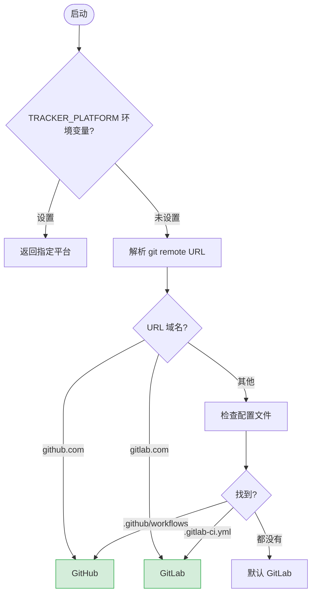

**检测优先级：** 环境变量 > git remote > 配置文件 > 默认 GitLab

---

## 信号协议

### 两种数据通道

系统通过两条通道与 Agent 通信，各有侧重：

| 通道 | 数据 | 写入方 | 读取方 | 用途 |
|------|------|--------|--------|------|
| `.afk-signal.json` | 控制事件 | Agent | Runner 轮询 | goal_complete / ac_result / timeout / handoff_ready |
| `.afk/claude-status.json` | 客观状态 | Claude Code statusline | Runner 按需 | token 计数、模型、上下文窗口 |

**设计原则：控制信号走文件（Agent 主动），状态数据走 statusline（引擎自动推送）**。

### 信号类型（控制通道）

| 信号 | 触发场景 | 系统响应 |
|------|---------|---------|
| `goal_complete` | Agent 完成目标 | 进入 AC 验收 |
| `ac_result` | AC 检查结果 | PASS→创建 MR，FAIL→重试或升级 |
| `timeout` | 硬超时 | 捕获日志，添加 `mode::timeout` 标签 |
| `handoff_ready` | 上下文切换完成 | 关闭旧 session，启动新 session |

上下文溢出不是信号：Runner 轮询 statusline token 计数与 `CONTEXT.HIGH_THRESHOLD` 比较后直接触发 handoff。

### 信号生命周期

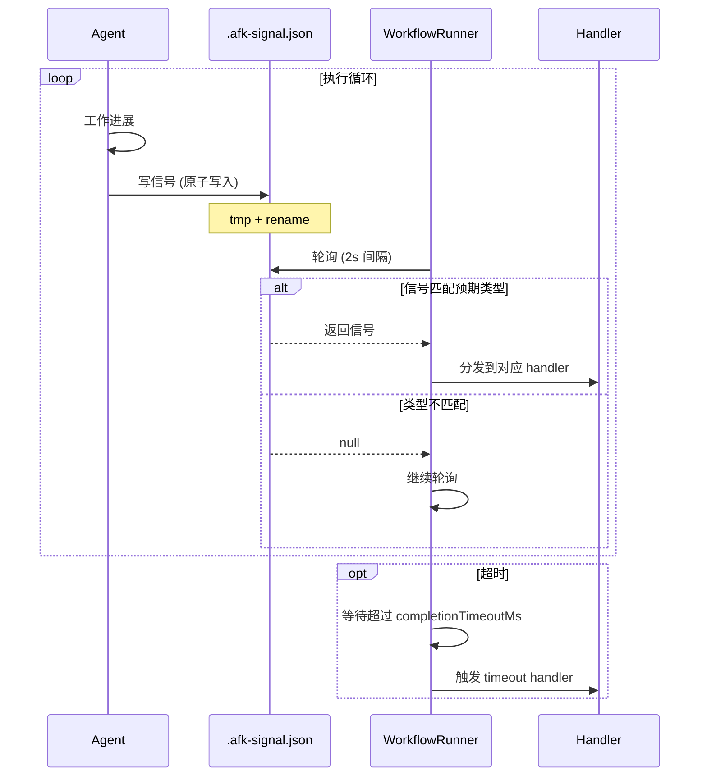

### 状态数据流（状态通道）

Claude Code statusline 在每回合自动通过 stdin 推送 JSON payload。AFK 在 worktree 创建时自动配置 statusline 用 tee 命令同时写入文件，并写一个 placeholder 文件以便 Runner 立即检测 prompt-ready：

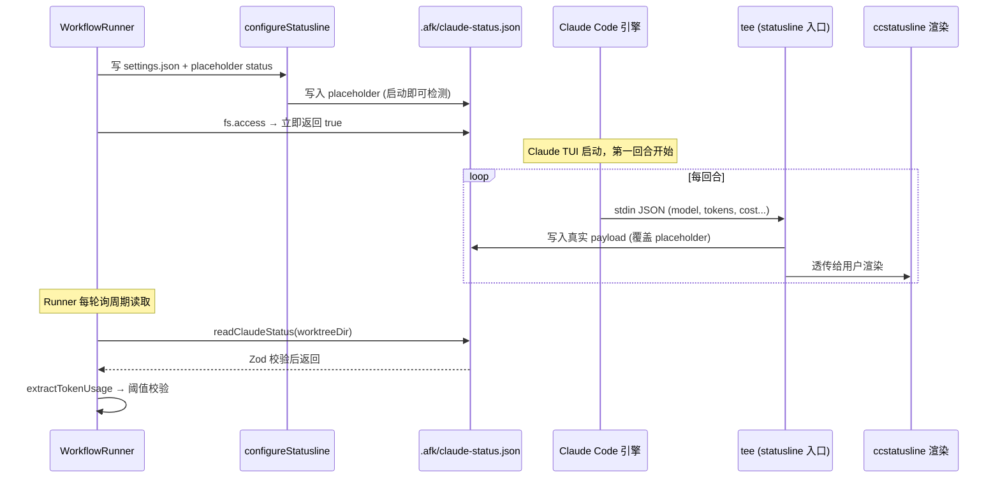

**Status JSON schema (Zod):**

```typescript
{
  model: { display_name: string },
  context_window: {
    context_window_size: number,           // e.g., 200000
    current_usage: {
      input_tokens: number,
      output_tokens: number,
      cache_creation_input_tokens: number,
      cache_read_input_tokens: number,
    }
  },
  session_id: string,
  // ... 其他字段忽略
}
```

### 为什么 Zod 校验？

信号文件跨进程边界，**格式错误是常态而非异常**：
- Agent skill 版本不匹配
- 手动编辑的测试信号
- 网络问题导致写入中断

Zod 在边界处快速失败，比让 `undefined.sha` 这种错误传播到深处再崩溃要好。

---

## WorkflowRunner 流程

### 核心架构

WorkflowRunner 采用**模板驱动、多阶段设计**：

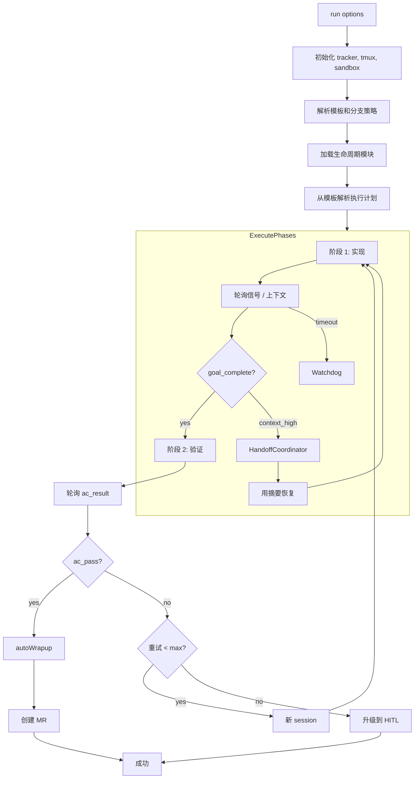

### 两阶段设计

**阶段 1 (实现)：** 发送 `/goal "实现 issue #N"` → 等待 `goal_complete` 信号或上下文阈值

**阶段 2 (验证)：** 发送 `/goal "验证 issue #N 的 AC"` → 等待 `ac_result` 信号

**autoWrapup：** 推送分支 → 创建 MR → 添加 `stage::qa` 标签

### Handoff 系统

当上下文阈值达到时：
1. **HandoffCoordinator** 与 agent 协商摘要
2. 将摘要持久化到 handoff 文档
3. 将摘要作为 issue 评论发布
4. 用注入的摘要重新启动 session
5. 继续直到阶段完成或 budget 耗尽

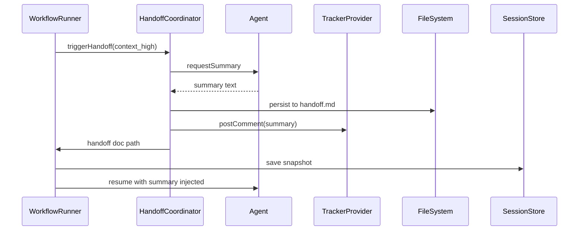

### autoWrapup 的关键设计

**AC 验收不依赖 Agent 自评**。Runner 做客观校验：

1. 推送分支到 origin
2. `verifyAC()` 客观校验：
   - 分支相对 baseBranch 有 commit（不是空仓库）
   - issue 有 AC 条目（labels 或 markdown）
3. Agent 发 `ac_result` 信号作为**提示**，不是门控
4. **Runner 自己做裁决**，把评估责任从"被评估者"移到"评估者"

### AC 数据来源

AC 支持两种格式，优先 labels：

```yaml
# 推荐: ac::1::... labels（结构化）
labels:
  - ac::1:: 用户能登录
  - ac::2:: 看到欢迎页

# 兼容: ## AC markdown section（best-effort 解析）
description: |
  ## AC
  - [ ] 用户能登录
  - [ ] 看到欢迎页
```

### 重试机制

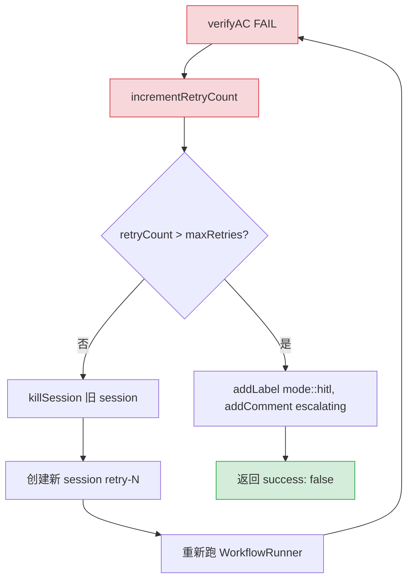

**关键：每个 retry 都是新 session**，不是同一个 session 继续跑。这避免了上下文污染，也符合 Claude Code 的会话独立性。

---

## Scheduler 设计

### 为什么需要 Scheduler？

`afk implement <iid>` 是单次命令。Scheduler 解决：
- **自动发现**：轮询 GitLab 找 `stage::ready-for-implement` 的 Issue
- **并发控制**：避免一台机器跑 10 个 Agent 把 CPU/内存打爆
- **优先级调度**：`priority::high` 优先于 `priority::low`
- **失败重试**：内存队列 + 指数退避

### 调度流程

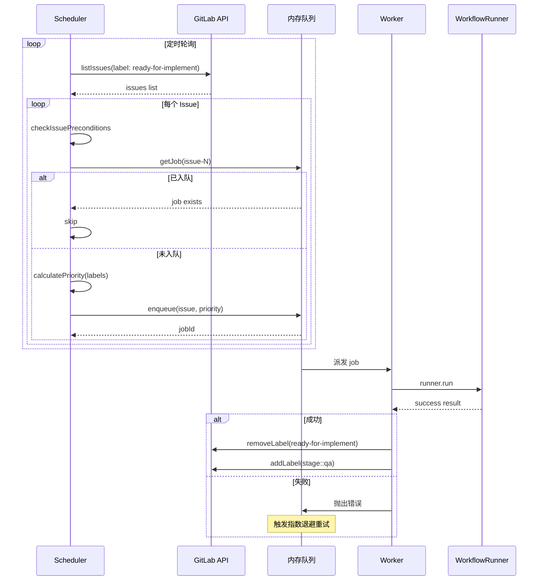

### 优先级映射

| 标签 | 优先级 |
|------|--------|
| `priority::high` | 10 |
| `priority::medium` | 5 |
| `priority::low` | 1 |
| （无） | 5 |

**去重机制：** `queue.getJob('issue-123')` 检查是否已入队，避免重复提交。

---

## CLI 命令系统

### 入口 (`src/index.ts`)

CLI 入口是一个**极简分发器**（~50 行），刻意保持轻量以维持懒加载性能：

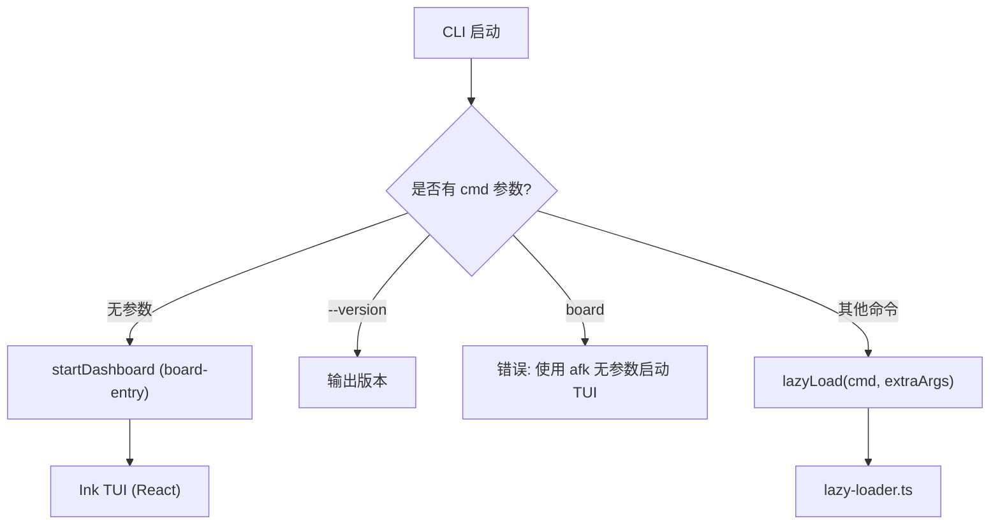

**设计原则：** 导入时不加载共享日志栈。用户输出通过命令内的 `cli-utils` helpers 完成。入口只处理版本契约和兜底错误。

### 命令注册表 (`src/command-registry.ts`)

**单一数据源**。一个 `COMMANDS` 数组同时支持懒加载器（快速路径）和 full-cli（兜底），避免两者不一致：

```typescript
export const COMMANDS: CommandEntry[] = [
  { names: ['signal'], loader: () => import('./commands/signal.js').then(m => m.registerSignalCommands) },
  { names: ['issue', 'mr'], loader: () => import('./commands/tracker.js').then(m => m.registerTrackerCommands) },
  { names: ['tmux'], loader: () => import('./commands/tmux.js').then(m => m.registerTmuxCommands) },
  { names: ['worktree'], loader: () => import('./commands/worktree.js').then(m => m.registerWorktreeCommands) },
  { names: ['workflow'], loader: () => import('./commands/workflow.js').then(m => m.registerWorkflowCommands) },
  { names: ['scheduler'], loader: () => import('./commands/scheduler.js').then(m => m.registerSchedulerCommands) },
  { names: ['board'], loader: () => import('./commands/board.js').then(m => m.registerBoardCommands) },
  { names: ['kanban'], loader: () => import('./commands/kanban.js').then(m => m.registerKanbanCommands) },
  { names: ['debug'], loader: () => import('./commands/debug.js').then(m => m.registerDebugCommands) },
  { names: ['escalate'], loader: () => import('./commands/escalate.js').then(m => m.registerEscalateCommands) },
  { names: ['isolate'], loader: () => import('./commands/isolate.js').then(m => m.registerIsolateCommands) },
  { names: ['qa'], loader: () => import('./commands/qa.js').then(m => m.registerQACommands) },
  { names: ['loop'], loader: () => import('./commands/loop.js').then(m => m.registerLoopCommands) },
  { names: ['completion', '__complete'], loader: () => import('./commands/completion.js').then(m => m.registerCompletionCommands) },
];
```

### 懒加载器 (`src/lazy-loader.ts`)

按命令动态 import — 快速路径：

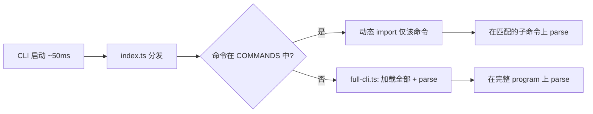

**为什么？** 加载所有命令的依赖会拖慢 `afk --help` 这种轻量命令的响应。懒加载把冷启动从 ~500ms 降到 ~50ms。

### Full-CLI 兜底 (`src/full-cli.ts`)

对于未知命令，并行加载所有模块作为兜底：

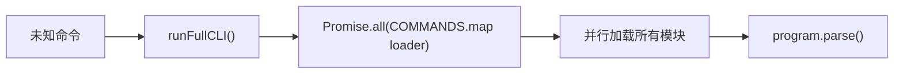

### 命令结构

| 命令 | 注册函数 | 说明 |
|------|---------|------|
| `afk signal` | `registerSignalCommands` | 结构化信号文件管理 |
| `afk issue` / `afk mr` | `registerTrackerCommands` | Issue/MR CRUD，自动检测平台 |
| `afk tmux` | `registerTmuxCommands` | Tmux 会话管理 |
| `afk worktree` | `registerWorktreeCommands` | Git worktree 列出/清理 |
| `afk workflow` | `registerWorkflowCommands` | 信号驱动工作流编排 |
| `afk scheduler` | `registerSchedulerCommands` | 内存后台调度器 |
| `afk board` | `registerBoardCommands` | TUI 仪表盘 |
| `afk kanban` | `registerKanbanCommands` | Issue 看板 |
| `afk debug` | `registerDebugCommands` | 调试循环 (复现→验证) |
| `afk escalate` | `registerEscalateCommands` | 提 issue + 启动工作流 |
| `afk isolate` | `registerIsolateCommands` | 每个 worktree 的 DB 服务隔离 |
| `afk qa` | `registerQACommands` | 合并代码的 QA 验证 |
| `afk loop` | `registerLoopCommands` | 持续集成循环 |
| `afk completion` | `registerCompletionCommands` | Shell 补全 |

**注意：** `github` / `gitlab` 旧命令组已移除。所有 issue/MR 操作走 `afk issue` / `afk mr`。

---

## 生命周期模块

模块为 WorkflowRunner 提供扩展能力：

### 模块注册表 (`src/lib/modules/_registry.ts`)

```typescript
loadModules(names: string[], params: Record<string, unknown>): LifecycleModule[]
parseModuleParams(params: string[]): Record<string, unknown>
```

### 可用模块

| 模块 | 文件 | 用途 |
|------|------|------|
| **loop-runner** | `modules/loop-runner.ts` | 持续集成循环 |
| **qa-runner** | `modules/qa-runner.ts` | 合并代码的 QA 验证 |
| **isolate** | `modules/isolate.ts` | 每个 worktree 的 DB 服务隔离 |
| **project-resolver** | `modules/project-resolver.ts` | 跨项目 issue 解析 |

### 模块加载

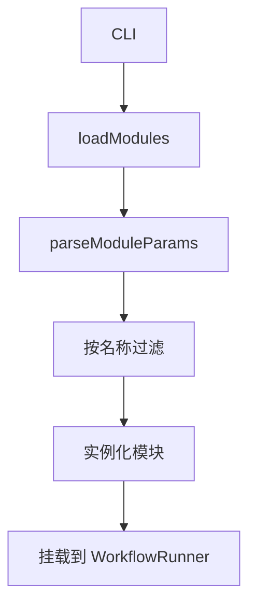

---

## 沙箱提供商

### 提供商架构

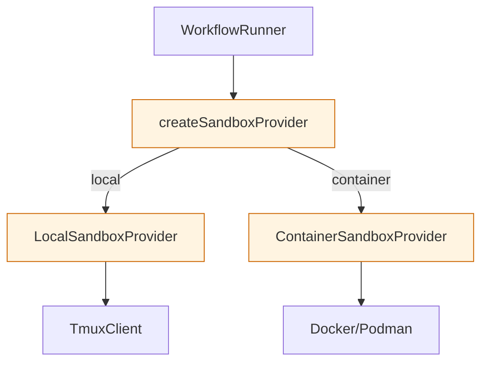

### Local 沙箱

使用 tmux session 执行 agent：
- 在专用 tmux session 中启动 agent
- 与主机共享文件系统（worktree）
- 开销低，启动快

### Container 沙箱

使用 Docker/Podman 隔离：
- 完全进程隔离
- 可配置资源限制
- 网络隔离选项

---

## Session 管理

### Session Store 链

```
FileSessionStore (原生 Claude Code 快照)
    ↓ (fallback)
HandoffSessionStore (Markdown handoff 文档)
```

### Handoff 流程

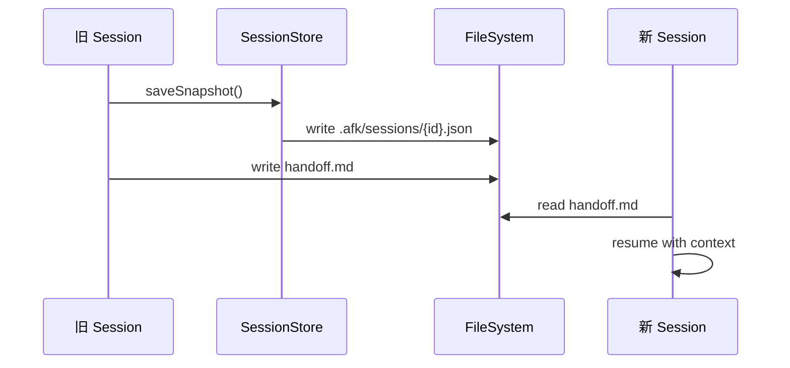

---

## 模板系统

### 模板注册表

模板定义工作流执行计划：

```typescript
planFor(name: string, ctx: PlanContext): ExecutionPlan
loadBuiltinTemplates(): Template[]
```

### 内置模板

| 模板 | 用途 |
|------|------|
| `implement` | Issue → MR 两阶段工作流 |
| `qa` | QA 验证 |
| `loop` | 持续集成 |

### 模板解析

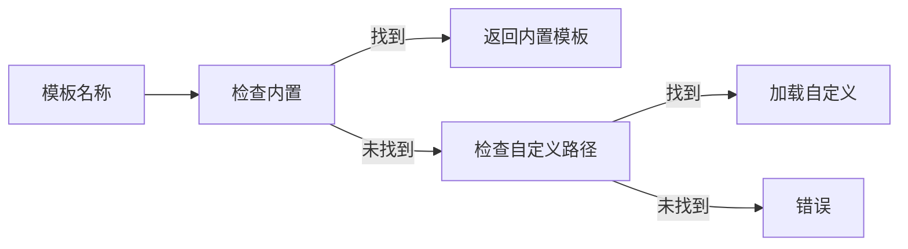

---

## 技术栈选型

| 选型 | 替代方案 | 选择理由 |
|------|---------|---------|
| **TypeScript** | Go/Rust | LLM 代码生成友好；Node 生态成熟 |
| **commander** | yargs/oclif | 轻量、API 稳定 |
| **内存队列** | BullMQ (已移除) | 轻量级优先级队列，无 Redis 依赖 |
| **tmux** | 子进程管理 | 进程隔离 + 可观测（attach 看输出） |
| **git worktree** | 分支切换 | 物理隔离，零切换开销 |
| **Zod** | io-ts/typebox | 错误信息友好，生态成熟 |
| **Ink** | blessed/ratatui | React-based，组件化 TUI |

---

## 扩展点

### 添加新平台（以 Bitbucket 为例）


### 添加新生命周期模块

1. 在 `src/lib/modules/` 创建模块
2. 实现并导出 `LifecycleModule` 接口
3. 在 `_registry.ts` 注册
4. 通过 `RunnerOptions` 的 `ext` 选项激活

### 添加新 Agent 提供商

1. 在 `src/lib/agents/` 实现 `AgentProvider` 接口
2. 在 `agents/registry.ts` 注册
3. 通过 `RunnerOptions` 的 `agentProvider` 选项激活

### 添加新信号类型

1. 在 `SignalSchema` 中定义 Zod schema
2. 在 WorkflowRunner 的 `waitForAnySignal()` 中添加新类型
3. 添加对应的 handler 方法
4. 更新 Agent skill 指令

### 自定义 AC 来源

AC 提取逻辑集中在 `src/lib/core/tracker/ac.ts`。要添加新来源（如 YAML 块、外部 AC 服务）：

1. 在 `extractAC()` 中按优先级添加新的提取函数
2. 返回 `{ items, source: 'your-source' }`
3. 调用方无需改动

### 利用 statusline 数据做更智能决策

statusline JSON 提供丰富会话元数据（token 用量、缓存命中率、成本、模型等）。除上下文检测外，未来可在这些场景用上：

| 决策 | 所需字段 | 阈值常量 |
|------|---------|---------|
| 触发提前 handoff | `cache_read_input_tokens` 占比 | 待定 |
| 成本告警 | `cost.total_cost_usd` | 待定 |
| 模型切换判断 | `model.display_name` | 配置驱动 |
| 缓存策略评估 | `cache_creation_input_tokens` 增长率 | 待定 |

---

## 状态文件

| 文件 | 内容 | 写入方 | 读取方 |
|------|------|--------|--------|
| `.afk/worktrees.json` | Worktree 元数据 | WorktreeManager | WorktreeManager / CLI |
| `<worktree>/.afk-signal.json` | 控制信号 | Agent | WorkflowRunner 轮询 |
| `<worktree>/.afk/claude-status.json` | Claude statusline payload | statusline tee（首回合覆盖 placeholder） | Runner 轮询（上下文阈值检测、prompt-ready 检测） |
| `<worktree>/.afk/CRASHED` | 异常退出标记 | watchdog | WorktreeManager |
| `<worktree>/.afk/SUCCESS` | 成功完成标记 | workflow 结束 | WorktreeManager |
| `<worktree>/.claude/settings.json` | 自动注入的 statusline 配置 | configureStatusline | Claude Code |
| `.afk/sessions/*.json` | 原生 session 快照 | FileSessionStore | Session 链 |
| `handoff.md` | 上下文 handoff 文档 | HandoffCoordinator | 新 session resume |
| `~/.claude/logs/afk/` | 超时日志、watchdog 记录 | handleTimeout / watchdog | 运维 |

---

## 常见问题

### Q: 平台检测失败

设置 `TRACKER_PLATFORM=gitlab` 或确保 `git remote -v` 包含可识别的域名。

### Q: AC 一直失败

两种情况：
1. **AC 解析失败**：检查 issue 是否含 `ac::1::...` label 或 `## AC` markdown 章节
2. **verifyAC 失败**：分支相对 baseBranch 必须有 commit；空仓库会被拦下

### Q: Worktree 占用空间

`afk worktree clean --stale` 清理 7 天未活动的 worktree。

### Q: 如何调试单个 Issue？

`afk implement <iid> --dry-run` 跳过实际执行，只打印计划。

---

## 相关文档

- [快速开始](GETTING-STARTED.md) — 安装和配置
- [工作流程](WORKFLOWS.md) — Issue → MR 完整流程
- [Skills 说明](SKILLS.md) — Claude Code skills
