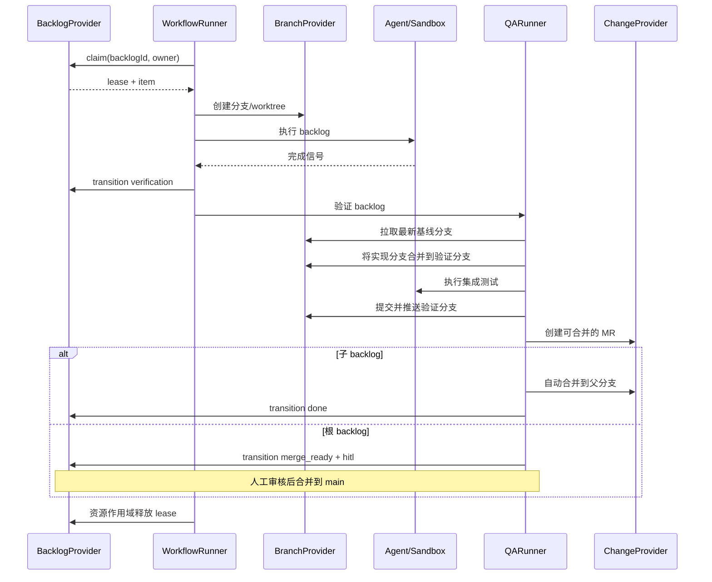

# AFK 架构

## 范围与命令

AFK 只执行外部规划器已经创建并拆分好的 backlog，不负责创建或拆分任务。
命令注册表是唯一命令来源：

| 命令 | 职责 |
| --- | --- |
| `afk backlog init` | 初始化 provider 元数据 |
| `afk backlog list/show/tag` | 查看和管理 backlog |
| `afk run --backlog-id <id>` | 认领并执行一个 backlog |
| `afk loop` | 连续执行、基线同步 QA，以及按层级合并 |
| `afk qa --backlog-id <id>` | 执行等待验证的 backlog QA |
| `afk signal`、`afk tmux`、`afk board`、`afk kanban`、`afk debug`、`afk isolate`、`afk completion` | 运维和本地工具 |

已移除的命令组没有别名。provider 的元数据标签属于 adapter 内部实现，
不是 CLI 契约。

## Provider 边界

`BacklogProvider` 是 backlog 的 canonical 来源，负责身份、标题与描述、
状态、执行模式、父子关系、依赖、业务标签以及分支映射。`BranchProvider`
负责分支和 worktree；`ChangeProvider` 负责变更请求的创建、查询和合并。
Runner 只编排这些接口，不解析平台标签。

GitHub 和 GitLab 分别由具体的 `BacklogProvider` 实现，并由 provider bundle
按平台选择。它们可以在内部复用 tracker 机制，但平台校验和生产构造位于
各自边界。未来的 Linear 等平台直接实现 `BacklogProvider`，Runner 不依赖
tracker 类型。

管理 bundle 会将具体 provider 包装为不含认领能力的 facade。其 backlog
接口提供读取、列表、元数据初始化、业务标签更新，以及 QA 所需的状态和
执行模式更新；类型和运行时都没有 `claim()`。只有执行 bundle 暴露认领和
可运行性检查。

## Backlog 生命周期

```text
ready --claim--> in_progress --> verification --> merge_ready --> done
   \                         \
    \                         +--> blocked（执行模式：hitl）
     +--> blocked（冲突、失败、超时或 lease 过期）
```

只有状态为 `ready`、执行模式为 `afk`、没有子 backlog 且所有 `dependsOn`
均为 `done` 时，条目才可运行。`parentId` 用于聚合子 backlog，父 backlog
本身不可运行。任何自动化失败、冲突、超时或不确定的 lease 恢复都必须将
条目转为 `blocked` 并切换到 `hitl`。

## 认领与本地文件系统 fallback

Provider 支持原生条件认领（CAS）时优先使用。否则在
`${AFK_STATE_DIR:-~/.afk/state}` 下取得持久化 lease；持有期间重新读取并
校验 backlog，执行 `ready -> in_progress`，再读取确认。Runner 通过资源
作用域维护 heartbeat，并在成功、失败、超时、崩溃和 handoff 时 exactly once
释放 lease。

文件系统 lease 只协调单机本地可信文件系统上的 worker，不提供多机共识或
跨主机崩溃恢复。多机执行必须使用 provider 原生 CAS（仅共享文件系统并
不足够）。路径按 provider、项目
和 backlog ID 命名空间隔离；符号链接路径会被拒绝；过期 lease 默认 fail-closed，
只有 provider 已持久化 `blocked` 与 `hitl` 后才允许恢复。

## 完整流程



`afk loop` 在进程内复用同一流程并集成 QA；独立 `qa` 命令使用管理 bundle，
不会认领实现任务。实现阶段只推送 feature 分支；QA 负责拉取最新基线、合并、
执行集成测试、提交、推送并创建可合并的 MR。子 backlog 自动合并到父分支，根
backlog 进入 `merge_ready + hitl`，等待人工审核后合并到 `main`。

## 扩展机制

插件运行时可以注册 provider。每个 provider 必须完整实现 `BacklogProvider`，
包括父子关系、依赖校验、状态与执行模式、业务标签和认领策略。平台客户端
封装在 provider 内部。系统不引入数据库或额外中间件；本地状态只使用文件
系统 lease 目录。

## 可靠性规则

- 任何失败转换、冲突、超时或 lease 过期都进入 `blocked + hitl`，不会静默
  作为自动任务重试。
- 优先使用原生认领；文件系统 fallback 仅适用于单机上的本地可信文件系统。
- lease 清理由生命周期统一管理且必须幂等。
- backlog ID 通过 provider-neutral 函数确定性映射到分支名。
