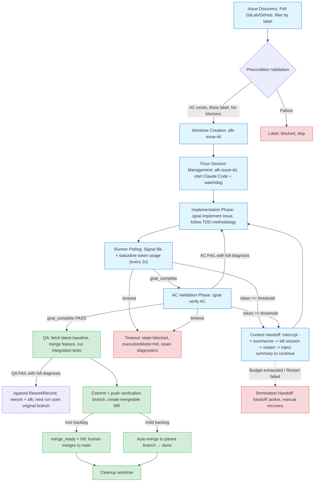
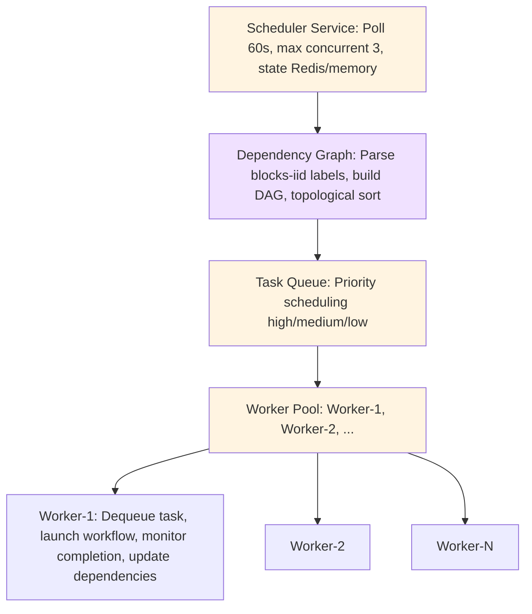
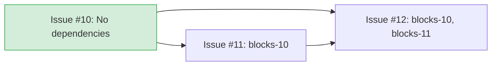
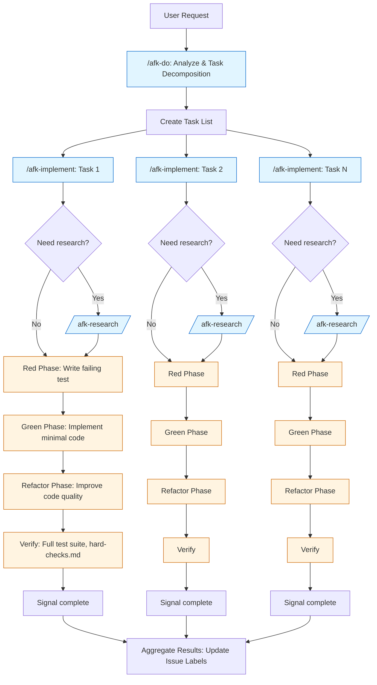
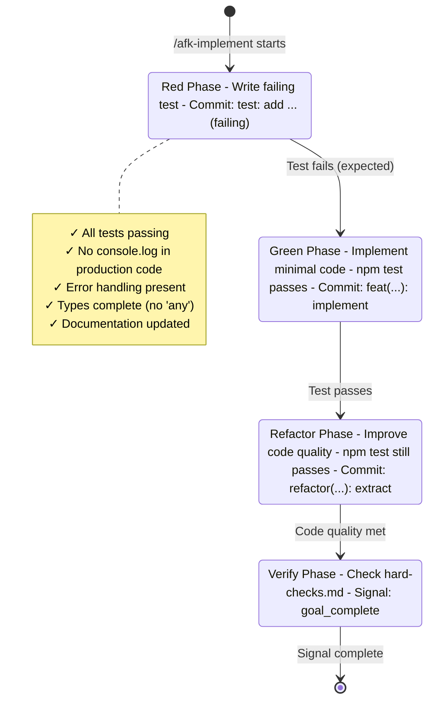
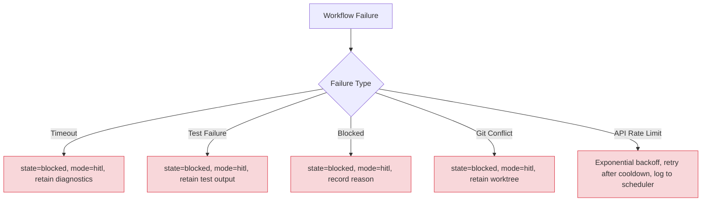
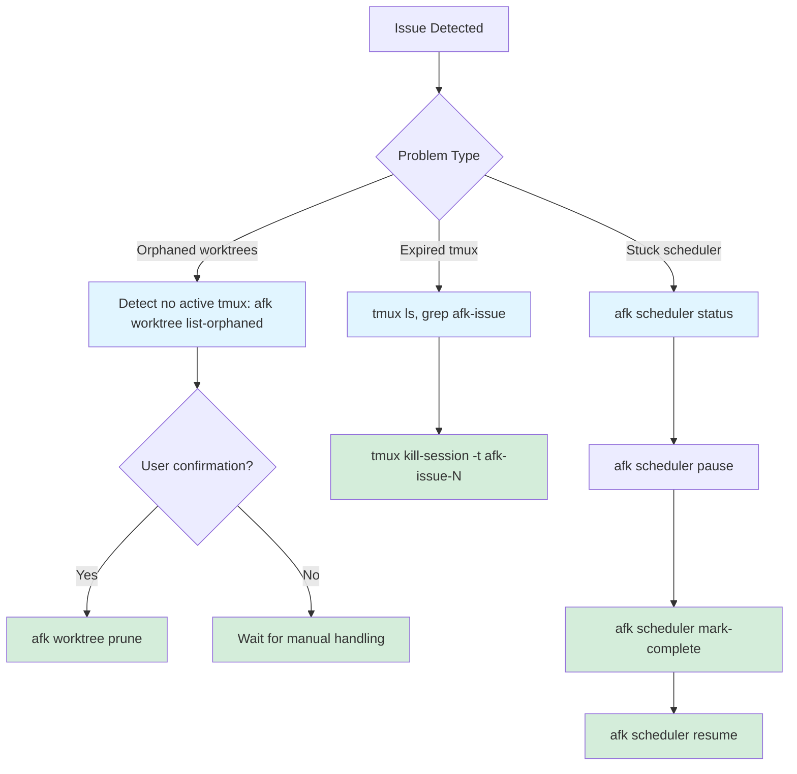
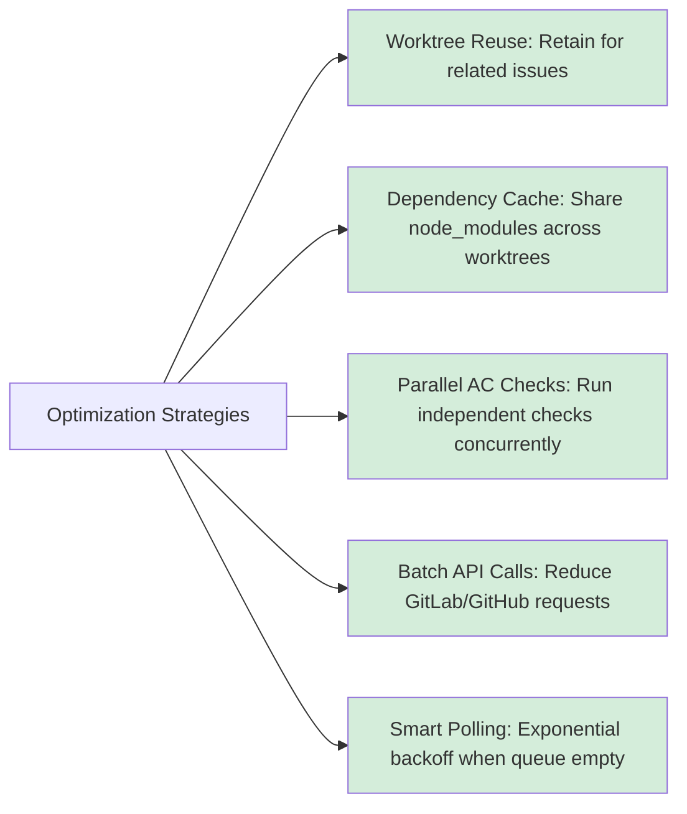

# AFK Workflows

> Breaking CLI note: use `afk backlog` for management,
> `afk run --backlog-id <id>` for one item, `afk loop` for the complete
> implementation → QA → merge pipeline, and `afk qa --backlog-id <id>` for
> standalone verification. There are no issue, tracker, or workflow aliases.

AFK executes backlog items prepared outside the runner. A backlog item may be a GitHub/GitLab issue today, but the runner depends only on `BacklogProvider`, `BranchProvider`, and `ChangeProvider`.

The loop atomically claims a canonical `ready` or `rework` item, verifies parent/dependency constraints, reuses its `afk/backlog-<id>` branch, runs the selected template, pushes the implementation branch, and queues QA. A complete implementation-stage AC failure is corrected in the same run and worktree up to `AFK_MAX_SELF_ITERATIONS` (default 2). QA first synchronizes the latest baseline branch, merges the implementation branch into a disposable verification branch, runs integration tests, commits and pushes the result, then creates a mergeable change request. A root backlog enters `merge_ready + hitl` for human approval into `main`; a child backlog is automatically merged into its parent branch.

Integration QA is cross-process, so a diagnosable QA `FAIL` creates a persistent, append-only `ReworkRecord` in the provider Issue (GitHub comment or GitLab note), sets `rework + afk`, and lets the next AFK run repair the original branch with the record injected into its implementation prompt. QA PASS resolves exactly that open record. An ambiguous result, conflict, timeout, agent failure, or exhausted AC self-correction loop becomes `blocked + hitl`.

### Agent provider selection

Claude Code remains the default agent provider. Select Codex explicitly when
testing or running a Codex-backed chain:

```bash
afk run --backlog-id 123 --agent codex --execution-mode batch
afk qa --backlog-id 123 --agent codex --mode batch
afk loop --agent codex --max-iterations 1
```

AFK resolves `codex` directly from `PATH`; it does not install or wrap the
binary. In batch mode AFK writes the provider-neutral execution prompt to
stdin and parses Codex JSONL output. A loop uses the selected provider for
both implementation and QA, and the Tasks projection and runtime diagnostics
record `agentProvider: codex` for each phase.

#### Codex runtime selection

The same Codex runtime options are available on `afk run`, `afk loop`, and
`afk qa`:

```bash
--agent-transport auto|exec|app-server
--agent-auth auto|chatgpt|api
--agent-provider <model-provider>
--agent-profile <host-profile>
--agent-app-server stdio://|unix://PATH|ws://HOST:PORT|wss://HOST:PORT
--agent-app-server-auth-env <environment-variable>
```

Resolution is deterministic: command-line overrides win over `.afk/config.yml`,
then host Codex diagnostics fill `auto` values. `auto` transport selects
`app-server` only when an endpoint is explicitly configured; otherwise it
selects `exec`. Explicit provider values are passed to both the readiness
probes and the selected execution transport. A profile is exec-only: AFK
applies it to the live exec probe and final exec process, but never passes it
to `codex doctor` or `codex app-server`. Selecting app-server together with a
profile is rejected before execution. AFK never reads or copies raw Codex
credentials.

`stdio://` starts a new host `codex app-server` process and is supported only
by the local sandbox. `unix://`, `ws://`, and `wss://` connect directly to a
configured server; WebSocket bearer tokens are read from the named environment
variable and are never persisted. AFK cannot attach to the private stdio
process owned by the Codex desktop UI, but a process it starts uses the same
host Codex configuration and login cache.

Before Loop polls or claims a backlog, AFK runs redacted `codex doctor --json`.
For `exec` and spawned stdio it also performs a bounded, ephemeral, read-only
model call so a cached but rejected API key cannot pass readiness. Remote
app-server modes perform the JSON-RPC handshake and a bounded read-only live
turn through the configured endpoint; opening a socket alone is not considered
ready. Connection setup uses the same startup timeout and actively terminates
a socket that never opens. Failures use fixed messages (`CLI_NOT_FOUND`,
`AUTH_INVALID`, `PROVIDER_INVALID`, or `ENDPOINT_UNREACHABLE`) and create no
backlog claim.

Codex-specific Tasks diagnostics expose only transport, auth mode, provider
name, endpoint kind, and app-server thread ID. To recover from readiness failure, repair the
selected host Codex login/provider or endpoint, verify `codex doctor --json`,
then rerun the same AFK command. A real opt-in matrix is available with:

```bash
npm run test:e2e:codex -- --transport exec
npm run test:e2e:codex -- --transport app-server
```

An explicit E2E invocation exits nonzero on readiness or workflow failure; it
never reports a skip. A successful root backlog finishes as
`merge_ready + hitl` and prints both the backlog and merge-request URLs.

## Overview

AFK implements three primary workflow patterns:
1. **Issue → Implementation → MR Pipeline**: Manual or automated issue handling
2. **Scheduler Workflow**: Background dependency-aware execution
3. **Skills Workflow**: TDD methodology integration

## Issue → Implementation → MR Pipeline

End-to-end workflow from issue discovery to merge request.

### Manual Execution

```bash
# 1. Inspect and manage backlog
afk backlog list --state ready --mode afk

# 2. Execute one externally-created backlog item
afk run --backlog-id 123

# 3. Monitor progress (workflow runs in tmux session)
tmux attach -t afk-issue-123

# 4. Run acceptance criteria checks
afk qa --backlog-id 123

# 5. QA creates the merge request after baseline sync and integration tests
# Root backlogs wait for human approval; child backlogs merge into their parent branch.

# 6. Cleanup worktree
afk worktree cleanup --iid 123
```

### Automated Execution (Scheduler)

```bash
# Start the complete implementation and QA loop
afk loop --max-concurrent 3 --poll-interval 60

# Scheduler automatically:
# 1. Polls for backlog items with state=ready|rework and mode=afk
# 2. Validates preconditions (AC, base label, no blockers)
# 3. Launches workflows up to max-concurrent limit
# 4. Runs QA against the latest baseline, then creates a mergeable MR
```

### Workflow Phases



## Scheduler Workflow

Dependency-aware background execution system.

### Architecture



### Dependency Resolution

Issues declare dependencies via labels:

```
Backlog #10: parent=prd-1, state=ready, mode=afk
Backlog #11: parent=prd-1, dependsOn=[10], state=ready, mode=afk
Backlog #12: parent=prd-1, dependsOn=[10, 11], state=ready, mode=afk
```



Scheduler execution order:
1. **#10** starts first (no dependencies)
2. **#11** waits for #10 to complete
3. **#12** waits for both #10 and #11 to complete

### Concurrency Control

```typescript
// Pseudocode
class Scheduler {
  maxConcurrent: number = 3;
  activeWorkers: Set<Worker> = new Set();

  async processQueue() {
    while (activeWorkers.size < maxConcurrent) {
      const task = queue.dequeue();  // Get highest priority ready task
      if (!task) break;

      const worker = new Worker(task);
      activeWorkers.add(worker);

      worker.on('complete', () => {
        activeWorkers.delete(worker);
        this.notifyDependents(task.id);  // Unblock blocked tasks
      });

      worker.start();
    }
  }
}
```

### Task State Machine

```mermaid
stateDiagram-v2
    [*] --> PENDING: Task created
    PENDING: PENDING - Initial state, waiting for dependencies
    QUEUED: QUEUED - Ready, in priority queue
    RUNNING: RUNNING - Workflow executing
    COMPLETED: COMPLETED - QA passed; root may await human merge
    FAILED: FAILED - AC check failed or error
    BLOCKED: BLOCKED - Unresolvable dependency or timeout

    PENDING --> QUEUED: Dependencies satisfied
    QUEUED --> RUNNING: Worker available
    RUNNING --> COMPLETED: Success
    RUNNING --> FAILED: AC failed
    RUNNING --> BLOCKED: Timeout/unresolvable

    COMPLETED --> [*]
    FAILED --> [*]
    BLOCKED --> [*]
```



## Skills Workflow

Integration with Claude Code skills for TDD methodology.

### Skill Invocation Chain



### Skill Communication

Skills communicate via three mechanisms:

1. **Task System** (TaskCreate/TaskUpdate):
   ```typescript
   TaskCreate({
     subject: "Implement user authentication",
     description: "Add login endpoint with JWT",
   });
   // Later: TaskUpdate({ taskId: "1", status: "completed" });
   ```

2. **Signal Files** (`.afk-signal.json`):
   ```json
   {
     "type": "goal_complete",
     "timestamp": "2026-07-27T10:30:00Z",
     "sha": "abc123def456",
     "summary": "Authentication implemented, 5 tests passing"
   }
   ```

3. **Git State** (commits, branches):
   - Progress commits: `wip: add login endpoint`
   - Final commits: `feat(auth): implement user authentication`

### TDD Methodology Integration



**Red Phase:**
```bash
# /afk-implement first creates failing test
$ afk workflow run --iid 123
# Claude writes tests
$ npm test
# ❌ Tests fail (expected)
# Progress commit: "test: add authentication test (failing)"
```

**Green Phase:**
```bash
# Claude implements minimal code to pass tests
$ npm test
# ✅ Tests pass
# Progress commit: "feat(auth): implement login endpoint"
```

**Refactor Phase:**
```bash
# Claude improves code quality
$ npm test
# ✅ Tests still pass
# Progress commit: "refactor(auth): extract token validation"
```

**Verification:**
```bash
# Check references/hard-checks.md requirements
✓ All tests passing
✓ No console.log in production code
✓ Error handling present
✓ Types complete (no 'any')
✓ Documentation updated

# Signal complete
$ cat .afk-signal.json
{
  "type": "goal_complete",
  "sha": "final-commit-sha",
  "summary": "Authentication complete: 8 tests passing"
}
```

### Workflow Orchestration in afk-do

`/afk-do` orchestrates the complete workflow:

1. **Parse issue** into discrete tasks
2. **For each task**:
   - Check if research is needed (`/afk-research`)
   - Invoke `/afk-implement` with specific goals
   - Wait for signal (success/failure/blocked)
3. **Aggregate results** and report
4. **Update issue** labels based on results

Task decomposition example:
```
Issue #123: "Add user authentication"

Tasks:
1. Research: Review existing auth patterns → /afk-research
2. Implement: Login endpoint → /afk-implement
3. Implement: Logout endpoint → /afk-implement
4. Implement: Session middleware → /afk-implement
5. Verify: Integration tests → /afk-implement
```

## Signal Types

Workflows communicate state via typed signals (written to `<worktree>/.afk-signal.json`, written by agent or watchdog, polled by Runner):

```typescript
type SignalType =
  | 'goal_complete'    // Phase 1 complete: implementation delivered (summary required)
  | 'ac_result'        // Phase 2 complete: AC validation result
  | 'timeout'          // watchdog hard timeout (written by forked process)
  | 'handoff_ready'    // Handoff summary complete (summary required)

interface Signal {
  type: SignalType;
  timestamp: string;
  summary?: string;        // required for goal_complete / handoff_ready
  sha?: string;            // Git commit SHA
  result?: 'PASS' | 'FAIL'; // for ac_result
  tests_run?: number;
  tests_passed?: number;
}
```

## Context Handoff

When context approaches its limit, the workflow **automatically interrupts the current Claude session, hands off context, and restarts the session to continue execution** — rather than terminating and waiting for manual recovery.

### Detection Mechanism

- **Runner polls statusline**: The agent cannot reliably perceive its own context limit (Claude Code's TUI warnings are invisible at the rendering layer, and the compression system message arrives too late). There is no context_high in the signal protocol. The Runner is the sole authority for context overflow — checks signal files and `<worktree>/.afk/claude-status.json` token usage during wait cycles (statusline writes every turn).
- **Threshold**: Absolute token count, default `CONTEXT.HIGH_THRESHOLD` = 100,000, configurable via `--context-high <tokens>`.
- **Signal priority**: If agent has already written a completion signal, no interruption occurs (signal file check takes precedence over token check).

### Handoff Flow (Auto-Resume)

1. **Request summary**: Type plain text handoff instructions (urge immediate brief summary) — ① `git add -A && git commit` (skip if no changes) → ② 3 quick answers (done/doing/next) → ③ write `handoff_ready` signal. If no valid `handoff_ready` within 60s (template placeholder `<summary>` counts as no summary), use pane snapshot as fallback.
2. **Handoff document**: Summary + snapshot + commit sha written to `<worktree>/.afk/handoff/handoff-<iid>-<gen>.md` (`.afk/` is already in the repo's `.gitignore`, so it won't be committed to the MR via `git add -A`; the document travels with the worktree, and the recovering agent can read it directly on resume).
3. **Recovery comment**: Issue comment records handoff progress (recovery document at time of task interruption). For termination handoffs, the comment **embeds the complete handoff document content** (no file path reference) — the recovering party gets all information from the comment alone.
4. **Restart**: Kill tmux session → clear signal files and old statusline data → recreate session with same name → restart watchdog (each generation gets a full hard timeout).
5. **Continue**: New session receives instructions to "continue implementing/verifying issue #N (read handoff document first)", looping until completion signal or another handoff.

### Budget and Fallback

- `--max-handoffs <n>` (default 3): Auto-resume round limit, shared **globally** across both phases (implementation/verification).
- `--max-total-tokens <tokens>` (default 500,000): Cumulative token limit across the entire run spanning handoff generations (each handoff adds the old session's usage; termination check = cumulative + current session usage >= limit).
- **Either budget exhausted** → Termination handoff: `handoff::active` label + comment (with termination reason, **complete handoff document content**, and recovery instructions). After manually removing the label, re-trigger `/afk-implement <iid>` to resume.
- **Restart failure** (e.g., Claude not ready within 30s) → Automatically flip to termination handoff (keep recovery comment sent), avoid crash path.

## Error Handling

### Workflow Failures



### Recovery Process



**Orphaned worktrees:**
```bash
# Detect worktrees with no active tmux session
afk worktree list-orphaned

# Cleanup with confirmation
afk worktree prune
```

**Expired tmux sessions:**
```bash
# List all afk sessions
tmux ls | grep afk-issue

# Kill specific expired session
tmux kill-session -t afk-issue-123
```

**Stuck scheduler:**
```bash
# Check scheduler status
afk scheduler status

# Pause to prevent new launches
afk scheduler pause

# Manually complete stuck task
afk scheduler mark-complete --iid 123

# Resume
afk scheduler resume
```

## Performance Considerations

### Concurrency Tuning

| Configuration | Max Concurrent | Poll Interval | Use Case |
|---------------|----------------|---------------|----------|
| Conservative | 2 | 120s | Limited resources |
| Balanced | 5 | 60s | Typical server |
| Aggressive | 10 | 30s | High-end machine |

### Per-Workflow Resource Usage

- **CPU**: 1-2 cores (Claude + tests)
- **Memory**: 500MB-1GB (Node.js process)
- **Disk**: 50-200MB (worktree + node_modules)
- **Network**: API calls + git operations

### Optimization Strategies



1. **Worktree Reuse** — Retain worktrees for related issues
2. **Dependency Cache** — Share node_modules across worktrees
3. **Parallel AC Checks** — Run independent checks concurrently
4. **Batch API Calls** — Reduce GitLab/GitHub API requests
5. **Smart Polling** — Exponential backoff when queue is empty
