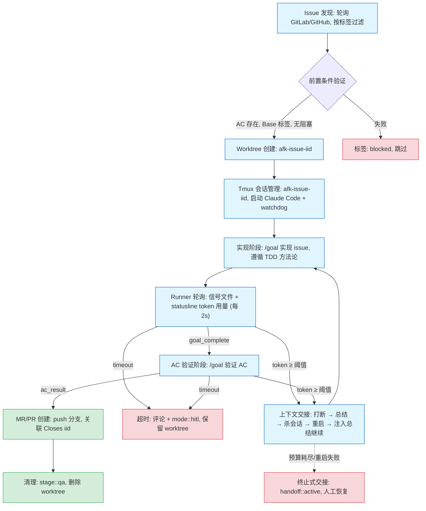
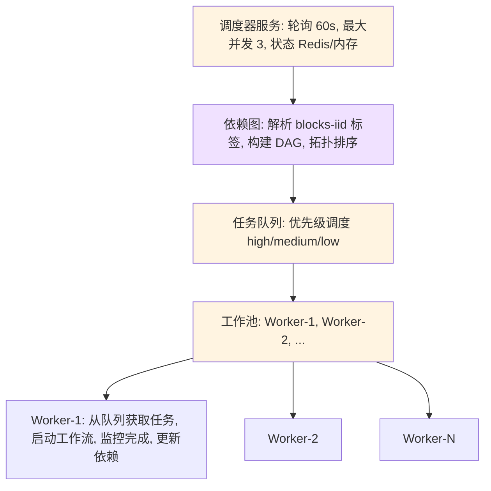
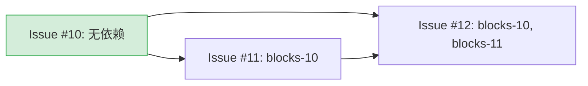
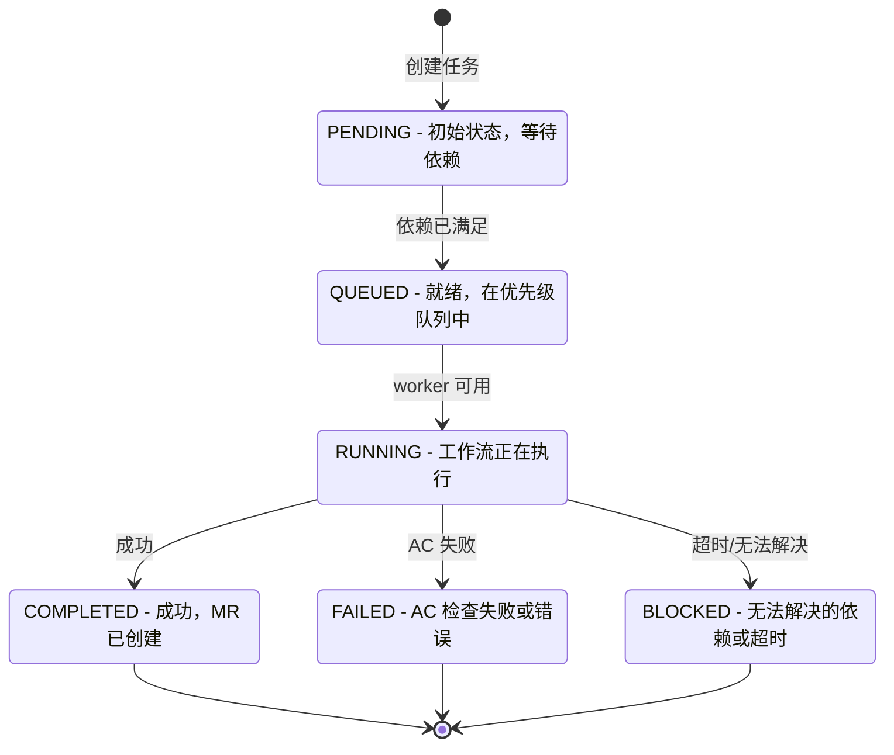
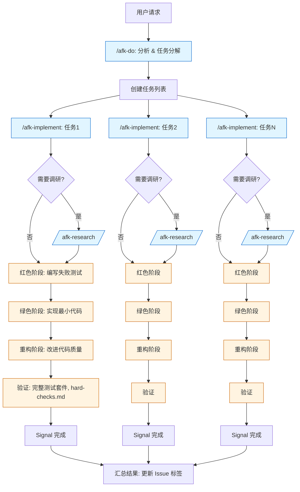
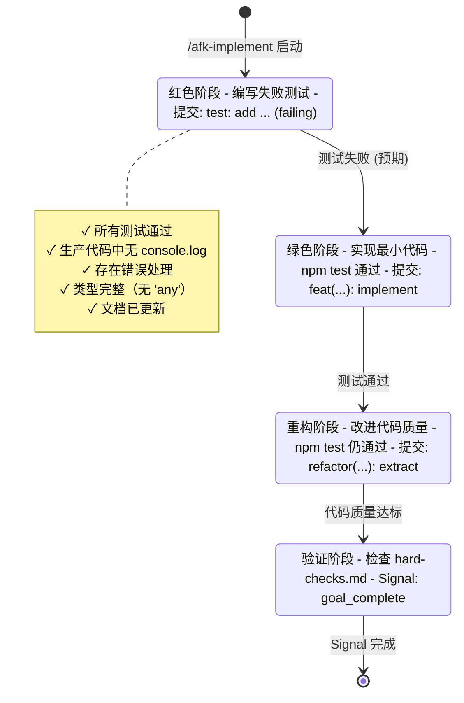
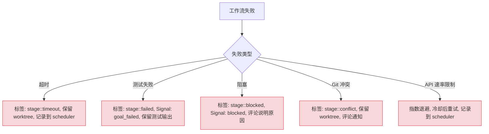
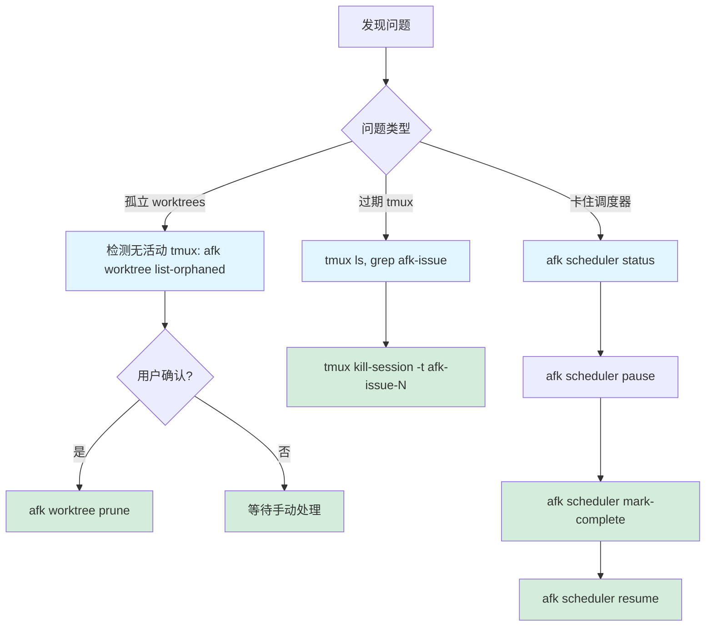
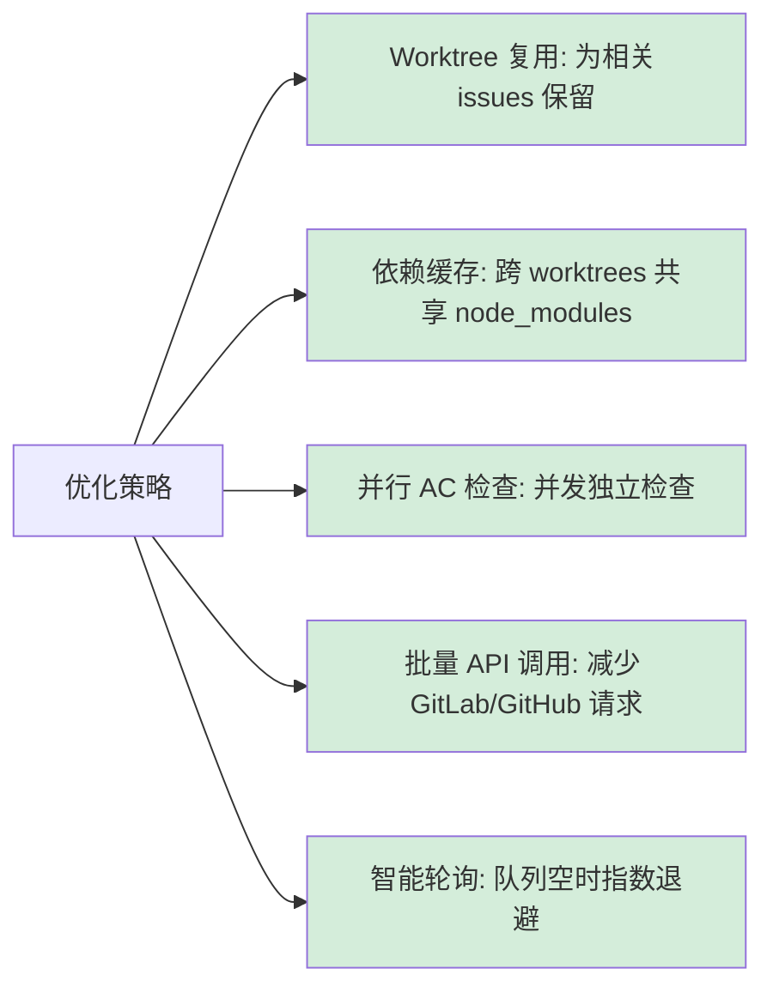

# AFK 工作流程

## 概述

AFK 实现三种主要工作流模式：
1. **Issue → 实现 → MR 流水线**：手动或自动化 issue 处理
2. **调度器工作流**：后台依赖感知执行
3. **Skills 工作流**：TDD 方法论集成

## Issue → 实现 → MR 流水线

从 issue 发现到合并请求的端到端工作流。

### 手动执行

```bash
# 1. Discover ready issues
afk issue list --label "stage::ready-for-implement"

# 2. Launch workflow for specific issue
afk workflow launch --iid 123 --base main --timeout 7200

# 3. Monitor progress (workflow runs in tmux session)
tmux attach -t afk-issue-123

# 4. Run acceptance criteria checks
afk workflow run-ac --iid 123 --session afk-issue-123 --worktree /tmp/afk-worktrees/issue-123

# 5. Create merge request if passed
afk workflow create-mr --iid 123 --worktree /tmp/afk-worktrees/issue-123

# 6. Cleanup worktree
afk worktree cleanup --iid 123
```

### 自动执行（调度器）

```bash
# Start scheduler daemon
afk scheduler start --max-concurrent 3 --poll-interval 60

# Scheduler automatically:
# 1. Polls for issues with stage::ready-for-implement
# 2. Validates preconditions (AC, base label, no blockers)
# 3. Launches workflows up to max-concurrent limit
# 4. Monitors completion and creates MRs
```

### 工作流阶段



## 调度器工作流

依赖感知的后台执行系统。

### 架构



### 依赖解析

Issues 通过标签声明依赖：

```
Issue #10: base::prd-1, stage::ready-for-implement
Issue #11: base::prd-1, blocks-10, stage::ready-for-implement
Issue #12: base::prd-1, blocks-10, blocks-11, stage::ready-for-implement
```



调度器执行顺序：
1. **#10** 首先开始（无依赖）
2. **#11** 等待 #10 完成
3. **#12** 等待 #10 和 #11 都完成

### 并发控制

```typescript
// 伪代码
class Scheduler {
  maxConcurrent: number = 3;
  activeWorkers: Set<Worker> = new Set();

  async processQueue() {
    while (activeWorkers.size < maxConcurrent) {
      const task = queue.dequeue();  // 获取最高优先级就绪任务
      if (!task) break;

      const worker = new Worker(task);
      activeWorkers.add(worker);

      worker.on('complete', () => {
        activeWorkers.delete(worker);
        this.notifyDependents(task.id);  // 解锁被阻塞任务
      });

      worker.start();
    }
  }
}
```

### 任务状态机



## Skills 工作流

与 Claude Code skills 集成，实现 TDD 方法论。

### Skill 调用链



### Skill 通信

Skills 通过三种机制通信：

1. **任务系统** (TaskCreate/TaskUpdate):
   ```typescript
   TaskCreate({
     subject: "实现用户认证",
     description: "添加带 JWT 的登录端点",
   });
   // 稍后: TaskUpdate({ taskId: "1", status: "completed" });
   ```

2. **Signal 文件** (`.afk-signal.json`):
   ```json
   {
     "type": "goal_complete",
     "timestamp": "2026-07-27T10:30:00Z",
     "sha": "abc123def456",
     "summary": "已实现认证，5 个测试通过"
   }
   ```

3. **Git 状态** (commits, branches):
   - 进度提交: `wip: add login endpoint`
   - 最终提交: `feat(auth): implement user authentication`

### TDD 方法论集成



**红色阶段：**
```bash
# /afk-implement 首先创建失败测试
$ afk workflow launch --iid 123
# Claude 编写测试
$ npm test
# ❌ 测试失败（预期）
# 进度提交: "test: add authentication test (failing)"
```

**绿色阶段：**
```bash
# Claude 实现最小代码以通过测试
$ npm test
# ✅ 测试通过
# 进度提交: "feat(auth): implement login endpoint"
```

**重构阶段：**
```bash
# Claude 改进代码质量
$ npm test
# ✅ 测试仍然通过
# 进度提交: "refactor(auth): extract token validation"
```

**验证：**
```bash
# 检查 references/hard-checks.md 要求
✓ 所有测试通过
✓ 生产代码中无 console.log
✓ 存在错误处理
✓ 类型完整（无 'any'）
✓ 文档已更新

# Signal 完成
$ cat .afk-signal.json
{
  "type": "goal_complete",
  "sha": "final-commit-sha",
  "summary": "认证完成：8 个测试通过"
}
```

### afk-do 中的工作流编排

`/afk-do` 编排完整工作流：

1. **解析 issue** 为离散任务
2. **对于每个任务**:
   - 检查是否需要调研（`/afk-research`）
   - 用特定目标调用 `/afk-implement`
   - 等待 signal（成功/失败/阻塞）
3. **汇总结果** 并报告
4. **根据结果更新 issue** 标签

任务分解示例：
```
Issue #123: "添加用户认证"

任务：
1. 调研: 审查现有认证模式 → /afk-research
2. 实现: 登录端点 → /afk-implement
3. 实现: 登出端点 → /afk-implement
4. 实现: 会话中间件 → /afk-implement
5. 验证: 集成测试 → /afk-implement
```

## Signal 类型

工作流通过类型化 signal 通信状态（写入 `<worktree>/.afk-signal.json`，由 agent 或 watchdog 写入，Runner 轮询读取）：

```typescript
type SignalType =
  | 'goal_complete'    // Phase 1 完成：实现交付（summary 必填）
  | 'ac_result'        // Phase 2 完成：AC 验证结果
  | 'timeout'          // watchdog 硬超时（分离进程写入）
  | 'handoff_ready'    // 交接总结完成（summary 必填）

interface Signal {
  type: SignalType;
  timestamp: string;
  summary?: string;        // goal_complete / handoff_ready 必填
  sha?: string;            // Git commit SHA
  result?: 'PASS' | 'FAIL'; // ac_result
  tests_run?: number;
  tests_passed?: number;
}
```

## 上下文交接（Context Handoff）

上下文接近上限时，workflow **自动打断当前 Claude 会话，交接上下文并重启会话继续执行**，而不是终止等待人工恢复。

### 检测机制

- **Runner 轮询 statusline**：agent 无法可靠感知自己的上下文上限（Claude Code 的 TUI 警告在渲染层不可见、压缩系统消息到达时已太迟），信号协议中不存在 context_high。Runner 是上下文溢出的唯一权威 —— 在等待周期（2s）内检查信号文件与 `<worktree>/.afk/claude-status.json` 的 token 用量（statusline 每个 turn 写入）。
- **阈值**：绝对 token 数，默认 `CONTEXT.HIGH_THRESHOLD` = 100,000，可配置 `--context-high <tokens>`。
- **信号优先**：agent 已写完成信号时不打断（信号文件检查先于 token 检查）。

### 交接流程（自动续跑）

1. **请求总结**：打字纯文本交接指令（催促立即简短总结）—— ① `git add -A && git commit`（无改动可跳过）→ ② 3 个简答（已完成/正在做/接下来）→ ③ 写 `handoff_ready` 信号。60s 内无有效 `handoff_ready`（含模板占位符 `<总结>` 视为无总结）则用 pane 快照兜底。
2. **交接文档**：总结 + 快照 + commit sha 写入 `~/.claude/logs/afk/handoff-<iid>-<gen>.md`（**worktree 外**，避免被 `git add -A` 提交进 MR）。
3. **恢复评论**：同一内容发 issue 评论（任务中断时的恢复文档）。
4. **重启**：杀 tmux 会话 → 清理信号文件与旧 statusline 数据 → 重建同名 session → 重启 watchdog（每代会话拥有完整的 hard timeout）。
5. **继续**：新会话收到「继续实现/验证 issue #N（先阅读交接文档）」指令，循环直到完成信号或再次交接。

### 预算与兜底

- `--max-handoffs <n>`（默认 3）：自动续跑轮次上限，两个 phase（实现/验证）**全局共享**。
- `--max-total-tokens <tokens>`（默认 500,000）：整个 run 跨交接代际的累计 token 上限（每次交接时把旧会话的用量累加；终止判断 = 累计 + 当前会话用量 ≥ 上限）。
- **任一预算耗尽** → 终止式交接：`handoff::active` label + 评论（含终止原因、恢复指引与交接文档路径），人工移除 label 后重新触发 `/afk-implement <iid>` 恢复。
- **重启失败**（如 Claude 30s 内未就绪）→ 自动翻转终止式交接（保留已发恢复评论），不落入 crash 路径。

## 错误处理

### 工作流失败



### 恢复过程



**孤立的 worktrees：**
```bash
# 检测无活动 tmux 会话的 worktrees
afk worktree list-orphaned

# 带确认的清理
afk worktree prune
```

**过期的 tmux 会话：**
```bash
# 列出所有 afk 会话
tmux ls | grep afk-issue

# 杀死特定过期会话
tmux kill-session -t afk-issue-123
```

**卡住的调度器：**
```bash
# 检查调度器状态
afk scheduler status

# 暂停以防止新启动
afk scheduler pause

# 手动完成卡住的任务
afk scheduler mark-complete --iid 123

# 恢复
afk scheduler resume
```

## 性能考虑

### 并发调优

| 配置 | 最大并发 | 轮询间隔 | 适用场景 |
|------|---------|---------|---------|
| 保守型 | 2 | 120s | 资源有限 |
| 均衡型 | 5 | 60s | 典型服务器 |
| 激进型 | 10 | 30s | 高端机器 |

### 每个工作流的资源使用

- **CPU**: 1-2 核（Claude + 测试）
- **内存**: 500MB-1GB（Node.js 进程）
- **磁盘**: 50-200MB（worktree + node_modules）
- **网络**: API 调用 + git 操作

### 优化策略



1. **Worktree 复用** — 为相关 issues 保留 worktrees
2. **依赖缓存** — 跨 worktrees 共享 node_modules
3. **并行 AC 检查** — 并发运行独立检查
4. **批量 API 调用** — 减少 GitLab/GitHub API 请求
5. **智能轮询** — 队列为空时指数退避