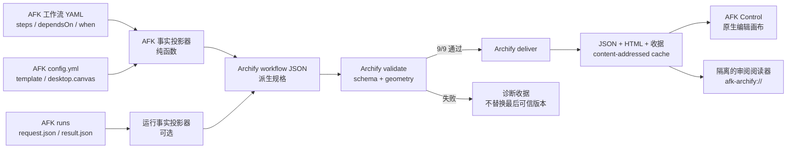
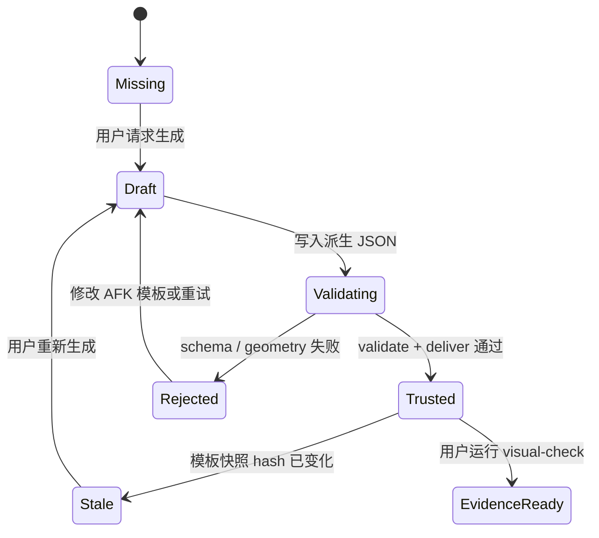

# Archify × AFK 集成方案：将可验证技术地图纳入本地工作流体系

**作者：Manus AI**  
**状态：建议采纳，尚未实现**  
**范围：AFK CLI、项目 `.afk/` 配置与工作流、Electron AFK Control**

## 决策摘要

建议将 Archify 集成为 AFK 的**可验证可视化与审阅层**，而不是工作流执行器、状态机或模板编辑的权威来源。AFK 继续以 `.afk/workflows/*.yml`、`.afk/config.yml`、运行请求与运行结果为唯一事实源；Archify 只消费经过白名单转换的事实，生成可复现、可验证、可分享的 JSON 规格、独立 HTML 与验证收据。这个边界既能保留 Archify 的 typed JSON、路线校验、独立 HTML 与有限 trace 优势，也不会把视觉产物反向变成执行逻辑。[1] [2]

> **核心原则：AFK 决定“实际执行什么”；Archify 解释“已定义或已观察到什么”。**

当前 AFK Control 中的紧凑画布应继续承担**快速配置和局部编辑**职责。Archify 产物则应提供“审阅模式”：用于验证模板主路径、并行汇聚、条件分支、运行后的事实覆盖、导出和分享。不要把完整 Archify viewer 强行塞入主编辑器，也不要让用户在两套编辑器之间维护同一套拓扑。

| 决策 | 建议 | 原因 |
|---|---|---|
| 系统定位 | 派生的审阅/导出层 | 避免双重事实源与反向写回执行模型。|
| 工作流编辑 | 保留 AFK Control 原生画布 | 自定义节点、位置、prompt、provider 已由 AFK 受控保存。|
| 生成触发 | 手动“生成审阅图”或模板变更后的显式预生成 | Archify 的 `preview` 不应作为后台常驻服务。[1] |
| 产物接受 | 只有 `deliver --quality showcase` 成功才替换最后可信产物 | 使 HTML、JSON、收据具备同一批次的确定性。 [1] |
| 运行时状态 | 仅以可核验 run/request/result 事件覆写 | 不从 prompt、节点颜色或推测文本推断进度。|
| Desktop 展示 | 隔离的只读 Archify 阅读器 | 保持 `contextIsolation`、sandbox、受限导航和受控 IPC。 [4] |

## 1. 集成边界与总体架构

Archify 的 workflow 类型适合表达具有阶段、分支、恢复、审查或审批语义的技术流程；其场景指南同时明确区分 workflow、architecture、sequence、dataflow 与 lifecycle。AFK 不应把所有运行信息塞入一张图，而应先根据真实数据类型选择正确视图。[2]



该架构有三个不可越过的方向。第一，YAML 和运行记录只能单向投影到 Archify IR；第二，Archify 的布局建议不能静默回写 YAML、`desktop.canvas.nodes` 或运行状态；第三，桌面端 renderer 只能请求“生成、读取元数据、打开受控产物”三类操作，不能获得通用文件读取或命令执行能力。

| 层级 | 权威职责 | Archify 的职责 | 明确不做 |
|---|---|---|---|
| AFK domain / CLI | 模板解析、拓扑、条件、执行请求、执行结果 | 无 | 不通过图形定义或改变执行顺序。|
| 项目 `.afk/` | 模板、配置、可编辑自定义节点、运行留档 | 输入快照与项目级缓存目录 | 不把大体积 HTML 或临时预览状态写入 config。|
| 主进程 | 路径校验、原子生成、受控子进程、协议服务 | 编排 Archify CLI；保存收据 | 不向 renderer 暴露 shell。|
| AFK Control 原生画布 | 快速配置、节点编辑、拖拽、Inspector | 显示“已生成/待生成/诊断失败”状态 | 不变成第二套 Archify JSON 编辑器。|
| Archify 阅读器 | 只读审阅、关系追踪、缩放、主题、导出 | 呈现已验证产物 | 不显示未验证或任意本地 HTML。|

## 2. AFK 事实到 Archify IR 的映射

第一阶段应仅支持 `workflow` 类型，并且只使用桌面快照中已经存在的 `id`、`role`、`kind`、`provider`、`action`、`dependsOn` 和 `when`。这些字段足以复现目前已经验证过的阶段列、Agent/系统/条件轨道与正交关系。无论是否存在运行记录，模板图都必须是静态定义图；只有用户明确选择“叠加本次运行事实”时，才生成单独的 run-scoped 产物。

| AFK 事实 | Archify workflow 字段 | 规则 | 不可推断的内容 |
|---|---|---|---|
| `WorkflowTemplate.name`、`description` | `meta.title`、可选 `meta.subtitle` | 使用模板原文；不补写营销文案。 | 模板是否推荐或安全。|
| step 拓扑深度 | `phases[].fromCol/toCol`、`nodes[].col` | `dependsOn` 的拓扑层为阶段列。 | 真实耗时或优先级。|
| `kind: agent` | `nodes[].type: backend`；Agent 轨道 | `role` 作为 tag；provider 可作为短 sublabel。 | Agent 已运行或已成功。|
| `kind: system` / `action` | `nodes[].type: messagebus/cloud`；系统轨道 | action 必须原样写出。 | 系统操作的外部副作用已发生。|
| `dependsOn` | `edges[].from/to` | 每个依赖生成一条有向边。 | 依赖是否已经满足。|
| `when.step`、`when.equals` | 条件轨道、`edge.label`、dashed branch | 仅条件步骤或条件边显示精确标签，例如 `review = failed`。 | 条件当前是否为真。|
| `parallel` 或同层多个 root | 同列、同轨道的确定性垂直分布 | 共享端点采用可读的正交分散路由。 | 真实并发槽位、资源占用。|
| `request.json` / `result.json` | 独立的 run overlay / proof card | 仅显示已落盘的 runId、状态、开始时间、错误摘要。 | 尚未落盘的“实时完成百分比”。|

建议把转换器实现为 AFK core 中无副作用的纯函数，例如 `src/application/visualizations/project-workflow-to-archify.ts`。该函数的输入是已解析的模板及可选的 run fact snapshot，输出是符合 Archify schema 的对象。它必须有单测覆盖：每个 `dependsOn` 都转成边；每个 `when` 都转成条件标签；未知 provider 或缺失运行记录均不能导致虚构节点、状态或颜色。

## 3. 产物、缓存与验证生命周期

Archify 官方流程把 `validate`、`deliver` 与 `visual-check` 分为不同门槛：showcase 验收需要九项检查全部通过且没有错误或警告；`deliver` 负责原子化最终交付；`visual-check` 收集多视口证据但不能代替人工审阅。[1] 因此，AFK 的集成不应直接调用 renderer 后立刻展示结果，而应将产物状态建模为明确的状态机。



建议默认把自动生成的产物保存在项目的 `.afk/cache/archify/`，并将其加入 AFK 的忽略规则。缓存路径使用模板名和输入 hash，以避免不同快照相互覆盖：

```text
.afk/cache/archify/
  workflow/<template-id>/<input-sha256>/
    source.workflow.json
    artifact.workflow.html
    delivery.receipt.json
    visual-check.receipt.json        # 用户要求视觉证据时才生成
    visual-check.*.png               # 同上
```

该缓存应由主进程原子写入，并建立一个小型 `index.json`，记录 `templateId`、AFK 模板内容 hash、生成时间、Archify 版本、`deliver` 收据 hash 及状态。配置发生改变时，AFK 不删除旧可信产物；而是将其标记为 **stale**，直到新的交付成功。用户显式点击“导出到文档”时，才把经过选择的 HTML/PNG 复制到项目的 `docs/afk-diagrams/`，避免把临时文件污染代码评审。

| 状态 | AFK Control 文案 | 是否可打开 | 是否可导出 | 主进程行为 |
|---|---|---|---|---|
| `missing` | “尚未生成审阅图” | 否 | 否 | 不创建任何文件。|
| `generating` | “正在验证流程结构” | 显示上一个可信版本（若有） | 否 | 运行受限 `validate` / `deliver`。|
| `trusted` | “已验证 · 输入版本 …” | 是 | 是 | 提供只读 HTML 与收据。|
| `stale` | “模板已更新，需要重新生成” | 是，明确标记旧版本 | 仅在二次确认后 | 不自动覆盖。|
| `rejected` | “未生成：查看结构诊断” | 否；可看 JSON 诊断 | 否 | 保存经过脱敏的诊断收据，不替换可信版本。|

## 4. Electron 安全模型

Archify 产物是包含脚本和 viewer 交互的独立 HTML。即使它由本地工具生成，也不能获得 AFK renderer 的 Node 能力或全局 IPC。Electron 官方安全指南建议对不受信任内容保持 `nodeIntegration: false`、启用 context isolation 与 sandbox，限制导航和新窗口，验证 IPC sender，并优先于 `file://` 使用受控协议。[4]

建议在主进程中创建专用的 `ArchifyViewerWindow` 或隔离 `WebContentsView`。它只加载 `afk-archify://artifact/<opaque-id>`，由 `protocol.handle` 根据 `index.json` 查找已验证的 HTML。协议不得接受任意路径、`..`、外部 URL 或 query 中的文件名。设置严格的 CSP；拒绝 `will-navigate`、`setWindowOpenHandler` 与所有权限请求；禁止 `shell.openExternal` 直接消费 viewer 中的 URL。阅读器 preload 仅公开只读元数据，例如当前 artifact ID、title、delivery receipt 和“返回主窗口”。

| IPC 名称 | 参数 | 返回值 | 权限与校验 |
|---|---|---|---|
| `archify:status` | workspace、templateId | 产物状态与收据摘要 | `resolveWorkspace`；仅登记模板。|
| `archify:generate` | workspace、templateId、mode | jobId / 最终收据 | 主进程白名单；拒绝任意 CLI 参数。|
| `archify:diagnostics` | workspace、artifactId | 已保存诊断 JSON | artifactId 必须来自索引。|
| `archify:open` | artifactId | boolean | 仅允许 `trusted` 或明确标记 `stale` 的产物。|
| `archify:export` | artifactId、format、destination token | 导出收据 | 路径由系统保存对话框产生；不接受 renderer 原始路径。|

这里不建议使用隐藏 webview 或向现有工作流 renderer 注入 HTML。AFK 现有 `contextIsolation: true`、`nodeIntegration: false` 和 `sandbox: true` 是应保持的基线；任何 Archify 集成都不应为了便利而放宽它们。

## 5. 桌面端信息架构

主画布上的 Archify 集成应当轻量，避免再次造成复杂的双侧栏。推荐在工作流编辑器顶部操作区加入一个二级动作 **“审阅图”**，旁边使用状态芯片显示“未生成 / 已验证 / 已过期 / 有诊断”。点击后打开独立阅读窗口或明确的全屏审阅模式，而不是在原有画布上叠加完整 toolbar。

| 用户目标 | AFK 原生画布 | Archify 审阅图 |
|---|---|---|
| 新增/编辑 Agent 或 QA | 主入口；可编辑 Inspector | 仅显示过期状态，不能直接编辑。|
| 修改 prompt/provider/位置 | 主入口 | 不回写；重新生成后更新。|
| 检查主路径、并行汇聚与条件分支 | 提供即时编辑反馈 | 主入口；使用阶段、轨道、关系标签与路径追踪。|
| 阅读某次已完成/失败运行 | 运行记录与详情抽屉 | 可选 run overlay；严格基于 request/result。|
| 分享设计、进入评审或导出 | 不承担 | 主入口；HTML/PNG/SVG/WebM 由可信产物导出。|

首次实施不需要复制 Archify 的 PATH、MAP、LENS、guided stories 或语义雷达。只有在 AFK 能提供相应的真实 facts 后，才以能力开关逐步启用。例如，PATH 可以基于已定义的 `dependsOn` 查询；LENS 需要稳定且有意义的角色类型；run overlay 则需要每一步的结构化开始/结束/状态事件。没有这些数据时，UI 应明确显示“AFK 当前未提供此事实”，而不是模拟功能。

## 6. 分阶段实施路线

| 阶段 | 交付内容 | 成功门槛 | 主要风险控制 |
|---|---|---|---|
| P0：契约冻结 | AFK→Archify 纯转换器、fixture、JSON schema 测试 | 6 个内置模板的 steps、依赖与 `when` 映射完整 | 不触碰执行器；先测试再接入 UI。|
| P1：可信生成 | 主进程受控 `generate/status/diagnostics`，本地缓存和收据 | 每个模板 `validate` + `deliver` 都可获得 9/9 收据 | 失败不替换最后可信版本。|
| P2：审阅阅读器 | 隔离窗口、受控协议、状态芯片、导出 HTML | navigation / popup / IPC 安全回归通过 | 不向 HTML 暴露 Node 或通用 IPC。|
| P3：运行事实叠加 | 基于 request/result 的 run-scoped 只读图 | 所有显示状态均能追溯至落盘字段 | 未定义或实时不完整状态不显示。|
| P4：扩展视图 | architecture、sequence、lifecycle 的明确用例 | 只有新事实模型通过验收才启用 | 不把 workflow 模式泛化成万能图。|

P0 和 P1 应优先完成，因为它们把“生成漂亮图”改造成“可重复生成、可接受或可拒绝的派生产物”。P2 才向用户暴露完整 viewer。P3 的价值最高但数据要求也最高，应等待 AFK run event schema 能定位到 `template step id` 后实现。

## 7. 验收标准与反模式

集成验收应覆盖准确性、可重复性、隔离性和体验四个方面。每一份 generated workflow 必须能从输入模板重新生成相同的拓扑；每一条关系都能回溯到 `dependsOn` 或 `when`；每一项运行状态都能回溯到落盘事件。作为最小门槛，`deliver` 收据必须是 showcase 9/9、0 errors、0 warnings；`visual-check` 必须覆盖 1440×900、1600×1000、1920×1080 和 2048×1320 的无溢出证据；人工审阅必须检查条件标签、共享端点和面板遮挡。[1]

| 反模式 | 后果 | 正确替代 |
|---|---|---|
| 把 Archify JSON 当作新的工作流配置文件 | 形成双向漂移和不可预测执行 | YAML 仍是唯一执行定义；JSON 是派生缓存。|
| 每次编辑都启动 `preview` 常驻进程 | 生命周期复杂、资源泄漏、最后可信版本难治理 | 显式生成；只在开发工具中使用 preview。|
| 直接用 `file://` 打开任意 HTML | 路径穿越、导航与脚本风险扩大 | 受控 `afk-archify://` 协议与 artifact 索引。|
| 把“失败分支”涂成实际失败状态 | 误导用户 | 仅呈现 `when` 定义；状态叠加必须来自 run result。|
| 把完整 viewer 叠在编辑画布中 | 编辑密度、焦点和性能恶化 | 原生编辑器与只读审阅器分层。|
| 将自动布局坐标写回业务 YAML | 视觉偏好污染执行定义 | 布局仅存在于派生 IR 或 `desktop.canvas`。|

## 结论

Archify 最有效的集成方式不是取代 AFK 工作流画布，而是让 AFK 从“可配置”进一步成为“可审阅、可验证、可分享”。应先完成纯映射、可信交付和安全阅读器，再叠加运行事实。这个次序保留了 AFK 的执行权威与 Electron 安全边界，并利用 Archify 的真正价值：把真实、受限、可追溯的技术事实转换为高质量的阅读和评审产物。

## References

[1]: https://github.com/tt-a1i/archify/blob/main/archify/SKILL.md "Archify SKILL.md"
[2]: https://tt-a1i.github.io/archify/guide.html "Archify Scenario Guide"
[3]: https://github.com/tt-a1i/archify "Archify GitHub repository"
[4]: https://www.electronjs.org/docs/latest/tutorial/security "Electron Security"
