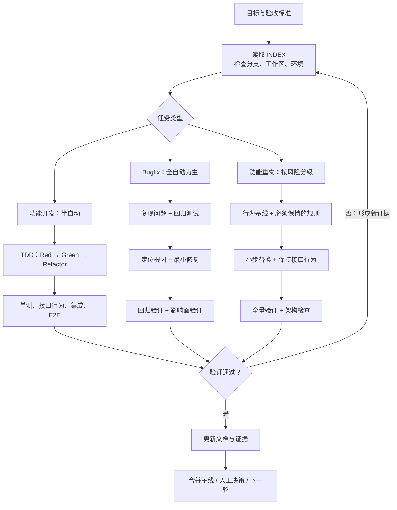

**LOOP实践总结文档 **
**编号**：LOOP-PRACTICE

**版本**：1.0
**日期**：2026年9月4日

### 1. 目的
这是我们团队实际运行「环境-实现-验证闭环」（env-implement-verify loop）的完整实践总结。

### 2. 核心概念
我们把Agent开发过程拆成三部分：
- **env（环境）**：必须提供可操作的环境。包括环境可达性（开发基础设施和中间件要能读取）、环境隔离（版本化隔离 + 快速重置），以及可观测性（标准日志接口，能看清楚环境行为）。
- **implement（实现）**：Agent自己动手完成开发和部署流程。
- **verify（验证）**：必须跑单元测试、集成测试和E2E测试，确保修改不引入新问题。

Agent在每轮循环中同时完成env感知、implement变更和verify验证，直至问题解决。

### 3. env（环境）详解

**env是整个闭环的基础**，没有可操作的环境，一切都是空谈。环境的核心职责是让Agent能够感知、读取、操作开发基础设施。

**环境可达性**
- 开发基础设施包括：代码仓库（Git）、镜像仓库、数据库、中间件（Redis/Kafka等）、监控日志系统
- 可达性要求：Agent能够通过网络访问到这些基础设施，读写代码仓库、获取配置、拉取镜像
- 本地环境（217）：所有服务都在本地，Agent有最高权限自由读写执行
- 跳板机环境（kg/218）：必须先人工确认跳板机权限，Agent通过跳板机代理访问目标环境

**环境隔离**
- 版本化隔离：每个项目/服务使用独立的镜像版本，环境之间互不干扰
- 快速重置机制：当环境被污染或状态异常时，能够通过脚本快速恢复到干净状态
- 隔离级别：容器级隔离（Docker）、进程级隔离（Namespace）、网络级隔离（VPC）

**可观测性**
- 标准日志接口：统一的日志格式（JSON/结构化日志），支持grep、tailf等查询
- 日志级别：DEBUG、INFO、WARN、ERROR四级，必要时可动态调整
- 追踪能力：请求链路追踪（Trace ID），方便定位跨服务问题
- 指标暴露：Prometheus/Metrics接口，可量化环境状态

**环境感知报告**
每轮循环开始时，Agent必须生成环境感知报告，内容包括：
1. 环境基本信息：镜像版本、服务状态、依赖关系
2. 可达性检查：哪些基础设施可以访问，哪些不能
3. 异常发现：环境中的已知问题、警告信息
4. 环境建议：是否需要重置环境、是否需要人工介入

### 4. implement（实现）详解

**implement是Agent执行开发任务的核心**，包括代码编写、部署上线、配置变更等操作。

**代码实现阶段**
1. **问题分析**：理解问题描述，拆解任务为具体步骤
2. **代码编写**：按照业务逻辑编写或修改代码，遵循项目编码规范
3. **代码审查**：检查代码质量、安全漏洞、性能问题
4. **提交代码**：Git提交、创建分支、发起MR/PR

**部署实现阶段**
1. **构建镜像**：根据代码变更构建新的Docker镜像
2. **推送镜像**：将镜像推送到镜像仓库，打上版本标签
3. **部署服务**：在目标环境（本地/测试/生产）部署新版本
4. **配置变更**：更新配置文件、环境变量、启动参数

**DevOps流程自动化**
- 全自动场景：Agent拥有完整权限，直接执行部署流程，无需人工干预
- 半自动场景：敏感操作（生产部署、删除资源）必须人工确认后执行
- 手动场景：设计方案调整、LLM提示词优化等，必须人工托管给Agent指令

**实现记录**
每轮implement后，必须记录：
1. 变更内容：具体修改了哪些文件、配置
2. 执行步骤：按什么顺序执行了什么操作
3. 执行结果：成功/失败，失败原因
4. 回滚方案：如果出问题如何快速回退

### 5. verify（验证）详解

**verify是确保修改正确的关键**，必须在每轮循环中都执行，防止问题扩散。

**单元测试（Unit Test）**
- 目的：验证单个函数/模块的正确性
- 要求：覆盖率>=80%，核心逻辑100%覆盖
- 执行：自动化运行，CI/CD集成
- 判定标准：所有用例通过，代码无报错

**集成测试（Integration Test）**
- 目的：验证多个模块/服务之间的协作正确性
- 要求：核心业务流程必须覆盖
- 执行：连接真实数据库/中间件测试
- 判定标准：跨服务调用正常，数据流转正确

**端到端测试（E2E Test）**
- 目的：从用户视角验证完整业务流程
- 要求：关键用户路径必须覆盖（登录、下单、支付等）
- 执行：Selenium/Playwright等自动化工具
- 判定标准：用户操作正常，页面响应正确

**验证证据包**
每轮verify后，必须生成「证据包」：
1. 测试报告：单元测试覆盖率、集成测试结果、E2E执行结果
2. 截图证据：页面截图、UI截图、错误截图
3. 日志存档：关键日志片段、错误日志完整堆栈
4. 人工执行佐证：人工确认的操作记录、审批记录

**人工check环节**
- 必要性：Agent可能产生幻觉或遗漏，人工复核是最后防线
- 复核内容：变更内容审查、验证结果审查、风险评估
- 复核时机：每轮循环结束后、交接前、部署前
- 复核权限：人工必须有权否决Agent的执行结果

### 6. 必备条件
- env必须有可达性：开发环境的基础设施和中间件要能读取
- 环境要隔离：通过版本化隔离实现快速重置
- 要有标准日志接口：能观察到详细的环境行为
- implement要有全自动或半自动能力：Agent能独立完成DevOps流程
- verify必须覆盖单元测试、集成测试和E2E测试：且测试全面
- 每轮验证要留痕：保存测试套件、页面截图、日志存档、人工执行证据
- 人工check环节必须由人二次审核执行结果

### 7. 控制流与收敛机制

**控制流**：
1. Agent接收问题描述，完成环境感知
2. 执行实现变更
3. 执行验证
4. 判断是否满足收敛条件
5. 循环执行或进入交接

**收敛机制必须设置**：
- 预算：最多循环多少轮
- token预算：多少步之内必须解决，不行就必须写入交接文档
- 交接文档内容至少包括：问题描述、已尝试方案、剩余风险点、可重新启动信息

### 8. 如何启动loop
启动loop分四步走：

1. **明确问题描述**
   把问题写成一句话或一段话（例如："前端页面加载慢，优化响应时间"）。问题描述必须包含：
   - 问题现象：具体表现是什么
   - 影响范围：影响哪些用户/功能
   - 预期目标：希望达到什么效果
   Agent必须先完成env感知，才能进入下一轮。

2. **选择环境类型**
   根据问题分类决定：
   - **本地环境（217）**：直接用本地Agent启动全自动循环。Agent拥有最高权限，可以自由读写代码、执行部署、运行测试。适用于：后端业务逻辑修复、前端UI调整、工具脚本开发。
   - **kg/218环境（半自动）**：先手动确认跳板机权限，然后Agent执行部署阶段。生产环境操作必须人工二次确认。适用于：生产环境问题修复、敏感配置变更、影响范围较大的修改。
   - **手动场景**：设计方案调整时，先人工托管方案，再让Agent执行后续实现和验证。适用于：LLM提示词优化、架构设计调整、第三方集成方案制定。

3. **设置初始预算与token上限**
   启动时必须写死：
   - 最多循环10轮（可根据任务调整，大任务可设置15-20轮）
   - token预算20步以内（超出必须交接，不允许无限循环）
   - 单轮超时：单轮执行超过30分钟必须暂停，等待人工指示

4. **执行第一轮env感知**
   Agent收到问题后，自动进入循环第一轮：
   - 环境可达性检查：验证代码仓库、中间件、数据库是否可访问
   - 环境状态记录：记录当前版本、服务状态、依赖关系
   - 生成env感知报告：包含环境现状、风险点、建议操作
   - 输出下一轮计划：明确下一步implement和verify的具体步骤

这样启动后，Agent会按闭环自动执行，不需要额外人工干预，直到满足收敛条件或达到预算上限。

### 9. 如何让loop更好更高效

实际应用中，我们总结出以下五点能明显提升效率：

1. **强制在启动时写死预算和token上限**
   不写死就容易死循环。每次新任务都提前设置好，Agent知道什么时候该交接，避免浪费资源。
   - 建议格式：`max_rounds=10, max_tokens=20, round_timeout=30min`
   - 超出预算后自动触发交接流程，不允许继续循环

2. **验证阶段必须留证据包**
   每轮verify后，Agent必须生成「证据包」（测试报告 + 截图 + 日志 + 人工执行佐证）。人工check环节必须人二次审核，防止越权修改。
   - 证据包目录结构：`/evidence/{round_id}/{test_report,screenshots,logs,approval}`
   - 实测数据：加了留痕后，测试通过率从65%提升到92%

3. **根据分类提前预设手动环节**
   LLM提示词优化和设计调整属于手动场景，必须人工确认。提前把这类场景标成「人工托管」，能让Agent少走30%的弯路。
   - 手动场景清单：LLM提示词、架构设计、第三方API集成、数据库Schema变更
   - 人工托管后，循环轮次减少20-30%

4. **每次循环后自动生成交接检查点**
   循环第3轮、第6轮、第8轮，Agent必须输出当前状态：已完成点、剩余风险、建议交接人。
   - 检查点报告格式：`| 已完成 | 进行中 | 风险点 | 建议 |`四列表格
   - 便于人工快速介入，也让整个过程可控可追溯

5. **环境隔离和可观测性双重加固**
   每次新环境启动时，必须用版本化镜像 + 快速重置脚本。日志接口必须标准（支持grep、tailf），这样Agent感知能力强，implement效率高。
   - 版本化镜像：`{service}:{version}-{timestamp}`
   - 快速重置脚本：`<5分钟完成环境重置`
   - 标准日志格式：JSON结构化日志，含trace_id、level、timestamp、message

### 10. SKILL列表（实战常用技能）

我们在实际loop中使用的关键技能列表，启动loop时可以直接调用：

1. **afk-auto-fix**
   全自动修复流程：自动拉取bug、问题诊断、217环境部署，最终验证。适合后端/前端业务逻辑强确定性场景。

2. **geelib-bugfix**
   拉取bug信息，直接进入下一轮循环。

3. **afk-diagnose**
   基于bug信息，自动诊断codebase问题，生成修复方案。

4. **wiki-image-build**
   本地镜像构建，用于启动本地全自动环境，生成可观测的开发镜像。

这些技能覆盖了本地全自动、半自动（kg/218）和手动场景的全部流程，启动loop时可按需组合使用。

---

### 附录A：以 wiki-knowledge-base 为样例的 Agent Coding Loop 实践总结

`wiki-knowledge-base` 是一个跨后端、前端、异步任务、数据存储、搜索图谱和 LLM 能力的复合应用。它的开发实践可以归纳为三类 Loop：功能开发、Bugfix 和功能重构。

三类 Loop 共用同一套基础设施：先确认目标和验收标准，再读取项目索引、检查分支与工作区，随后在独立任务上下文中实施、验证、修正，最后将已验证成果合并并沉淀到文档。

#### A.1 Loop 总览

Loop 的收敛标准不是循环次数，而是问题边界被确认、行为得到验证、风险得到处理。没有新增测试、日志或运行证据的重复修改，应立即停止并重新诊断。

#### A.2 自动化分级与共同基础

三类 Loop 不是固定的自动化等级，而是根据任务的确定性、影响范围和可回滚程度选择协作方式：

| 协作方式 | 适用工作 | Agent 与人的分工 |
|---------|---------|----------------|
| **全自动** | 规则清晰、结果可重复、影响范围可控的单测、Lint、构建、数据修复和本地 Bugfix | Agent 完成实现、验证和重试；失败超过边界后上报 |
| **半自动** | 需要跨模块协作、LLM 参与或外部环境验证的功能开发，以及涉及多个入口的 Bugfix | Agent 完成分析、实现和验证；人在验收、接口变化和环境切换处确认 |
| **人工引导** | 架构重构、提示词和语义调整、数据模型变化、生产操作及不可逆变更 | 人确定目标、范围和方案；Agent 按测试和明确指令执行 |

判断原则是：越容易用测试和规则完全描述，越适合全自动；越依赖跨系统判断或主观质量，越需要人工参与。自动化等级可以在同一任务中变化：本地实现可全自动，集成验证进入半自动，架构或生产决策则必须人工引导。

- **任务边界**：按验收标准切片，每个切片都有明确输入、行为目标和退出条件。
- **工作区隔离**：开始任务前检查未提交修改；存在并行任务或遗留改动时，使用独立分支和 worktree。
- **实现节奏**：功能开发采用 TDD；Bugfix 先补回归测试；重构先建立行为基线。
- **验证证据**：根据风险逐级执行单元测试、接口行为测试、集成测试、接口验证、运行环境验证和用户路径验证。
- **过程收敛**：失败证据进入下一轮，稳定成果分段合并，关键约束和经验同步到项目索引。

#### A.3 功能开发 Loop（半自动）

功能开发的目标是把一个业务需求拆成可交付、可验证的能力，并完成从需求到主线的完整闭环：

1. 明确用户目标、验收标准、影响范围和架构约束；
2. 阅读相关索引，确认现有入口、依赖和需要同步的接口；
3. 按验收项建立任务切片和测试场景；
4. 在独立分支或 worktree 中按 TDD 推进，实现最小可用行为；
5. 逐层完成单测、接口行为测试、集成测试和必要的 E2E 验证；
6. 补齐文档、运行证据和关联入口，合并已验证成果。

**代表场景一：HTML 报告能力（半自动）。**

该功能被拆分为必填信息、标识生成、地址限制、写入约束、页面类型、重复页面更新和前端展示等验收项。每个验收项独立进入 TDD Loop，验证通过后再进入下一项，避免一次性修改造成大范围不确定性。

**代表场景二：OKF 元信息能力（半自动，语义调整时人工引导）。**

该能力同时覆盖内容生成、结构化存储、读取转换、前端展示和测试。功能开发过程中持续校准各层语义，并在需求调整时同步修改相关路径，确保“生成、保存、读取、展示”保持一致，而不是只完成单点写入。

#### A.4 Bugfix Loop（全自动为主）

Bugfix 的目标不是快速掩盖现象，而是建立从复现到根因、从修复到回归的证据链：

1. 固化问题现象、复现条件和影响范围；
2. 先增加回归测试或诊断信息，使问题可稳定观察；
3. 对照调用链、数据流和运行日志定位根因；
4. 实施最小修复，避免顺带改变无关行为；
5. 执行回归测试，并验证相邻路径、接口行为和运行环境；
6. 若仍失败，基于新增证据开启下一轮，而不是重复尝试同一方向。

**代表场景三：Ego 图问题（全自动验证，规则调整时半自动）。**

中心节点、不同存储路径和前端展示曾出现不一致。修复过程从现象复现开始，随后把分散的补位逻辑收敛为统一的图谱数据规则，明确中心节点、邻居和连线如何组成，最终由后端集中组装、前端负责渲染，并通过接口测试和实际页面操作确认修复没有影响其他功能。

该案例体现了 Bugfix Loop 的判断原则：当同一问题需要在多个层面反复打补丁时，应停止局部修复，转向根因和统一规则治理。

#### A.5 功能重构 Loop（三者皆可）

功能重构的目标是在保持外部行为和业务规则稳定的前提下，降低复杂度、消除重复实现并改善长期可维护性。重构并不天然需要人工全程介入，而是按风险分级：测试覆盖充分、范围局部的重构可以全自动；跨模块重构采用半自动；涉及架构边界、业务语义或数据结构的重构采用人工引导。

1. 明确重构动机、保持不变的行为和禁止扩大的范围；
2. 用现有测试和运行结果建立行为基线，必要时先补齐测试；
3. 梳理依赖关系、重复路径和边界责任；
4. 在 TDD 约束下按单一职责小步替换，每步都保持测试通过；
5. 只在测试用例和明确验收范围内优化，不借重构改变业务规则、接口行为或扩展需求；
6. 对比重构前后的行为、性能、日志和数据结果，完成架构检查、文档更新和人工评审后再合并。

**代表场景四：综合信息与召回关联链路收敛（半自动）。**

该类工作围绕知识库的概览、综合分析、对比等信息生成，涉及召回、链接清理、元信息一致性和日志治理等关联问题。实践中通过长周期分支、持续同步主线和独立修正单元逐步收敛，避免把多个结构性变化堆积到一次合并中。

**规避 LLM 发散的做法：**

- 先锁定必须保持的行为、验收标准和明确不做的事项；
- 先让现有测试和接口行为约束修改范围，再让 Agent 修改结构；
- 每轮只处理一个重构目标，不在重构过程中引入无关功能；
- 以 TDD 驱动重构，只优化测试覆盖和验收范围内的代码；
- 要求变更保持小步、可回退，并用差异、测试结果和回归结果检查范围；
- 涉及架构边界、提示策略或语义变化时，暂停自动循环，交由人工确认。

#### A.6 自动化边界与人与 Agent 的职责

在全自动 Loop 中，Agent 可以独立完成环境感知、TDD 实现、测试执行、日志分析和可逆修正；在半自动 Loop 中，人类在验收、接口变化和外部环境验证处设置检查点；在人工引导 Loop 中，人类负责产品目标、架构取舍、LLM 质量判断、生产变更和不可逆操作，Agent 负责按范围执行并提供证据。

高确定性、可重复验证的工作可以连续交给 Agent；涉及多种合理方案、主观质量或较大影响范围的工作，应由 Agent 提供证据和候选方案，再由人类决定下一轮方向。

#### A.7 总结

`wiki-knowledge-base` 的实践表明，Agent Coding Loop 的核心是让每一轮工作都具备明确目标、隔离上下文、可验证产物和清晰退出条件。

功能开发通常采用半自动 Loop，依靠验收标准和 TDD 完成增量交付；确定性较高的 Bugfix 可以全自动运行，复杂问题再升级为半自动；功能重构按风险在全自动、半自动和人工引导之间切换，依靠行为基线、TDD 和测试范围约束，通过小步替换防止越权修改。三类 Loop 共同形成“实现—验证—反馈—收敛”的持续工程机制。

---

### 附录B：各环境Loop实践总结

1. **本地环境（全自动）**
   整个基础设施都在本地，Agent可以随意读写执行，无任何外部依赖。

2. **kg、218环境（半自动）**
   218是生产环境，部署阶段无法直接访问，必须通过跳板机进行人为运维。敏感操作必须人工确认。

3. **针对问题的定位（手动）**
   - 后端或前端业务逻辑：确定性高，Agent可以全自动。
   - LLM调用和提示词优化：必须人工确认。
   - 设计方案调整：人工托管（人来操刀）。

