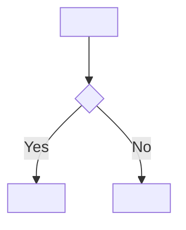
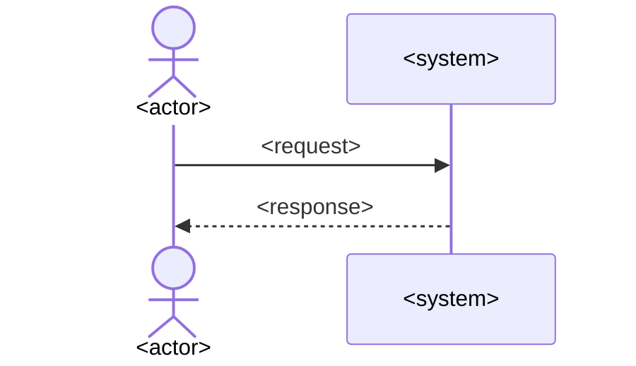

# AI-Friendly PRD Markdown Template

Use this template as the canonical structure. Keep the headings, ID prefixes,
and field labels stable so a person and an AI can locate the same contract.
Replace angle-bracket placeholders. Do not leave `TBD`, `TODO`, or empty
requirements in an approved PRD; unresolved content belongs in `Open Risks`.

```markdown
# PRD: <short title>

- **PRD ID**: PRD-2026-001
- **Version**: 1.0.0
- **Status**: Draft
- **Owner**: <team or person>
- **Created**: <YYYY-MM-DD>
- **Updated**: <YYYY-MM-DD>
- **Source**: <alignment record or approved request>

> **Writing rule**: Use precise product and engineering terminology. Mark
> content as `Confirmed`, `Inferred`, `Proposed`, or `Unknown` when its source
> is not obvious. Model knowledge may surface candidates and common edge cases,
> but only confirmed content becomes an approved requirement.

## 1. Problem Statement

### 1.1 Problem

<Describe the user-visible problem, not the proposed implementation.>

### 1.2 Affected Users

- <role>

### 1.3 Current Impact

- <observable impact>

### 1.4 Why Now

<Explain why this problem is being addressed now.>

## 2. Goals

### GOAL-001: <outcome title>

<State the measurable user or business outcome.>

## 3. Non-Goals

- <explicitly excluded behavior or scope>

## 4. Users & Jobs

### USER-001: <role>

- **Role**: <who this is>
- **Job**: <what the person needs to accomplish>
- **Success**: <how the person knows the job is complete>

## 5. Domain Glossary

| Term | Definition |
|---|---|
| <term> | <one precise definition> |

## 6. Functional Requirements

### FR-001: <imperative requirement title>

- **Confidence**: Confirmed / Inferred / Proposed / Unknown
- **Priority**: Must
- **Surface**: User / Public API / Event / CLI/Batch / Policy
- **Related Goal**: GOAL-001
- **Actor**: USER-001
- **Bounded Context**: <context>
- **Trigger**: <event that starts the behavior>

#### Product Promise

<State what the product surface promises to the user or consumer. Do not name
an implementation component as the promise.>

#### Preconditions

- <condition that must already be true>

#### Main Flow

1. <observable system behavior>
2. <observable system behavior>

#### Abnormal Flows

- If <condition>, the system MUST <observable response>.

#### Completion Conditions

- <observable postcondition>

#### Invariants

- <rule that must remain true>

#### Acceptance Criteria

##### AC-001: <scenario title>

- **Given**: <initial condition>
- **When**: <user or system action>
- **Then**: <observable result>

## 7. State Model

### STATE-001: <entity lifecycle>

| Current State | Event | Next State | Allowed |
|---|---|---|---|
| <state> | <event> | <state> | Yes |


## 8. User Flows

### FLOW-001: <flow title>

- **Purpose**: <what this diagram clarifies>
- **Related Requirements**: FR-001
- **Related Acceptance Criteria**: AC-001



## 9. Sequence Diagrams

### SEQ-001: <interaction title>

- **Purpose**: <what cross-boundary interaction this clarifies>
- **Related Requirements**: FR-001
- **Participants**: <actor>, <system>, <service>



## 10. Non-Functional Requirements

### NFR-001: <quality attribute>

<Use a measurable constraint or observable behavior.>

## 11. Technical Constraints & Decisions

### CONSTRAINT-001: <product-affecting technical constraint>

- **Constraint**: <what the product or integration must guarantee>
- **Product Impact**: <which user-visible or consumer-visible behavior changes>
- **Rationale**: <why this constraint exists>
- **Implementation**: Defined in Technical Design; do not prescribe it here.
- **Affected Requirements**: FR-001

## 12. Key Decisions

### DEC-001: <decision title>

- **Decision**: <confirmed choice>
- **Rationale**: <why>
- **Impact**: <affected requirements or boundaries>
- **Source**: <decision source>

## 13. Assumptions

### ASM-001: <assumption title>

- **Assumption**: <unverified belief>
- **Confidence**: High / Medium / Low
- **Validation Needed**: Yes / No
- **Affected Requirements**: FR-001

## 14. Open Risks

### RISK-001: <risk or open question>

- **Question or Risk**: <unresolved content>
- **Impact**: <what may change>
- **Severity**: High / Medium / Low
- **Owner**: <person or team>
- **Affected Requirements**: FR-001
- **Resolve Before**: Approval / Decomposition / Implementation

## 15. Traceability

| Source or Goal | Requirement, Diagram, or Criterion | Relationship |
|---|---|---|
| GOAL-001 | FR-001 | implements |
| FR-001 | AC-001 | verified by |
| FR-001 | FLOW-001 | illustrated by |

## 16. Change Log

### <YYYY-MM-DD> — Version <version>

- <change>

### Downstream Impact

- <affected requirement, criterion, diagram, or backlog reference>
```

## Authoring Rules

- Use one requirement per `FR-###` heading.
- Use one acceptance scenario per `AC-###` heading.
- Describe product behavior first. Include UI or API behavior only when the
  corresponding surface is part of the product contract.
- Use concise, information-dense, domain-standard vocabulary instead of broad
  adjectives or explanatory filler.
- Use model prior knowledge to propose relevant edge cases and established
  patterns, but label inferred or proposed content and keep it out of approved
  requirements until confirmed.
- Include technical constraints only when they affect product behavior,
  quality, compatibility, security, compliance, scope, or material risk.
- Do not turn implementation choices into requirements. Keep detailed
  Technical Design in a separate document.
- For UI requirements, specify user actions, visible outcomes, permissions,
  errors, and state; leave layout and component details to UX or technical
  design documents.
- For API requirements, specify consumer intent, input/output semantics,
  errors, idempotency, and compatibility; leave route and implementation
  details to the API or technical design document.
- Keep requirement IDs stable across revisions; never reuse a retired ID.
- Keep diagram IDs stable unless the diagram represents a different concept.
- Use `MUST`, `SHOULD`, and `MAY` when obligation levels matter.
- Make every behavior observable and falsifiable.
- Include error, permission, cancellation, retry, and duplicate-action behavior
  when they are relevant to the feature.
- Use a diagram only when it reduces ambiguity; conditional sections may say
  `Not applicable — <reason>`.
