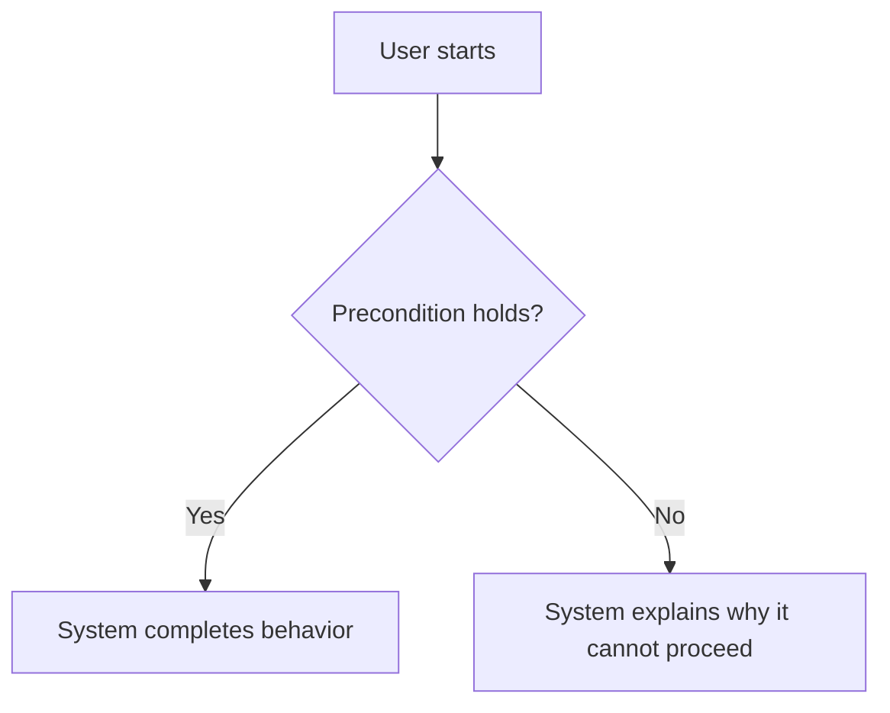
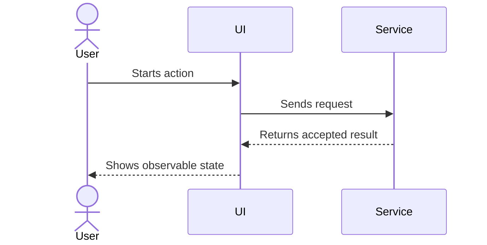
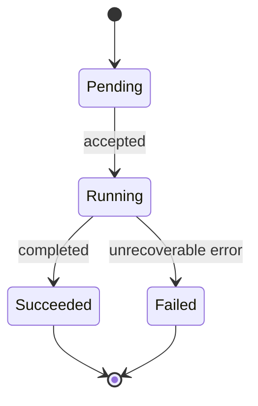

# Diagram Guidelines for AI-Friendly PRDs

Use Mermaid code blocks as the canonical diagram source. A rendered image may
be attached for convenience, but it is never the source of truth.

## Diagram Selection

| Need | Diagram | Required prefix |
|---|---|---|
| User or business path | `flowchart` | `FLOW-###` |
| Cross-boundary interaction | `sequenceDiagram` | `SEQ-###` |
| Entity lifecycle | `stateDiagram-v2` | `STATE-###` |
| Complex branching rule | `flowchart` decision tree | `RULE-###` |

## Common Rules

- Give every diagram a stable ID, purpose, and related requirement IDs.
- Use the same actor, context, entity, and state names as the prose.
- Label decision branches with explicit conditions, not `else` or `other`.
- Include material failure, permission, cancellation, timeout, retry, and
  duplicate-request paths.
- Keep cross-boundary diagrams at the boundary level; do not diagram every
  internal function call.
- Do not introduce a component, API, event, or data store in a diagram unless
  the PRD records it as a decision, constraint, or explicit assumption.
- If prose and a diagram disagree, record an `Open Risk` and stop approval.

## Flowcharts

Use flowcharts for user-visible and business-process steps. Every path should
have a meaningful end state or explicitly lead to a waiting state.

## Sequence Diagrams

Use sequence diagrams for actors and systems that cross an ownership or process
boundary. Show request/response direction and asynchronous behavior explicitly.

Use `alt` for mutually exclusive paths, `opt` for optional paths, and `par`
for concurrent paths.

## State Diagrams

Use state diagrams when an entity has a lifecycle. Define the initial state,
terminal states, transition events, and prohibited transitions in prose or a
table next to the diagram.

